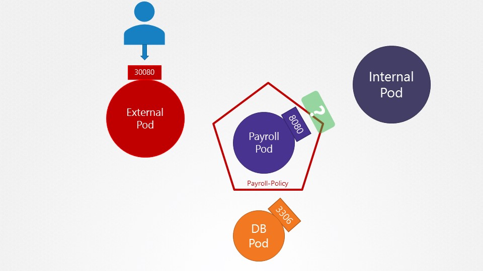
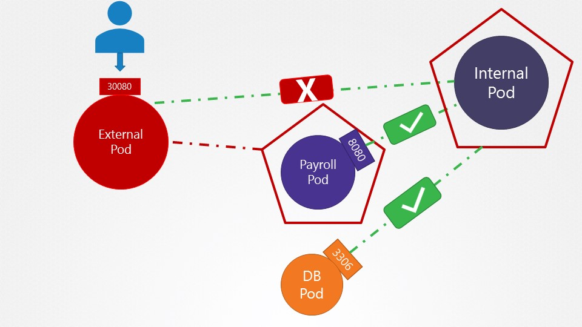
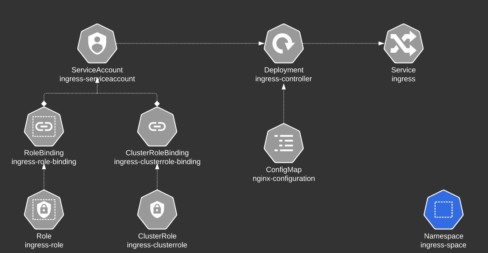
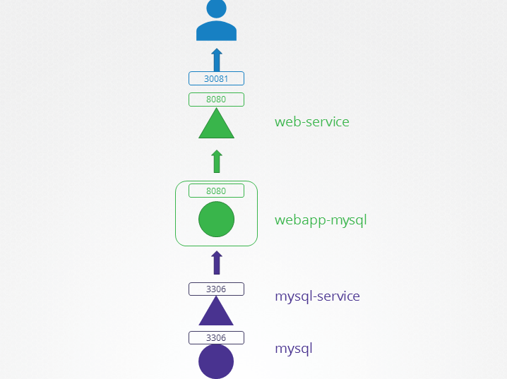
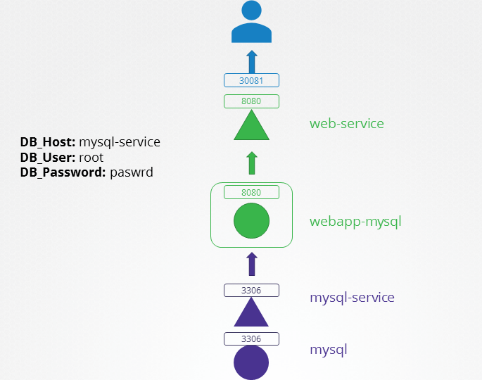
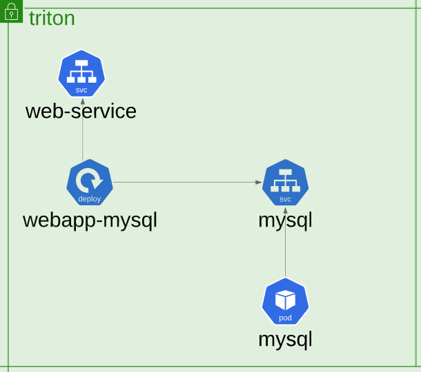

# Certified Kubernetes Administrator (CKA) with Practice Tests

## CORE CONCEPTS, PRACTICE TEST – PODS

### PODs with YAML
```
kubectl run nginx --image=nginx

kubectl describe pod newpods-<id>

kubectl get pods -o wide
```

What does the READY column in the output of the kubectl get pods command indicate?
- Running Conatiners in POD/Total Conatiners in POD

```
kubectl delete pod webapp
kubectl run redis --image=redis123 --dry-run=client -o yaml > redis-definition.yaml
```

```
# redist-definition.yaml
apiVersion: v1
kind: Pod
metadata:
  name: redis
spec:
  containers:
  - name: redis
    image: redis123    
```

- vi find and replace: `:s/redis123/redis/g`

### ReplicaSets
```
apiVersion: apps/v1
kind: ReplicaSet
metadata:
  name: myapp-replicaset
  labels:
    app: myapp
    type: front-end
spec:
  template:
    metadata:
      name: myapp-pod
      labels:
        app: mysqpp
        type: front-end
    spec:
      containers:
      - name: nginx-container
        image: nginx
 replicas: 3
 selector: 
   matchLabels:
     type: front-end
```

- ReplicaSets에서는 `selector`를 통해서 대상 `Pod` 선정
- Scale

```
kubectl replace -f replicaset-defnition.yml
kubectl scale --replicas=6 -f replicaset-definition.yml
kubectl scale --replicas=6 replicaset myapp-replicaset
```

```
kubectl get replicasets

kubectl describe replicasets new-replica-set
```

Why are there still 4 PODs, even after you deleted one?
- ReplicaSet ensures that desired number of PODs always run

Create a ReplicaSet using the `replicaset-definition-1.yaml` file located at /root/. There is an issue with the file, so try to fix it.
- `kubectl explain replicaset | grep VERSION`


```
$ kubectl explain replicaset
KIND:     ReplicaSet
VERSION:  apps/v1
```

```
kubectl delete replicaset replicaset-1

kubectl edit replicaset new-replica-set

# 기존 Pod를 삭제해야 새로운 Pod들이 실행됩니다.
kubectl delete pod new-replica-set-nxbh6 new-replica-set-62524 new-replica-set-5mv75 new-replica-set-rvpp8

# replicaset 개수 조정 (UP/DOWN)
kubectl edit replicaset new-replica-set
```

### Certification Tip!
```
kubectl run nginx --image=nginx --dry-run=client -o yaml

kubectl create deployment --image=nginx nginx --dry-run=client -o yaml

kubectl create deployment --image=nginx nginx --dry-run=client -o yaml > nginx-deployment.yaml

kubectl create deployment --image=nginx nginx --replicas=4 --dry-run=client -o yaml > nginx-deployment.yaml
```

### Deployments
```
$ kubectl get all

$ kubectl create -f deployment-definition-1.yaml 
Error from server (BadRequest): error when creating "deployment-definition-1.yaml": deployment in version "v1" cannot be handled as a Deployment: no kind "deployment" is registered for version "apps/v1" in scheme "k8s.io/apimachinery@v1.23.3-k3s1/pkg/runtime/scheme.go:100"

$ kubectl explain deployment 
KIND:     Deployment
VERSION:  apps/v1

$ kubectl create deployment --image=httpd:2.4-alpine httpd-frontend --replicas=3 --dry-run=client -o yaml > deployment-definition.yaml
```

### Service
```
apiVersion: v1
kind: Service
metadata:
  name: webapp-service
spec:
  type: NodePort
  ports:
   - targetPort: 8080
     port: 8080
     nodePort: 30080
  selector:
    name: simple-webapp
```

### Namespaces

mysql.connect("db-service.dev.svc.cluster.local")
- cluster.local: domain
- svc: object
- dev: namespace
- db-service: service name

```
# namespace-dev.yaml

apiVersion: v1
kind: Namespace
metadata:
  name: dev
```

```
kubectl get pods --namespace=prod
kubectl config set-context $(kubectl config current-context) --namespace=dev
kubectl get pods --all-namespaces
kubectl get po -A
```

#### Resource Quota
```
# compute-quota.yaml

apiVersion: v1
kine: ResourceQuota
metadata:
  name: compute-quota
  namespace: dev
spec:
  hard:
    pods: "10"
    requests.cpu: "4"
    requests.memory: 5Gi
    limits.cpu: "10"
    limits.memeory: 10Gi
```

```
k get po -n research
kubectl run redis --image=redis -n finance --dry-run=client -o yaml

k get po --all-namespaces | grep blue
```

### Imperative vs Declarative

**Imperative**
```
kubectl run --image=nginx nginx
kubectl create deployment --image=nginx nginx
kubectl expose deployment nginx --port 80
kubectl edit deployment nginx
kubectl scale deployment nginx --replicas=5
kubectcl set image deployment nginx nginx=nginx:1.18
kubectl create -f nginx.yaml
kubectl replace -f nginx.yaml
kubectl delete -f nginx.yaml
```

**Declarative**
```
kubectl apply -f nginx.yaml
```

#### Certification Tips - Imperative Commands with Kubectl

```
# POD
kubectl run nginx --image=nginx --dry-run=client -o yaml

# Deployment
kubectl create deployment nginx --image=nginx --replicas=4 --dry-run=client -o yaml

kubectl create deployment nginx --image=nginx --replicas=4 --dry-run=client -o yaml > nginx-deployment.yaml

# Service
# Create a Service named redis-service of type ClusterIP to expose pod redis on port 6379
kubectl expose pod redis --port 6379 --name redis-service --dry-run=client -o yaml 
kubectl create service clusterip redis --tcp=6379:6379 --dry-run=client -o yaml

# Create a Service named nginx of type NodePort to expose pod nginx's port 80 on port 30080 on the nodes:
kubectl expose pod nginx --type=NodePort --port=80 --name=nginx-service --dry-run=client -o yaml
```

#### Practice
```
kubectl run redis --image=redis:alpine --dry-run=client -o yaml > redis-pod.yaml
kubeclt run redis --image=reids:aplpine --labels="tier=db"

kubectl expose pod redis --port=6379 --name redis-service --dry-run=client -o yaml > redis-service.yaml

kubectl create deployment webapp --image=kodekloud/webapp-color --replicas=3 

kubectl run custom-nginx --image=nginx --port=8080

kubectl create namespace dev-ns

kubectl create deployment redis-deploy --image=redis --namespace=dev-ns --replicas=2

kubectl run httpd --image=httpd:alpine --port=80 --expose
```

## Section 3: Scheduling

### Manual Scheduling
```
# Pod-bind-definition.yaml
apiVersin: v1
kind: Binding
metadata:
  name: nginx
target:
  apiVersion: v1
  kind: Node
  name: node2

curl --header "Content-Type:application/json" --request POST --data '{"apiVersion":"v1", "kind:"Binding", ..}' http://$SERVER/api/v1/namespace/default/pods/$PODNAME/binding/
```

#### Practice

```
# Check scheduling controller
kubectl get pods --namespace kube-system

# Assign pod to node01 manually
---
apiVersion: v1
kind: Pod
metadata:
  name: nginx
spec:
  containers:
  -  image: nginx
     name: nginx
  nodeName: node01

# You should delete or replace pod first
kubectl replace --force -f nginx.yaml

# Monitor the pod you deployed
kubectl get pods --watch
kubectl get pods -o wide
```

### Labels and Selectors
```
kubectl get pods --selector app=App1
```
#### practice
```
kubectl get pods --selector env=dev
kubectl get pods --selector env=dev --no-headers | wc -l

kubectl get all --selector env=prod
kubectl get pods --selector env=prod,bu=finance,tier=frontend
```

### Taints and Tolerations

`kubectl taint nodes node-name key=value:taint-effect`
- taint-effect
  - NoSchedule
  - PreferNoSchedule
  - NoExcute

```
kubectl taint nodes node1 app=blue:NoSchedule
```

#### Practice
```
k describe  node node01 | grep Taint
kubectl taint nodes node01 spray=mortein:NoSchedule

k describe  node node01 | grep Taint
Taints:             spray=mortein:NoSchedule

kubectl run mosquito --image=nginx

```


**pod-definition.yml**
```yaml
apiVersion:
kind: Pod
metadata:
  name: myapp-pod
spec:
  containers:
  - name: nginx-container
    image: nginx
  
  tolerations:
  - key: "app"
    operator: "Equal"
    value: "blue"
    effect: "NoSchdule"
```

**Master Node**
```
kubectl describe node kubemaster | grep Taint
Taints:             node-role.kubernetes.io/master:NoSchedule
```

**pod-bee.yaml**
```yaml
apiVersion: v1
kind: Pod
metadata:
  name: bee
spec:
  containers:
  - image: nginx
    name: bee

  tolerations:
  - key: spray
    operator: Equal
    value: mortein
    effect: NoSchedule
```

**taints on controlplane**
```
k describe node controlplane | grep Taints
Taints:             node-role.kubernetes.io/master:NoSchedule
```

**Untaint controlplane**
```
kubectl taint nodes controlplane node-role.kubernetes.io/master:NoSchedule-
node/controlplane untainted
```

### Node Selectors

```
kubectl label nodes node01 size=large
```

### Node Affinity

```yaml
apiVersion: v1
kind: Pod
metadata:
  name: nginx
spec:
  affinity:
    nodeAffinity:
      requiredDuringSchedulingIgnoredDuringExecution:
        nodeSelectorTerms:
        - matchExpressions:
          - key: size
            operator: In
            values:
            - Large
            - Medium    
```

```yaml
apiVersion: v1
kind: Pod
metadata:
  name: nginx
spec:
  affinity:
    nodeAffinity:
      requiredDuringSchedulingIgnoredDuringExecution:
        nodeSelectorTerms:
        - matchExpressions:
          - key: size
            operator: NotIn
            values:
            - Small    
```

**Node Affinity Types**
- requiredDuringSchedulingIgnoredDuringExecution
- preferedDuringSchedulingIgnoredDuringExecution
- requiredDuringSchedulingrequiredDuringExecution

#### Practice
```
k describe node controlplane | grep -i taints
```

```
apiVersion: apps/v1
kind: Deployment
metadata:
  creationTimestamp: null
  labels:
    app: blue
  name: blue
spec:
  replicas: 3
  selector:
    matchLabels:
      app: blue
  strategy: {}
  template:
    metadata:
      creationTimestamp: null
      labels:
        app: blue
    spec:
      containers:
      - image: nginx
        name: nginx
        resources: {}
      affinity:
        nodeAffinity:
          requiredDuringSchedulingIgnoredDuringExecution:
            nodeSelectorTerms:
            - matchExpressions:
              - key: color
                operator: In
                values:
                - blue
```

```
apiVersion: apps/v1
kind: Deployment
metadata:
  creationTimestamp: null
  labels:
    app: red
  name: red
spec:
  replicas: 2
  selector:
    matchLabels:
      app: red
  strategy: {}
  template:
    metadata:
      creationTimestamp: null
      labels:
        app: red
    spec:
      affinity:
            nodeAffinity:
              requiredDuringSchedulingIgnoredDuringExecution:
                nodeSelectorTerms:
                - matchExpressions:
                  - key: node-role.kubernetes.io/master
                    operator: Exists
      - image: nginx
        name: nginx
        resources: {}
status: {}
```

### Resource Requirements and Limits

**Note on default resource requirements and limits**
```
apiVersion: v1
kind: LimitRange
metadata:
  name: mem-limit-range
spec:
  limits:
  - default:
      memory: 512Mi
    defaultRequest:
      memory: 256Mi
    type: Container
```

```
apiVersion: v1
kind: LimitRange
metadata:
  name: cpu-limit-range
spec:
  limits:
  - default:
      cpu: 1
    defaultRequest:
      cpu: 0.5
    type: Container
```

### A quick note on editing PODs and Deployments

Remember, you CANNOT edit specifications of an existing POD other than the below.
- spec.containers[*].image
- spec.initContainers[*].image
- spec.activeDeadlineSeconds
- spec.tolerations

**1. Run the kubectl edit pod <pod name> command.**
```
kubectl delete pod webapp
kubectl create -f /tmp/kubectl-edit-ccvrq.yaml
``` 
**2. The second option is to extract the pod definition in YAML format to a file using the command**
```
kubectl get pod webapp -o yaml > my-new-pod.yaml
vi my-new-pod.yaml
kubectl delete pod webapp
kubectl create -f my-new-pod.yaml
```

### Practice

**OOMKilled**
```
$ k describe po elephant | grep -A5 State
    State:          Waiting
      Reason:       CrashLoopBackOff
    Last State:     Terminated
      Reason:       OOMKilled
      Exit Code:    1
      Started:      Mon, 15 Aug 2022 00:51:42 +0000
      Finished:     Mon, 15 Aug 2022 00:51:42 +0000
    Ready:          False
```

**watch command to get the output every two seconds**
```
watch kubectl get pods
```

**Increase the limit of the elephant pod to 20Mi.**
```
# Solution A
kubectl edit pod elephant
kubectl replace --forece -f /tmp/kubectl-edit-000000.yaml

# Solution B
kubectl get pod elephant  -o yaml > elephant.yaml
kubectl delete pod elephant
kubectl create -f elephant.yaml

```

### DaemonSet
```
kubectl get daemonsets
kubectl describe daemonsets monitoring-daemon
```

#### Practice Test

```
k get daemonsets --all-namespaces
k get daemonsets -A

k describe daemonsets kube-flannel-ds -n kube-system
k describe ds kube-flannel-ds -n kube-system
k get ds -n kube-system
```

**Deploy a DaemonSet for FluentD Logging**
An easy way to create a DaemonSet is to first generate a YAML file for a Deployment with the command `kubectl create deployment elasticsearch --image=k8s.gcr.io/fluentd-elasticsearch:1.20 -n kube-system --dry-run=client -o yaml > fluentd.yaml`. Next, remove the replicas, strategy and status fields from the YAML file using a text editor. Also, change the kind from `Deployment to DaemonSet`.

Finally, create the Daemonset by running `kubectl create -f fluentd.yaml`

### Static Pods
Static Pods are managed directly by the kubelet daemon on a specific node, without the API server observing them. Unlike Pods that are managed by the control plane

1. How many static pods exist in this cluster in all namespaces?
- Run the command `kubectl get pods --all-namespaces` and look for those with `-controlplane` appended in the name
- `ownerReference`가 `Node`인지 확인

2. What is the path of the directory holding the static pod definition files?
- `/var/lib/kubelet/config.yaml`에서 `staticPodPath` 확인: `/etc/kubernetes/manifests`

```
cat /etc/kubernetes/manifests/kube-apiserver.yaml | grep image
    image: k8s.gcr.io/kube-apiserver:v1.23.0
    imagePullPolicy: IfNotPresent
```

3. Create a static pod named `static-busybox` that uses the `busybox` image and the command `sleep 1000`
```
k run static-busybox --image=busybox --dry-run=client -o yaml > static-busybox.yaml

# static-busybox.yaml
apiVersion: v1
kind: Pod
metadata:
  name: static-busybox
spec:
  containers:
  - image: busybox
    name: static-busybox
    command: ["sleep"]
    args: ["1000"]
```

```bash
root@controlplane:~# kubectl run static-busybox --image=busybox --restart=Never --dry-run=client -o yaml --command -- sleep 10000
```

4. We just created a new static pod named static-greenbox. Find it and delete it. This question is a bit tricky. But if you use the knowledge you gained in the previous questions in this lab, you should be able to find the answer to it.

Identify which node the static pod is created on, ssh to the node and delete the pod definition file.
If you don't know the IP of the node, run the `kubectl get nodes -o wide` command and identify the IP.
Then, SSH to the node using that IP. For static pod manifest path look at the file `/var/lib/kubelet/config.yaml` on node01

First, let's identify the node in which the pod called static-greenbox is created. To do this, run:
```bash
root@controlplane:~# kubectl get pods --all-namespaces -o wide  | grep static-greenbox
default       static-greenbox-node01                 1/1     Running   0          19s     10.244.1.2   node01       <none>           <none>
root@controlplane:~#
```

From the result of this command, we can see that the pod is running on node01.  
Next, SSH to `node01` and identify the path configured for static pods in this node.  
`Important`: The path need not be `/etc/kubernetes/manifests`.  
Make sure to check the path configured in the kubelet configuration file.

```bash
root@controlplane:~# ssh node01 
root@node01:~# ps -ef |  grep /usr/bin/kubelet 
root       752   654  0 00:30 pts/0    00:00:00 grep --color=auto /usr/bin/kubelet
root     28567     1  0 00:22 ?        00:00:11 /usr/bin/kubelet --bootstrap-kubeconfig=/etc/kubernetes/bootstrap-kubelet.conf --kubeconfig=/etc/kubernetes/kubelet.conf --config=/var/lib/kubelet/config.yaml --network-plugin=cni --pod-infra-container-image=k8s.gcr.io/pause:3.2
root@node01:~# grep -i staticpod /var/lib/kubelet/config.yaml
staticPodPath: /etc/just-to-mess-with-you
root@node01:~# 
```
Here the staticPodPath is `/etc/just-to-mess-with-you`  
Navigate to this directory and delete the YAML file:

```bash
root@node01:/etc/just-to-mess-with-you# ls
greenbox.yaml
root@node01:/etc/just-to-mess-with-you# rm -rf greenbox.yaml 
root@node01:/etc/just-to-mess-with-you#
```

Exit out of node01 using CTRL + D or type exit. You should return to the controlplane node. 
Check if the static-greenbox pod has been deleted:

### Multiple Schedulers

1. What is the name of the POD that deploys the default kubernetes scheduler in this environment?
```bash
root@controlplane ~ ➜  k get po -n kube-system
```

2. Create a configmap with name `my-scheduler-config` using the content of file `/root/my-scheduler-config.yaml`
```bash
root@controlplane ~ ➜  k create -n kube-system configmap my-scheduler-config --from-file=/root/my-scheduler-config.yaml
```

3. Deploy an additional scheduler to the cluster following the given specification. Use the manifest file provided at /root/my-scheduler.yaml. Use the same image as used by the default kubernetes scheduler.

```yaml
# /root/my-scheduler.yaml
apiVersion: v1
kind: Pod
metadata:
  labels:
    run: my-scheduler
  name: my-scheduler
  namespace: kube-system
spec:
  serviceAccountName: my-scheduler
  containers:
  - command:
    - /usr/local/bin/kube-scheduler
    - --config=/etc/kubernetes/my-scheduler/my-scheduler-config.yaml
    image: k8s.gcr.io/kube-scheduler:v1.23.0
    livenessProbe:
      httpGet:
        path: /healthz
        port: 10259
        scheme: HTTPS
      initialDelaySeconds: 15
    name: kube-second-scheduler
    readinessProbe:
      httpGet:
        path: /healthz
        port: 10259
        scheme: HTTPS
    resources:
      requests:
        cpu: '0.1'
    securityContext:
      privileged: false
    volumeMounts:
      - name: config-volume
        mountPath: /etc/kubernetes/my-scheduler
  hostNetwork: false
  hostPID: false
  volumes:
    - name: config-volume
      configMap:
        name: my-scheduler-config
```

4. A POD definition file is given. Use it to create a POD with the new custom scheduler. File is located at /root/nginx-pod.yaml
```yaml
apiVersion: v1
kind: Pod
metadata:
  name: nginx
spec:
  schedulerName: my-scheduler
  containers:
  - image: nginx
    name: nginx
```

## 4. Logging & Monitoring
### Monitor Cluster Components

1. Let us deploy metrics-server to monitor the PODs and Nodes. Pull the git repository for the deployment files.

```bash
# git clone https://github.com/kodekloudhub/kubernetes-metrics-server.git

# k create -f .    
```

2. Identify the node that consumes the most CPU.
```bash
# k top node
NAME           CPU(cores)   CPU%   MEMORY(bytes)   MEMORY%   
controlplane   326m         0%     1204Mi          0%        
node01         32m          0%     345Mi           0%        
```

3. Identify the POD that consumes the most Memory.
```bash
# k top po
NAME       CPU(cores)   MEMORY(bytes)   
elephant   20m          32Mi            
lion       1m           18Mi            
rabbit     139m         252Mi           
```

### Managing Application Logs
1. A user - USER5 - has expressed concerns accessing the application. Identify the cause of the issue.
```bash
# k logs webapp-1
```

2. A user is reporting issues while trying to purchase an item. Identify the user and the cause of the issue.
```bash
# k get po webapp-2 --watch
NAME       READY   STATUS    RESTARTS   AGE
webapp-2   2/2     Running   0          33s

# k logs webapp-2 
error: a container name must be specified for pod webapp-2, choose one of: [simple-webapp db]

# k logs webapp-2 simple-webapp
...
[2022-08-24 00:56:01,413] WARNING in event-simulator: USER30 Order failed as the item is OUT OF STOCK.
...
```

## 5. Application Lifecycle Management
### Rolling Updates and Rollbacks

1. Inspect the deployment and identify the current strategy

```bash
# k get all
NAME                            READY   STATUS    RESTARTS   AGE
pod/frontend-5c74c57d95-mhqnd   1/1     Running   0          3m36s
pod/frontend-5c74c57d95-wpfnv   1/1     Running   0          3m36s
pod/frontend-5c74c57d95-srbbd   1/1     Running   0          3m36s
pod/frontend-5c74c57d95-9qzj9   1/1     Running   0          3m36s
...

# k describe deploy frontend
...
StrategyType:           RollingUpdate
RollingUpdateStrategy:  25% max unavailable, 25% max surge
Pod Template:
  Labels:  name=webapp
  Containers:
   simple-webapp:
    Image:        kodekloud/webapp-color:v1
...
```

2. Let us try that. Upgrade the application by setting the image on the deployment to `kodekloud/webapp-color:v2`
```bash
# k edit deploy frontend
```

3. k edit deploy frontend
```yaml
...
spec:
  ...
  strategy:
    type: Recreate
```

### Commands and Arguments
1. Create a pod with the ubuntu image to run a container to sleep for 5000 seconds. Modify the file ubuntu-sleeper-2.yaml
```yaml
apiVersion: v1
kind: Pod 
metadata:
  name: ubuntu-sleeper-2
spec:
  containers:
  - name: ubuntu
    image: ubuntu
    command: ["sleep"]
    args: ["5000"]
```

```yaml
apiVersion: v1
kind: Pod 
metadata:
  name: ubuntu-sleeper-3
spec:
  containers:
  - name: ubuntu
    image: ubuntu
    command:
      - "sleep"
      - "1200"
```

### Configure Environment Variables 
1. Update the environment variable on the POD to display a `green` background

```bash
# k edit po webapp-color
# k replace --force -f /tmp/kubectl-edit-000000000.yaml
```


2. Create a new ConfigMap for the `webapp-color` POD. Use the spec given below.
```bash
# kubectl create configmap webapp-config-map --from-literal=APP_COLOR=darkblue
```

```yaml
# webapp-config-map.yaml
apiVersion: v1
kind: ConfigMap
metadata:
  name: webapp-config-map
data:
  APP_COLOR: "darkblue"
```

```bash
#  k get cm 
NAME                DATA   AGE
kube-root-ca.crt    1      20m
db-config           3      8m28s
webapp-config-map   1      31s
```

```yaml
  containers:
  - envFrom:
    - configMapRef:
        name: webapp-config-map
```

### Configure Secrets in Applications

**A note about Secrets**  
Secrets are not encrypted, so it is not safer in that sense. However, some best practices around using secrets make it safer. As in best practices like:
- Not checking-in secret object definition files to source code repositories.
- [Enabling Encryption at Rest](https://kubernetes.io/docs/tasks/administer-cluster/encrypt-data/) for Secrets so they are stored encrypted in ETCD. 

Also the way kubernetes handles secrets. Such as:
- A secret is only sent to a node if a pod on that node requires it.
- Kubelet stores the secret into a tmpfs so that the secret is not written to disk storage.
- Once the Pod that depends on the secret is deleted, kubelet will delete its local copy of the secret data as well.

1. How many secrets are defined in the default-token secret?

There are three secrets - ca.crt, namespace and token.
```
Type:  kubernetes.io/service-account-token

Data
====
ca.crt:     570 bytes
namespace:  7 bytes
token:      eyJhbGciOiJSUzI1NiIsImtpZCI6Ii1fY2MzNjQxUmhWYlFpTW5DZzJ2NHJoR25XLUxpYmZpcF9xNkF6VlZ1RDgifQ.eyJpc3MiOiJrdWJlcm5ldGVzL3NlcnZpY2VhY2NvdW50Iiwia3ViZXJuZXRlcy5pby9zZXJ2aWNlYWNjb3VudC9uYW1lc3B
```

2. The reason the application is failed is because we have not created the secrets yet. Create a new secret named db-secret with the data given below.

```bash
# k create secret --help
# k create secret generic --help

# k create secret generic db-secret --from-literal=DB_Host=sql01 --from-literal=DB_User=root --from-literal=DB_Password=password123
```

```yaml
apiVersion: v1
data:
  DB_Host: c3FsMDE=
  DB_Password: cGFzc3dvcmQxMjM=
  DB_User: cm9vdA==
kind: Secret
metadata:
  name: db-secret
type: Opaque
```

3. Configure `webapp-pod` to load environment variables from the newly created secret. Delete and recreate the pod if required.

```yaml
containers:
  - name: webapp
    image: kodekloud/simple-webapp-mysql
    envFrom:
    - secretRef:
        name: db-secret
```

```bash
# k edit po webapp-pod
error: pods "webapp-pod" is invalid
A copy of your changes has been stored to "/tmp/kubectl-edit-1890615175.yaml"
error: Edit cancelled, no valid changes were saved.

# k replace --force -f /tmp/kubectl-edit-1890615175.yaml
```

### Multi Container PODs
1. Create a multi-container pod with 2 containers.

```txt
    State:          Waiting
      Reason:       CrashLoopBackOff
```

```
apiVersion: v1
kind: Pod
metadata:
  name: yellow
spec:
  containers:
  - image: busybox
    name: lemon
    command:
      - "sleep"     
      - "1000"     
  - image: redis
    name: gold  
```

```bash
# k replace --force -f yellow.yaml 
pod "yellow" deleted
pod/yellow replaced
```

2. Configure a sidecar container for the application to send logs to Elastic Search. 
```bash
# kubectl -n elastic-stack logs kibana
```

3. The application outputs logs to the file /log/app.log. View the logs and try to identify the user having issues with Login

```bash
# kubectl -n elastic-stack exec -it app -- cat /log/app.log
```

4. Edit the pod to add a sidecar container to send logs to Elastic Search. Mount the log volume to the sidecar container. Only add a new container. Do not modify anything else. Use the spec provided below.

  

```yaml
apiVersion: v1
kind: Pod
metadata:
  name: app
  namespace: elastic-stack
  labels:
    name: app
spec:
  containers:
  - name: app
    image: kodekloud/event-simulator
    volumeMounts:
    - mountPath: /log
      name: log-volume

  - name: sidecar
    image: kodekloud/filebeat-configured
    volumeMounts:
    - mountPath: /var/log/event-simulator/
      name: log-volume

  volumes:
  - name: log-volume
    hostPath:
      # directory location on host
      path: /var/log/webapp
      # this field is optional
      type: DirectoryOrCreate
```

5. Inspect the Kibana UI. You should now see logs appearing in the Discover section.

### InitContainers

```yaml
apiVersion: v1
kind: Pod
metadata:
  name: myapp-pod
  labels:
    app: myapp
spec:
  containers:
  - name: myapp-container
    image: busybox:1.28
    command: ['sh', '-c', 'echo The app is running! && sleep 3600']
  initContainers:
  - name: init-myservice
    image: busybox
    command: ['sh', '-c', 'git clone <some-repository-that-will-be-used-by-application> ; done;']
```

```yaml
apiVersion: v1
kind: Pod
metadata:
  name: myapp-pod
  labels:
    app: myapp
spec:
  containers:
  - name: myapp-container
    image: busybox:1.28
    command: ['sh', '-c', 'echo The app is running! && sleep 3600']
  initContainers:
  - name: init-myservice
    image: busybox:1.28
    command: ['sh', '-c', 'until nslookup myservice; do echo waiting for myservice; sleep 2; done;']
  - name: init-mydb
    image: busybox:1.28
    command: ['sh', '-c', 'until nslookup mydb; do echo waiting for mydb; sleep 2; done;']
```


1. What is the state of the initContainer on pod blue

```yaml
Init Containers:
  init-myservice:
    ...
    State:          Terminated
```

2. Update the pod red to use an `initContainer` that uses the `busybox` image and `sleeps for 20` seconds
```yaml
  initContainers:
  - name: init-myservice
    image: busybox
    command: ['sh', '-c', 'sleep 20']
```

3. A new application `orange` is deployed. There is something wrong with it. Identify and fix the issue.

```bash
# k logs orange -c init-myservice
```

## 6. Cluster Maintenance
### OS Upgrade
1. We need to take node01 out for maintenance. Empty the node of all applications and mark it unschedulable.

```bash
# kubectl drain node01 --ignore-daemonsets
```

2. The maintenance tasks have been completed. Configure the node node01 to be schedulable again.

```bash
# kubectl uncordon node01
```

3. Why are the pods placed on the controlplane node?

```bash
# k describe node controlplane | grep -i taints
Taints:             <none>
```

```bash
# k drain node01 --ignore-daemonsets
node/node01 cordoned
error: unable to drain node "node01" due to error:cannot delete Pods not managed by ReplicationController, ReplicaSet, Job, DaemonSet or StatefulSet (use --force to override): default/hr-app, continuing command...
```

The drain command will not work in this case. To forcefully drain the node we now have to use the `--force` flag.  

```bash
# k drain node01 --ignore-daemonsets --force
node/node01 already cordoned
WARNING: ignoring DaemonSet-managed Pods: kube-system/kube-flannel-ds-4wk5d, kube-system/kube-proxy-m86qr; deleting Pods not managed by ReplicationController, ReplicaSet, Job, DaemonSet or StatefulSet: default/hr-app
evicting pod default/hr-app
pod/hr-app evicted
node/node01 drained
```

4. Oops! We did not want to do that! hr-app is a critical application that should not be destroyed. We have now reverted back to the previous state and re-deployed hr-app as a deployment.

hr-app is a critical app and we do not want it to be removed and we do not want to schedule any more pods on node01.
Mark node01 as unschedulable so that no new pods are scheduled on this node.

Make sure that hr-app is not affected.

```bash
# k cordon node01
node/node01 cordoned
```

### Cluster Upgrade

1. What is the current version of the cluster?
```bash
# kubectl get nodes
NAME           STATUS   ROLES    AGE   VERSION
controlplane   Ready    master   84m   v1.19.0
node01         Ready    <none>   83m   v1.19.0
```

2. What is the latest stable version available for upgrade?
```bash
# kubeadm upgrade plan  
[upgrade/config] Making sure the configuration is correct:
[upgrade/config] Reading configuration from the cluster...
[upgrade/config] FYI: You can look at this config file with 'kubectl -n kube-system get cm kubeadm-config -oyaml'
[preflight] Running pre-flight checks.
[upgrade] Running cluster health checks
[upgrade] Fetching available versions to upgrade to
[upgrade/versions] Cluster version: v1.19.0
[upgrade/versions] kubeadm version: v1.19.0
I0827 02:41:46.916624   46396 version.go:252] remote version is much newer: v1.25.0; falling back to: stable-1.19
[upgrade/versions] Latest stable version: v1.19.16
[upgrade/versions] Latest stable version: v1.19.16
[upgrade/versions] Latest version in the v1.19 series: v1.19.16
[upgrade/versions] Latest version in the v1.19 series: v1.19.16

Components that must be upgraded manually after you have upgraded the control plane with 'kubeadm upgrade apply':
COMPONENT   CURRENT       AVAILABLE
kubelet     2 x v1.19.0   v1.19.16

Upgrade to the latest version in the v1.19 series:

COMPONENT                 CURRENT   AVAILABLE
kube-apiserver            v1.19.0   v1.19.16
kube-controller-manager   v1.19.0   v1.19.16
kube-scheduler            v1.19.0   v1.19.16
kube-proxy                v1.19.0   v1.19.16
CoreDNS                   1.7.0     1.7.0
etcd                      3.4.9-1   3.4.9-1

```

3. We will be upgrading the master node first. Drain the master node of workloads and mark it UnSchedulable

```bash
# kubectl drain controlplane --ignore-daemonsets
```

4. Upgrade the `controlplane` components to exact version `v1.20.0`

[Upgrading kubeadm clusters](https://kubernetes.

1gio/docs/tasks/administer-cluster/kubeadm/kubeadm-upgrade/)

Upgrade kubeadm tool (if not already), then the master components, and finally the kubelet. Practice referring to the kubernetes documentation page. Note: While upgrading kubelet, if you hit dependency issue while running the `apt-get upgrade kubelet` command, use the `apt install kubelet=1.20.0-00` command instead

On the controlplane node, run the command run the following commands:

`apt update`  
This will update the package lists from the software repository.

`apt install kubeadm=1.20.0-00`  
This will install the kubeadm version 1.20

`kubeadm upgrade apply v1.20.0`  
This will upgrade kubernetes controlplane. Note that this can take a few minutes.

`apt install kubelet=1.20.0-00`  
This will update the kubelet with the version 1.20.
You may need to restart kubelet after it has been upgraded.  
Run: `systemctl restart kubelet`  

5. Next is the worker node. Drain the worker node of the workloads and mark it UnSchedulable

```bash
# ssh node01

# apt update
# apt install kubeadm=1.20.0-00
# kubeadm upgrade node

# apt install kubelet=1.20.0-00

# systemctl restart kubelet
```

### Backup and Restore Methods

1. What is the version of ETCD running on the cluster?
```yaml
Containers:
  etcd:
    Container ID:  docker://35cd0d9d5499de2444aec6eb2ff10d94e50fc42e9f175352f2b640d150d7cb3d
    Image:         k8s.gcr.io/etcd:3.5.1-0
```

2. At what address can you reach the ETCD cluster from the controlplane node?
```yaml
c263
    Port:          <none>
    Host Port:     <none>
    Command:
      etcd
      --listen-client-urls=https://127.0.0.1:2379,https://10.10.177.9:2379
```

3. Where is the ETCD server certificate file located?
```yaml
    Command:
      etcd
      --cert-file=/etc/kubernetes/pki/etcd/server.crt
```

```yaml
c263
    Port:          <none>
    Host Port:     <none>
    Command:
      etcd
      --peer-trusted-ca-file=/etc/kubernetes/pki/etcd/ca.crt
```

4. The master node in our cluster is planned for a regular maintenance reboot tonight. While we do not anticipate anything to go wrong, we are required to take the necessary backups. Take a snapshot of the ETCD database using the built-in snapshot functionality.

Store the backup file at location `/opt/snapshot-pre-boot.db`

```bash
root@controlplane:~# ETCDCTL_API=3 etcdctl --endpoints=https://[127.0.0.1]:2379 \
--cacert=/etc/kubernetes/pki/etcd/ca.crt \
--cert=/etc/kubernetes/pki/etcd/server.crt \
--key=/etc/kubernetes/pki/etcd/server.key \
snapshot save /opt/snapshot-pre-boot.db

Snapshot saved at /opt/snapshot-pre-boot.db
root@controlplane:~# 
```

5. Wake up! We have a conference call! After the reboot the master nodes came back online, but none of our applications are accessible. Check the status of the applications on the cluster. What's wrong?

6. Luckily we took a backup. Restore the original state of the cluster using the backup file.

First Restore the snapshot:
```bash
root@controlplane:~# ETCDCTL_API=3 etcdctl  --data-dir /var/lib/etcd-from-backup \
snapshot restore /opt/snapshot-pre-boot.db

2022-03-25 09:19:27.175043 I | mvcc: restore compact to 2552
2022-03-25 09:19:27.266709 I | etcdserver/membership: added member 8e9e05c52164694d [http://localhost:2380] to cluster cdf818194e3a8c32
root@controlplane:~# 
```  

Next, update the `/etc/kubernetes/manifests/etcd.yaml`:  

We have now restored the etcd snapshot to a new path on the controlplane - /var/lib/etcd-from-backup, so, the only change to be made in the YAML file, is to change the hostPath for the volume called etcd-data from old directory (`/var/lib/etcd`) to the new directory (`/var/lib/etcd-from-backup`).

```yaml
  volumes:
  - hostPath:
      path: /var/lib/etcd-from-backup
      type: DirectoryOrCreate
    name: etcd-data
```

With this change, `/var/lib/etcd` on the container points to `/var/lib/etcd-from-backup` on the controlplane (which is what we want)

When this file is updated, the ETCD pod is automatically re-created as this is a static pod placed under the /etc/kubernetes/manifests directory.

> Note 1: As the ETCD pod has changed it will automatically restart, and also kube-controller-manager and kube-scheduler. Wait 1-2 to mins for this pods to restart. You can run a watch "docker ps | grep etcd" command to see when the ETCD pod is restarted.   

> Note 2: If the etcd pod is not getting Ready 1/1, then restart it by kubectl delete pod -n kube-system etcd-controlplane and wait 1 minute.  

> Note 3: This is the simplest way to make sure that ETCD uses the restored data after the ETCD pod is recreated. You don't have to change anything else.


### Practice Test Backup and Restore Methods 2
1. How many clusters are defined in the kubeconfig on the student-node?

```bash
# kubectl config view
apiVersion: v1
clusters:
- cluster:
    certificate-authority-data: DATA+OMITTED
    server: https://cluster1-controlplane:6443
  name: cluster1
- cluster:
    certificate-authority-data: DATA+OMITTED
    server: https://10.2.37.21:6443
  name: cluster2
```

2. How many nodes (both controlplane and worker) are part of cluster1?

```bash
student-node ~ #  kubectl config use-context cluster1
Switched to context "cluster1".

student-node ~ #  k get nodes
NAME                    STATUS   ROLES           AGE   VERSION
cluster1-controlplane   Ready    control-plane   35m   v1.24.0
cluster1-node01         Ready    <none>          34m   v1.24.0
```

3. How is ETCD configured for cluster1?

```bash
student-node ~ #  kubectl config use-context cluster1
Switched to context "cluster1".

student-node ~ #  kubectl get pods -n kube-system | grep etcd
etcd-cluster1-controlplane                      1/1     Running   0              9m26s

student-node ~ #  
```

This means that ETCD is set up as a `Stacked ETCD` Topology where the distributed data storage cluster provided by etcd is stacked on top of the cluster formed by the nodes managed by kubeadm that run control plane components.

4. What is the IP address of the External ETCD datastore used in cluster2?

```bash
# k describe po kube-apiserver-cluster2-controlplane -n kube-system
...
Containers:
  kube-apiserver:
  ...
      --etcd-servers=https://10.5.137.9:2379
```

5. What is the default data directory used the for ETCD datastore used in cluster1?

```bash
Containers:
  etcd:
    ...
      --data-dir=/var/lib/etcd
```

6. What is the default data directory used the for ETCD datastore used in cluster2?
Remember, this cluster uses an External ETCD topology.

'/var/lib/etcd-data/'

7. How many other nodes are part of the ETCD cluster that etcd-server is a part of?

```
--advertise-client-urls=https://10.12.4.18:2379
--listen-client-urls=https://127.0.0.1:2379,https://10.12.4.18:2379
```

```bash
etcd-server ~ #  ETCDCTL_API=3 etcdctl \
 --endpoints=https://127.0.0.1:2379 \
 --cacert=/etc/etcd/pki/ca.pem \
 --cert=/etc/etcd/pki/etcd.pem \
 --key=/etc/etcd/pki/etcd-key.pem \
  member list
f0f805fc97008de5, started, etcd-server, https://10.1.218.3:2380, https://10.1.218.3:2379, false 
```

8. Take a backup of etcd on cluster1 and save it on the student-node at the path /opt/cluster1.db

Next, inspect the endpoints and certificates used by the `etcd` pod. We will make use of these to take the backup.

```bash
student-node # ✖ kubectl describe  pods -n kube-system etcd-cluster1-controlplane  | grep advertise-client-urls
      --advertise-client-urls=https://10.1.218.16:2379

student-node # ➜  

student-node # ➜  kubectl describe  pods -n kube-system etcd-cluster1-controlplane  | grep pki
      --cert-file=/etc/kubernetes/pki/etcd/server.crt
      --key-file=/etc/kubernetes/pki/etcd/server.key
      --peer-cert-file=/etc/kubernetes/pki/etcd/peer.crt
      --peer-key-file=/etc/kubernetes/pki/etcd/peer.key
      --peer-trusted-ca-file=/etc/kubernetes/pki/etcd/ca.crt
      --trusted-ca-file=/etc/kubernetes/pki/etcd/ca.crt
      /etc/kubernetes/pki/etcd from etcd-certs (rw)
    Path:          /etc/kubernetes/pki/etcd

student-node ~ ➜  
```

SSH to the `controlplane` node of `cluster1` and then take the backup using the endpoints and certificates we identified above:

```bash
cluster1-controlplane ~ #  ETCDCTL_API=3 etcdctl \
--endpoints=https://10.1.220.8:2379 \
--cacert=/etc/kubernetes/pki/etcd/ca.crt \
--cert=/etc/kubernetes/pki/etcd/server.crt \
--key=/etc/kubernetes/pki/etcd/server.key \
snapshot save /opt/cluster1.db


cluster1-controlplane ~ ➜  
```

Finally, copy the backup to the `student-node`. To do this, go back to the `student-node` and use scp as shown below:

```bash
student-node ~ #  scp cluster1-controlplane:/opt/cluster1.db /opt
cluster1.db                                                                                                        100% 2088KB 112.3MB/s   00:00    

student-node ~ # 
```


## 7. Security
[Kubernetes Certificate Health Check Spreadsheet](https://github.com/mmumshad/kubernetes-the-hard-way/tree/master/tools)
### View Certificates

1. Identify the certificate file used for the `kube-api server`  

```yaml
    Command:
      kube-apiserver
      --advertise-address=10.22.252.9
      --allow-privileged=true
      --authorization-mode=Node,RBAC
      --client-ca-file=/etc/kubernetes/pki/ca.crt
      --enable-admission-plugins=NodeRestriction
      --enable-bootstrap-token-auth=true
      --etcd-cafile=/etc/kubernetes/pki/etcd/ca.crt
      --etcd-certfile=/etc/kubernetes/pki/apiserver-etcd-client.crt
      --etcd-keyfile=/etc/kubernetes/pki/apiserver-etcd-client.key
      --etcd-servers=https://127.0.0.1:2379
      --insecure-port=0
      --kubelet-client-certificate=/etc/kubernetes/pki/apiserver-kubelet-client.crt
      --kubelet-client-key=/etc/kubernetes/pki/apiserver-kubelet-client.key
      --kubelet-preferred-address-types=InternalIP,ExternalIP,Hostname
      --proxy-client-cert-file=/etc/kubernetes/pki/front-proxy-client.crt
      --proxy-client-key-file=/etc/kubernetes/pki/front-proxy-client.key
      --requestheader-allowed-names=front-proxy-client
      --requestheader-client-ca-file=/etc/kubernetes/pki/front-proxy-ca.crt
      --requestheader-extra-headers-prefix=X-Remote-Extra-
      --requestheader-group-headers=X-Remote-Group
      --requestheader-username-headers=X-Remote-User
      --secure-port=6443
      --service-account-issuer=https://kubernetes.default.svc.cluster.local
      --service-account-key-file=/etc/kubernetes/pki/sa.pub
      --service-account-signing-key-file=/etc/kubernetes/pki/sa.key
      --service-cluster-ip-range=10.96.0.0/12
      --tls-cert-file=/etc/kubernetes/pki/apiserver.crt
      --tls-private-key-file=/etc/kubernetes/pki/apiserver.key
```

2. Identify the Certificate file used to authenticate kube-apiserver as a client to `ETCD Server`
```yaml
    Command:
      kube-apiserver
      --etcd-keyfile=/etc/kubernetes/pki/apiserver-etcd-client.key
```

3. Identify the key used to authenticate kubeapi-server to the kubelet server

```yaml
      --kubelet-client-key=/etc/kubernetes/pki/apiserver-kubelet-client.key
```

4. Identify the ETCD Server Certificate used to host ETCD server

```bash
# k describe po etcd-controlplane -n kube-system
...
    Command:
      etcd
      --advertise-client-urls=https://10.22.252.9:2379
      --cert-file=/etc/kubernetes/pki/etcd/server.crt
      --client-cert-auth=true
      --data-dir=/var/lib/etcd
      --initial-advertise-peer-urls=https://10.22.252.9:2380
      --initial-cluster=controlplane=https://10.22.252.9:2380
      --key-file=/etc/kubernetes/pki/etcd/server.key
      --listen-client-urls=https://127.0.0.1:2379,https://10.22.252.9:2379
      --listen-metrics-urls=http://127.0.0.1:2381
      --listen-peer-urls=https://10.22.252.9:2380
      --name=controlplane
      --peer-cert-file=/etc/kubernetes/pki/etcd/peer.crt
      --peer-client-cert-auth=true
      --peer-key-file=/etc/kubernetes/pki/etcd/peer.key
      --peer-trusted-ca-file=/etc/kubernetes/pki/etcd/ca.crt
      --snapshot-count=10000
      --trusted-ca-file=/etc/kubernetes/pki/etcd/ca.crt
...
```

5. Identify the ETCD Server CA Root Certificate used to serve ETCD Server
```bash
      --trusted-ca-file=/etc/kubernetes/pki/etcd/ca.crt
```

6. What is the Common Name (CN) configured on the Kube API Server Certificate?  

OpenSSL Syntax: `openssl x509 -in file-path.crt -text -noout`

```bash
# openssl x509 -in /etc/kubernetes/pki/apiserver.crt -text -noout
Certificate:
    Data:
        Version: 3 (0x2)
        ...
        Issuer: CN = kubernetes
        ...
        Subject: CN = kube-apiserver
```

7. What is the name of the CA who issued the Kube API Server Certificate?

8. Which of the below alternate names is not configured on the Kube API Server Certificate?
```bash
            X509v3 Subject Alternative Name: 
                DNS:controlplane, DNS:kubernetes, DNS:kubernetes.default, DNS:kubernetes.default.svc, DNS:kubernetes.def
```

9. What is the Common Name (CN) configured on the ETCD Server certificate?

```bash
# openssl x509 -in /etc/kubernetes/pki/etcd/server.crt -text -noout
Certificate:
    Data:
        Version: 3 (0x2)
        Serial Number: 5601635745801875035 (0x4dbd020835a6ae5b)
        Signature Algorithm: sha256WithRSAEncryption
        Issuer: CN = etcd-ca
        Validity
            Not Before: Aug 27 12:01:34 2022 GMT
            Not After : Aug 27 12:01:34 2023 GMT
        Subject: CN = control
        plane
        Subject Public Key Info:
            Public Key Algorithm: rsaEncryption
                RSA Public-Key: (2048 bit)
                Modulus:
                    00:e0:ad:26:8f:72:da:5d:c4:50:bd:0a:43:e6:a2:
                    35:42:34:e7:6d:25:7b:e2:42:20:0a:9d:35:6e:c6:
                    3e:36:f0:a9:3d:aa:65:6a:c1:f3:e8:b4:ec:32:57:
                    68:c8:00:66:e9:c4:c7:cb:22:72:0f:57:84:ee:76:
                    3b:9d:21:53:ea:2a:aa:42:f1:fe:93:1b:66:fd:5e:
                    30:09:2e:97:fc:2f:f7:da:d3:41:04:19:6d:f4:fe:
                    40:55:8e:63:17:ad:9d:a5:a3:a8:1b:46:05:b0:9a:
                    c1:e2:71:da:04:fa:7f:55:8a:48:e2:0f:e3:ab:10:
                    99:ae:e1:ed:72:cb:aa:55:bd:b7:32:a8:4b:d4:f7:
                    fa:bb:4d:c0:0a:10:1c:67:85:a6:90:71:7a:2e:d3:
                    0e:05:0f:8f:17:33:9f:7f:45:f4:db:06:97:50:8a:
                    01:9c:3a:5f:71:1c:b9:84:69:7b:5c:67:e0:36:1f:
                    ab:43:5f:9b:2a:dd:4f:ec:df:1a:c6:11:39:14:1b:
                    9a:90:6c:a6:e7:2a:dd:4b:8c:af:9c:d9:9d:a3:ba:
                    24:c7:0c:43:c4:24:ee:ca:f0:5a:cf:ac:72:f5:60:
                    25:58:63:8f:f0:c4:61:a8:1a:98:43:02:37:d0:ea:
                    a5:59:e0:65:51:b0:24:04:11:25:06:62:cc:93:b1:
                    be:63
                Exponent: 65537 (0x10001)
        X509v3 extensions:
            X509v3 Key Usage: critical
                Digital Signature, Key Encipherment
            X509v3 Extended Key Usage: 
                TLS Web Server Authentication, TLS Web Client Authentication
            X509v3 Authority Key Identifier: 
                keyid:9C:22:57:35:7A:ED:C2:E2:65:57:05:1D:D2:44:36:6E:5E:F9:F6:E1

            X509v3 Subject Alternative Name: 
                DNS:controlplane, DNS:localhost, IP Address:10.22.252.9, IP Address:127.0.0.1, IP Address:0:0:0:0:0:0:0:1
    Signature Algorithm: sha256WithRSAEncryption
         2a:c0:f2:cd:0e:30:3a:35:02:c2:ab:a2:6d:76:11:64:81:53:
         f6:e0:e6:8a:5f:59:92:88:e4:d8:ad:90:36:05:16:bb:cc:2c:
         f0:6d:76:dd:58:cd:de:51:a2:0a:83:12:19:54:e9:5c:3c:33:
         99:1c:e3:67:b4:57:da:0d:4f:9a:d8:78:e2:6e:57:c5:06:cc:
         27:31:57:a2:a9:51:99:31:f3:01:bf:41:92:54:85:3e:f7:4e:
         ea:ce:65:e5:cc:84:3c:79:90:1e:80:42:cd:84:99:ea:15:51:
         8d:05:12:dd:0f:d3:2c:89:84:5e:45:ea:fc:ef:4a:ce:0c:4f:
         ad:05:a1:33:67:93:7a:c7:9a:d0:ef:75:f8:a1:0d:5b:42:3f:
         9f:4d:c6:f2:07:bb:da:0c:a4:3e:83:15:d3:71:a3:66:c6:de:
         71:ae:12:c6:eb:bb:5c:e9:84:6d:b8:44:cd:52:b5:fb:63:95:
         2d:e3:0f:d1:45:34:99:2f:cb:64:d8:c7:5a:75:ec:ba:50:7a:
         b9:f7:f9:0d:05:08:43:77:5c:47:2f:2b:ae:dd:4d:fb:05:73:
         ce:25:f4:19:25:49:ca:56:68:04:58:41:4d:be:6f:2e:b9:f9:
         af:a7:1c:4e:f7:7b:e5:6c:a4:fe:46:99:e1:6f:5c:e6:09:44:
         e1:38:77:65
```

10. How long, from the issued date, is the Kube-API Server Certificate valid for?  
File: `/etc/kubernetes/pki/apiserver.crt`

```bash
# openssl x509 -in /etc/kubernetes/pki/apiserver.crt -text -noout
Certificate:
    Data:
        ...
        Validity
            Not Before: Aug 27 12:01:33 2022 GMT
            Not After : Aug 27 12:01:33 2023 GMT
```

11. How long, from the issued date, is the Root CA Certificate valid for?  
File: `/etc/kubernetes/pki/ca.crt`

```bash
# openssl x509 -in /etc/kubernetes/pki/ca.crt -text -noout
Certificate:
    Data:
        Version: 3 (0x2)
        Serial Number: 0 (0x0)
        Signature Algorithm: sha256WithRSAEncryption
        Issuer: CN = kubernetes
        Validity
            Not Before: Aug 27 12:01:33 2022 GMT
            Not After : Aug 24 12:01:33 2032 GMT
```

12. Kubectl suddenly stops responding to your commands. Check it out! Someone recently modified the `/etc/kubernetes/manifests/etcd.yaml` file. You are asked to investigate and fix the issue. Once you fix the issue wait for sometime for kubectl to respond. Check the logs of the ETCD container.

The certificate file used here is incorrect.  
It is set to `/etc/kubernetes/pki/etcd/server-certificate.crt` which does not exist.  
As we saw in the previous questions the correct path should be `/etc/kubernetes/pki/etcd/server.crt`.

```bash
root@controlplane:~# ls -l /etc/kubernetes/pki/etcd/server* | grep .crt
-rw-r--r-- 1 root root 1188 May 20 00:41 /etc/kubernetes/pki/etcd/server.crt
root@controlplane:~# 
```

Update the YAML file with the correct certificate path and wait for the ETCD pod to be recreated. wait for the kube-apiserver to get to a Ready state.

NOTE: It may take a few minutes for the kubectl commands to work again so please be patient.

```bash
# vi /etc/kubernetes/manifests/etcd.yaml
apiVersion: v1
kind: Pod
metadata:
  ...
spec:
  containers:
  - command:
    - etcd
    - --advertise-client-urls=https://10.22.252.9:2379
    - --cert-file=/etc/kubernetes/pki/etcd/server.crt
    - --client-cert-auth=true
    - --data-dir=/var/lib/etcd
    - --initial-advertise-peer-urls=https://10.22.252.9:2380
    - --initial-cluster=controlplane=https://10.22.252.9:2380
    - --key-file=/etc/kubernetes/pki/etcd/server.key
    - --listen-client-urls=https://127.0.0.1:2379,https://10.22.252.9:2379
    - --listen-metrics-urls=http://127.0.0.1:2381
    - --listen-peer-urls=https://10.22.252.9:2380
    - --name=controlplane
    - --peer-cert-file=/etc/kubernetes/pki/etcd/peer.crt
    - --peer-client-cert-auth=true
    - --peer-key-file=/etc/kubernetes/pki/etcd/peer.key
    - --peer-trusted-ca-file=/etc/kubernetes/pki/etcd/ca.crt
    - --snapshot-count=10000
    - --trusted-ca-file=/etc/kubernetes/pki/etcd/ca.crt
```

13. The kube-api server stopped again! Check it out. Inspect the kube-api server logs and identify the root cause and fix the issue.  

Run `docker ps -a` command to identify the kube-api server container. Run `docker logs container-id` command to view the logs.

```bash
# docker ps -a | grep kube-api
0d077f38c8ae        ca9843d3b545           "kube-apiserver --ad…"   36 seconds ago       Exited (1) 14 seconds ago                             k8s_kube-apiserver_kube-apiserver-controlplane_kube-system_3dc139844efbc9777eae13bd27ae32f8_2
2f2097b20255        k8s.gcr.io/pause:3.2   "/pause"                 About a minute ago   Up About a minute                                     k8s_POD_kube-apiserver-controlplane_kube-system_3dc139844efbc9777eae13bd27ae32f8_0

# docker logs 0d077f38c8ae
Flag --insecure-port has been deprecated, This flag has no effect now and will be removed in v1.24.
I0827 13:28:59.838674       1 server.go:632] external host was not specified, using 10.22.252.9
I0827 13:28:59.839314       1 server.go:182] Version: v1.20.0
I0827 13:29:00.331430       1 shared_informer.go:240] Waiting for caches to sync for node_authorizer
I0827 13:29:00.332583       1 plugins.go:158] Loaded 12 mutating admission controller(s) successfully in the following order: NamespaceLifecycle,LimitRanger,ServiceAccount,NodeRestriction,TaintNodesByCondition,Priority,DefaultTolerationSeconds,DefaultStorageClass,StorageObjectInUseProtection,RuntimeClass,DefaultIngressClass,MutatingAdmissionWebhook.
I0827 13:29:00.332612       1 plugins.go:161] Loaded 10 validating admission controller(s) successfully in the following order: LimitRanger,ServiceAccount,Priority,PersistentVolumeClaimResize,RuntimeClass,CertificateApproval,CertificateSigning,CertificateSubjectRestriction,ValidatingAdmissionWebhook,ResourceQuota.
I0827 13:29:00.333831       1 plugins.go:158] Loaded 12 mutating admission controller(s) successfully in the following order: NamespaceLifecycle,LimitRanger,ServiceAccount,NodeRestriction,TaintNodesByCondition,Priority,DefaultTolerationSeconds,DefaultStorageClass,StorageObjectInUseProtection,RuntimeClass,DefaultIngressClass,MutatingAdmissionWebhook.
I0827 13:29:00.333857       1 plugins.go:161] Loaded 10 validating admission controller(s) successfully in the following order: LimitRanger,ServiceAccount,Priority,PersistentVolumeClaimResize,RuntimeClass,CertificateApproval,CertificateSigning,CertificateSubjectRestriction,ValidatingAdmissionWebhook,ResourceQuota.
I0827 13:29:00.336611       1 client.go:360] parsed scheme: "endpoint"
I0827 13:29:00.336674       1 endpoint.go:68] ccResolverWrapper: sending new addresses to cc: [{https://127.0.0.1:2379  <nil> 0 <nil>}]
W0827 13:29:00.340488       1 clientconn.go:1223] grpc: addrConn.createTransport failed to connect to {https://127.0.0.1:2379  <nil> 0 <nil>}. Err :connection error: desc = "transport: authentication handshake failed: x509: certificate signed by unknown authority". Reconnecting...
I0827 13:29:01.331260       1 client.go:360] parsed scheme: "endpoint"
I0827 13:29:01.331319       1 endpoint.go:68] ccResolverWrapper: sending new addresses to cc: [{https://127.0.0.1:2379  <nil> 0 <nil>}]
W0827 13:29:01.335016       1 clientconn.go:1223] grpc: addrConn.createTransport failed to connect to {https://127.0.0.1:2379  <nil> 0 <nil>}. Err :connection error: desc = "transport: authentication handshake failed: x509: certificate signed by unknown authority". Reconnecting...
W0827 13:29:01.344024       1 clientconn.go:1223] grpc: addrConn.createTransport failed to connect to {https://127.0.0.1:2379  <nil> 0 <nil>}. Err :connection error: desc = "transport: authentication handshake failed: x509: certificate signed by unknown authority". Reconnecting...
W0827 13:29:02.339112       1 clientconn.go:1223] grpc: addrConn.createTransport failed to connect to {https://127.0.0.1:2379  <nil> 0 <nil>}. Err :connection error: desc = "transport: authentication handshake failed: x509: certificate signed by unknown authority". Reconnecting...
W0827 13:29:02.824507       1 clientconn.go:1223] grpc: addrConn.createTransport failed to connect to {https://127.0.0.1:2379  <nil> 0 <nil>}. Err :connection error: desc = "transport: authentication handshake failed: x509: certificate signed by unknown authority". Reconnecting...
W0827 13:29:03.739161       1 clientconn.go:1223] grpc: addrConn.createTransport failed to connect to {https://127.0.0.1:2379  <nil> 0 <nil>}. Err :connection error: desc = "transport: authentication handshake failed: x509: certificate signed by unknown authority". Reconnecting...
W0827 13:29:05.405697       1 clientconn.go:1223] grpc: addrConn.createTransport failed to connect to {https://127.0.0.1:2379  <nil> 0 <nil>}. Err :connection error: desc = "transport: authentication handshake failed: x509: certificate signed by unknown authority". Reconnecting...
W0827 13:29:06.141684       1 clientconn.go:1223] grpc: addrConn.createTransport failed to connect to {https://127.0.0.1:2379  <nil> 0 <nil>}. Err :connection error: desc = "transport: authentication handshake failed: x509: certificate signed by unknown authority". Reconnecting...
W0827 13:29:09.977855       1 clientconn.go:1223] grpc: addrConn.createTransport failed to connect to {https://127.0.0.1:2379  <nil> 0 <nil>}. Err :connection error: desc = "transport: authentication handshake failed: x509: certificate signed by unknown authority". Reconnecting...
W0827 13:29:10.714708       1 clientconn.go:1223] grpc: addrConn.createTransport failed to connect to {https://127.0.0.1:2379  <nil> 0 <nil>}. Err :connection error: desc = "transport: authentication handshake failed: x509: certificate signed by unknown authority". Reconnecting...
W0827 13:29:17.281320       1 clientconn.go:1223] grpc: addrConn.createTransport failed to connect to {https://127.0.0.1:2379  <nil> 0 <nil>}. Err :connection error: desc = "transport: authentication handshake failed: x509: certificate signed by unknown authority". Reconnecting...
W0827 13:29:17.343731       1 clientconn.go:1223] grpc: addrConn.createTransport failed to connect to {https://127.0.0.1:2379  <nil> 0 <nil>}. Err :connection error: desc = "transport: authentication handshake failed: x509: certificate signed by unknown authority". Reconnecting...
Error: context deadline exceeded
```

This indicates an issue with the `ETCD CA certificate` used by the kube-apiserver. Correct it to use the file `/etc/kubernetes/pki/etcd/ca.crt`.

Once the YAML file has been saved, wait for the kube-apiserver pod to be Ready. This can take a couple of minutes.

```bash
# vi /etc/kubernetes/manifests/kube-apiserver.yaml 
    - --etcd-cafile=/etc/kubernetes/pki/etcd/ca.crt
    - --etcd-certfile=/etc/kubernetes/pki/apiserver-etcd-client.crt
    - --etcd-keyfile=/etc/kubernetes/pki/apiserver-etcd-client.key
    - --etcd-servers=https://127.0.0.1:2379

```

### Certificates API
1. A new member akshay joined our team. He requires access to our cluster. The Certificate Signing Request is at the /root location.


```bash
# cat akshay.csr 
-----BEGIN CERTIFICATE REQUEST-----
MIICVjCCAT4CAQAwETEPMA0GA1UEAwwGYWtzaGF5MIIBIjANBgkqhkiG9w0BAQEF
AAOCAQ8AMIIBCgKCAQEAtY5AR2S90s28u3Pe773ll2pq/5xoRFVsjJoIXrgnbsF2
+ZiwExIQw7Akm/VRl07gz8LVpZTvPNYujhf44Sy14zN0eZ3Gwb3nHOZsaiiOESVl
4dpaOpp2SJynhUB2ss+3pUTVklBPX/Ovhm7rPLlN8b3XVeuHJ4ovPg6Cvj129D57
LxsJwLMLmbad9XfnCee3k5nJ1Qcp0e3/+gL8D0tltbVx6rRPtucbrpCVV/L1x1/T
Vedxnkk/vBFjKASdbZeNHfp0t5Kay+/ylGl6H27Rbmwb4r8fQg2+GgdotiNid6EE
ig6e0olo3OYl7bJcGQag1Q7rSZwp4ULNN2eLH/XTeQIDAQABoAAwDQYJKoZIhvcN
AQELBQADggEBAHJga8b2aU9OhtD9g9HLGkF+Cu7wCmoZeN7ksy9+8NzrfWORfhUt
HiJJwzPs8i9l4we/v5bE4dvh/XMAlApSFiMwT+5TFY6mn4Sbs+tPxbR6WNEwLtMq
xFKGyNcp3QMnaViiufR5MzAd7zoy+zogucbN77a2xKY+Rs97W16Ft5Q5AR/mamf8
+fm+8QVt9DCKbYRss/hDnhSk9S+vbWF+9EsSwBAStBc/08vH870hqv1OLvrwC3/N
phku0fClfgQmrmEpBk5vlWIv1bUEwhnrjAkYKAhjhTzuwgYYY8bhw9BdlJUC2jdz
Xl4YvxaIUG/BGeVsX2AafByw0i95uQ+mjZ8=
-----END CERTIFICATE REQUEST-----
```

2. Create a CertificateSigningRequest object with the name akshay with the contents of the akshay.csr file

As of kubernetes 1.19, the API to use for CSR is `certificates.k8s.io/v1`.  

Please note that an additional field called `signerName` should also be added when creating CSR. For client authentication to the API server we will use the built-in signer `kubernetes.io/kube-apiserver-client`.

[Create CertificateSigningRequest](https://kubernetes.io/docs/reference/access-authn-authz/certificate-signing-requests/#create-certificatesigningrequest)

```bash
# cat akshay.csr | base64 -w 0
LS0tLS1CRUdJTiBDRVJUSUZJQ0FURSBSRVFVRVNULS0tLS0KTUlJQ1ZqQ0NBVDRDQVFBd0VURVBNQTBHQTFVRUF3d0dZV3R6YUdGNU1JSUJJakFOQmdrcWhraUc5dzBCQVFFRgpBQU9DQVE4QU1JSUJDZ0tDQVFFQXRZNUFSMlM5MHMyOHUzUGU3NzNsbDJwcS81eG9SRlZzakpvSVhyZ25ic0YyCitaaXdFeElRdzdBa20vVlJsMDdnejhMVnBaVHZQTll1amhmNDRTeTE0ek4wZVozR3diM25IT1pzYWlpT0VTVmwKNGRwYU9wcDJTSnluaFVCMnNzKzNwVVRWa2xCUFgvT3ZobTdyUExsTjhiM1hWZXVISjRvdlBnNkN2ajEyOUQ1NwpMeHNKd0xNTG1iYWQ5WGZuQ2VlM2s1bkoxUWNwMGUzLytnTDhEMHRsdGJWeDZyUlB0dWNicnBDVlYvTDF4MS9UClZlZHhua2svdkJGaktBU2RiWmVOSGZwMHQ1S2F5Ky95bEdsNkgyN1JibXdiNHI4ZlFnMitHZ2RvdGlOaWQ2RUUKaWc2ZTBvbG8zT1lsN2JKY0dRYWcxUTdyU1p3cDRVTE5OMmVMSC9YVGVRSURBUUFCb0FBd0RRWUpLb1pJaHZjTgpBUUVMQlFBRGdnRUJBSEpnYThiMmFVOU9odEQ5ZzlITEdrRitDdTd3Q21vWmVON2tzeTkrOE56cmZXT1JmaFV0CkhpSkp3elBzOGk5bDR3ZS92NWJFNGR2aC9YTUFsQXBTRmlNd1QrNVRGWTZtbjRTYnMrdFB4YlI2V05Fd0x0TXEKeEZLR3lOY3AzUU1uYVZpaXVmUjVNekFkN3pveSt6b2d1Y2JONzdhMnhLWStSczk3VzE2RnQ1UTVBUi9tYW1mOAorZm0rOFFWdDlEQ0tiWVJzcy9oRG5oU2s5Uyt2YldGKzlFc1N3QkFTdEJjLzA4dkg4NzBocXYxT0x2cndDMy9OCnBoa3UwZkNsZmdRbXJtRXBCazV2bFdJdjFiVUV3aG5yakFrWUtBaGpoVHp1d2dZWVk4Ymh3OUJkbEpVQzJqZHoKWGw0WXZ4YUlVRy9CR2VWc1gyQWFmQnl3MGk5NXVRK21qWjg9Ci0tLS0tRU5EIENFUlRJRklDQVRFIFJFUVVFU1QtLS0tLQo=
```

```bash
vi akshay-csr.yaml

---
apiVersion: certificates.k8s.io/v1
kind: CertificateSigningRequest
metadata:
  name: akshay
spec:
  groups:
  - system:authenticated
  request: LS0tLS1CRUdJTiBDRVJUSUZJQ0FURSBSRVFVRVNULS0tLS0KTUlJQ1ZqQ0NBVDRDQVFBd0VURVBNQTBHQTFVRUF3d0dZV3R6YUdGNU1JSUJJakFOQmdrcWhraUc5dzBCQVFFRgpBQU9DQVE4QU1JSUJDZ0tDQVFFQXY4azZTTE9HVzcrV3JwUUhITnI2TGFROTJhVmQ1blNLajR6UEhsNUlJYVdlCmJ4RU9JYkNmRkhKKzlIOE1RaS9hbCswcEkwR2xpYnlmTXozL2lGSWF3eGVXNFA3bDJjK1g0L0lqOXZQVC9jU3UKMDAya2ZvV0xUUkpQbWtKaVVuQTRpSGxZNDdmYkpQZDhIRGFuWHM3bnFoenVvTnZLbWhwL2twZUVvaHd5MFRVMAo5bzdvcjJWb1hWZTVyUnNoMms4dzV2TlVPL3BBdEk4VkRydUhCYzRxaHM3MDI1ZTZTUXFDeHUyOHNhTDh1blJQCkR6V2ZsNVpLcTVpdlJNeFQrcUo0UGpBL2pHV2d6QVliL1hDQXRrRVJyNlMwak9XaEw1Q0ErVU1BQmd5a1c5emQKTmlXbnJZUEdqVWh1WjZBeWJ1VzMxMjRqdlFvbndRRUprNEdoayt2SU53SURBUUFCb0FBd0RRWUpLb1pJaHZjTgpBUUVMQlFBRGdnRUJBQi94dDZ2d2EweWZHZFpKZ1k2ZDRUZEFtN2ZiTHRqUE15OHByTi9WZEdxN25oVDNUUE5zCjEwRFFaVGN6T21hTjVTZmpTaVAvaDRZQzQ0QjhFMll5Szg4Z2lDaUVEWDNlaDFYZnB3bnlJMVBDVE1mYys3cWUKMkJZTGJWSitRY040MDU4YituK24wMy9oVkN4L1VRRFhvc2w4Z2hOaHhGck9zRUtuVExiWHRsK29jQ0RtN3I3UwpUYTFkbWtFWCtWUnFJYXFGSDd1dDJveHgxcHdCdnJEeGUvV2cybXNqdHJZUXJ3eDJmQnErQ2Z1dm1sVS9rME4rCml3MEFjbVJsMy9veTdqR3ptMXdqdTJvNG4zSDNKQ25SbE41SnIyQkZTcFVQU3dCL1lUZ1ZobHVMNmwwRERxS3MKNTdYcEYxcjZWdmJmbTRldkhDNnJCSnNiZmI2ZU1KejZPMUU9Ci0tLS0tRU5EIENFUlRJRklDQVRFIFJFUVVFU1QtLS0tLQo=
  signerName: kubernetes.io/kube-apiserver-client
  usages:
  - client auth
```

```bash
# kubectl get csr
NAME        AGE   SIGNERNAME                                    REQUESTOR                  REQUESTEDDURATION   CONDITION
akshay      21s   kubernetes.io/kube-apiserver-client           kubernetes-admin           <none>              Pending
```

3. Approve the CSR Request
```bash
# kubectl certificate approve akshay
certificatesigningrequest.certificates.k8s.io/akshay approved
```

4. During a routine check you realized that there is a new CSR request in place. What is the name of this request?

5. Hmmm.. You are not aware of a request coming in. What groups is this CSR requesting access to?  
Check the details about the request. Preferebly in YAML

```bash
# kubectl get csr agent-smith -o yaml
apiVersion: certificates.k8s.io/v1
kind: CertificateSigningRequest
metadata:
  creationTimestamp: "2022-08-28T23:47:25Z"
  name: agent-smith
  resourceVersion: "2617"
  uid: 187e7363-6c14-472e-80da-acb303e5353d
spec:
  groups:
  - system:masters
  - system:authenticated
  request: LS0tLS1CRUdJTiBDRVJUSUZJQ0FURSBSRVFVRVNULS0tLS0KTUlJQ1dEQ0NBVUFDQVFBd0V6RVJNQThHQTFVRUF3d0libVYzTFhWelpYSXdnZ0VpTUEwR0NTcUdTSWIzRFFFQgpBUVVBQTRJQkR3QXdnZ0VLQW9JQkFRRE8wV0pXK0RYc0FKU0lyanBObzV2UklCcGxuemcrNnhjOStVVndrS2kwCkxmQzI3dCsxZUVuT041TXVxOTlOZXZtTUVPbnJEVU8vdGh5VnFQMncyWE5JRFJYall5RjQwRmJtRCs1eld5Q0sKeTNCaWhoQjkzTUo3T3FsM1VUdlo4VEVMcXlhRGtuUmwvanYvU3hnWGtvazBBQlVUcFdNeDRCcFNpS2IwVSt0RQpJRjVueEF0dE1Wa0RQUTdOYmVaUkc0M2IrUVdsVkdSL3o2RFdPZkpuYmZlek90YUF5ZEdMVFpGQy93VHB6NTJrCkVjQ1hBd3FDaGpCTGt6MkJIUFI0Sjg5RDZYYjhrMzlwdTZqcHluZ1Y2dVAwdEliT3pwcU52MFkwcWRFWnB3bXcKajJxRUwraFpFV2trRno4MGxOTnR5VDVMeE1xRU5EQ25JZ3dDNEdaaVJHYnJBZ01CQUFHZ0FEQU5CZ2txaGtpRwo5dzBCQVFzRkFBT0NBUUVBUzlpUzZDMXV4VHVmNUJCWVNVN1FGUUhVemFsTnhBZFlzYU9SUlFOd0had0hxR2k0CmhPSzRhMnp5TnlpNDRPT2lqeWFENnRVVzhEU3hrcjhCTEs4S2czc3JSRXRKcWw1ckxaeTlMUlZyc0pnaEQ0Z1kKUDlOTCthRFJTeFJPVlNxQmFCMm5XZVlwTTVjSjVURjUzbGVzTlNOTUxRMisrUk1uakRRSjdqdVBFaWM4L2RoawpXcjJFVU02VWF3enlrcmRISW13VHYybWxNWTBSK0ROdFYxWWllKzBIOS9ZRWx0K0ZTR2poNUw1WVV2STFEcWl5CjRsM0UveTNxTDcxV2ZBY3VIM09zVnBVVW5RSVNNZFFzMHFXQ3NiRTU2Q0M1RGhQR1pJcFVibktVcEF3a2ErOEUKdndRMDdqRytocGtueG11RkFlWHhnVXdvZEFMYUo3anUvVERJY3c9PQotLS0tLUVORCBDRVJUSUZJQ0FURSBSRVFVRVNULS0tLS0K
  signerName: kubernetes.io/kube-apiserver-client
  usages:
  - digital signature
  - key encipherment
  - server auth
  username: agent-x
status: {}
```

6. That doesn't look very right. Reject that request.

```bash
# kubectl certificate deny agent-smith
certificatesigningrequest.certificates.k8s.io/agent-smith denied
```

### KubeConfig

1. Where is the default kubeconfig file located in the current environment?  
`/root/.kube`

2. How many clusters are defined in the default kubeconfig file?

```bash
# kubectl config view
apiVersion: v1
clusters:
- cluster:
    certificate-authority-data: DATA+OMITTED
    server: https://controlplane:6443
  name: kubernetes
contexts:
- context:
    cluster: kubernetes
    user: kubernetes-admin
  name: kubernetes-admin@kubernetes
current-context: kubernetes-admin@kubernetes
kind: Config
preferences: {}
users:
- name: kubernetes-admin
  user:
    client-certificate-data: REDACTED
    client-key-data: REDACTED
```

3. How many contexts are defined in the default kubeconfig file?
4. What is the user configured in the current context?
5. A new kubeconfig file named `my-kube-config` is created. It is placed in the `/root` directory. How many clusters are defined in that kubeconfig file?

6. How many contexts are configured in the `my-kube-config` file?  

```bash
# cat my-kube-config 
apiVersion: v1
kind: Config

clusters:
- name: production
  cluster:
    certificate-authority: /etc/kubernetes/pki/ca.crt
    server: https://controlplane:6443

- name: development
  cluster:
    certificate-authority: /etc/kubernetes/pki/ca.crt
    server: https://controlplane:6443

- name: kubernetes-on-aws
  cluster:
    certificate-authority: /etc/kubernetes/pki/ca.crt
    server: https://controlplane:6443

- name: test-cluster-1
  cluster:
    certificate-authority: /etc/kubernetes/pki/ca.crt
    server: https://controlplane:6443

contexts:
- name: test-user@development
  context:
    cluster: development
    user: test-user

- name: aws-user@kubernetes-on-aws
  context:
    cluster: kubernetes-on-aws
    user: aws-user

- name: test-user@production
  context:
    cluster: production
    user: test-user

- name: research
  context:
    cluster: test-cluster-1
    user: dev-user

users:
- name: test-user
  user:
    client-certificate: /etc/kubernetes/pki/users/test-user/test-user.crt
    client-key: /etc/kubernetes/pki/users/test-user/test-user.key
- name: dev-user
  user:
    client-certificate: /etc/kubernetes/pki/users/dev-user/developer-user.crt
    client-key: /etc/kubernetes/pki/users/dev-user/dev-user.key
- name: aws-user
  user:
    client-certificate: /etc/kubernetes/pki/users/aws-user/aws-user.crt
    client-key: /etc/kubernetes/pki/users/aws-user/aws-user.key
```

7. I would like to use the `dev-user` to access `test-cluster-1`. Set the current context to the right one so I can do that.  
Once the right context is identified, use the `kubectl config use-context` command.  


To use that context, run the command: `kubectl config --kubeconfig=/root/my-kube-config use-context research`
To know the current context, run the command: `kubectl config --kubeconfig=/root/my-kube-config current-context`

8. We don't want to have to specify the kubeconfig file option on each command. Make the my-kube-config file the default kubeconfig.

### Role Based Access Control

1. Inspect the environment and identify the authorization modes configured on the cluster.
```bash
spec:
  containers:
  - command:
    - kube-apiserver
    ...
    - --authorization-mode=Node,RBAC
```

2. How many roles exist in all namespace?

```bash
# kubectl get roles -A
NAMESPACE     NAME                                             CREATED AT
blue          developer                                        2022-08-29T11:18:23Z
kube-public   kubeadm:bootstrap-signer-clusterinfo             2022-08-29T11:15:52Z
kube-public   system:controller:bootstrap-signer               2022-08-29T11:15:50Z
kube-system   extension-apiserver-authentication-reader        2022-08-29T11:15:50Z
kube-system   kube-proxy                                       2022-08-29T11:15:52Z
kube-system   kubeadm:kubelet-config-1.23                      2022-08-29T11:15:51Z
kube-system   kubeadm:nodes-kubeadm-config                     2022-08-29T11:15:51Z
kube-system   system::leader-locking-kube-controller-manager   2022-08-29T11:15:50Z
kube-system   system::leader-locking-kube-scheduler            2022-08-29T11:15:50Z
kube-system   system:controller:bootstrap-signer               2022-08-29T11:15:50Z
kube-system   system:controller:cloud-provider                 2022-08-29T11:15:50Z
kube-system   system:controller:token-cleaner                  2022-08-29T11:15:50Z
```

3. What are the resources the `kube-proxy` role in the `kube-system` namespace is given access to?
```bash
# kubectl describe role kube-proxy -n kube-system
Name:         kube-proxy
Labels:       <none>
Annotations:  <none>
PolicyRule:
  Resources   Non-Resource URLs  Resource Names  Verbs
  ---------   -----------------  --------------  -----
  configmaps  []                 [kube-proxy]    [get]
```

4. Which account is the kube-proxy role assigned to?
```bash
# kubectl describe rolebinding kube-proxy -n kube-system
Name:         kube-proxy
Labels:       <none>
Annotations:  <none>
Role:
  Kind:  Role
  Name:  kube-proxy
Subjects:
  Kind   Name                                             Namespace
  ----   ----                                             ---------
  Group  system:bootstrappers:kubeadm:default-node-token  
```

5. A user `dev-user` is created. User's details have been added to the `kubeconfig` file. Inspect the permissions granted to the user. Check if the user can list pods in the `default` namespace.


Use the `--as dev-user` option with `kubectl` to run commands as the `dev-user`.

```bash
#  kubectl get pods --as dev-user
Error from server (Forbidden): pods is forbidden: User "dev-user" cannot list resource "pods" in API group "" in the namespace "default"
```

6. Create the necessary roles and role bindings required for the `dev-user` to create, list and delete pods in the default namespace.
- Role: developer
- Role Resources: pods
- Role Actions: list
- Role Actions: create
- Role Actions: delete
- RoleBinding: dev-user-binding
- RoleBinding: Bound to dev-user

```yaml
kind: Role
apiVersion: rbac.authorization.k8s.io/v1
metadata:
  namespace: default
  name: developer
rules:
- apiGroups: [""]
  resources: ["pods"]
  verbs: ["list", "create","delete"]

---
kind: RoleBinding
apiVersion: rbac.authorization.k8s.io/v1
metadata:
  name: dev-user-binding
subjects:
- kind: User
  name: dev-user
  apiGroup: rbac.authorization.k8s.io
roleRef:
  kind: Role
  name: developer
  apiGroup: rbac.authorization.k8s.io
```

7. A set of new roles and role-bindings are created in the `blue` namespace for the `dev-user`. However, the `dev-user` is unable to get details of the `dark-blue-app` pod in the `blue` namespace. Investigate and fix the issue.

We have created the required roles and rolebindings, but something seems to be wrong.

```bash
# kubectl edit role developer -n blue
apiVersion: rbac.authorization.k8s.io/v1
kind: Role
metadata:
  creationTimestamp: "2022-08-29T11:18:23Z"
  name: developer
  namespace: blue
  resourceVersion: "703"
  uid: bdf2f357-9b78-418d-959d-e934c9be1dd6
rules:
- apiGroups:
  - ""
  resourceNames:
  - blue-app
  resources:
  - pods
  verbs:
  - get
  - watch
  - create
  - delete


# kubectl get pod dark-blue-app  -n blue --as dev-user
NAME            READY   STATUS    RESTARTS   AGE
dark-blue-app   1/1     Running   0          32m  
```

8. Add a new rule in the existing role `developer` to grant the `dev-user` permissions to create deployments in the `blue` namespace.

Remember to add api group "apps".

```bash
# kubectl edit role developer -n blue
- apiGroups:
  - apps
  resources:
  - deployments
  verbs:
  - get
  - watch
  - create
  - delete
```

```bash
apiVersion: rbac.authorization.k8s.io/v1
kind: Role
metadata:
  name: developer
  namespace: blue
rules:
- apiGroups:
  - apps
  resourceNames:
  - dark-blue-app
  resources:
  - pods
  verbs:
  - get
  - watch
  - create
  - delete
- apiGroups:
  - apps
  resources:
  - deployments
  verbs:
  - get
  - watch
  - create
  - delete
```

### Cluster Roles

1. How many ClusterRoles do you see defined in the cluster?

```bash
# kubectl get clusterroles --no-headers | wc -l
69

# kubectl get clusterroles --no-headers -o json | jq '.items | length'
69
```

2. What user/groups are the `cluster-admin` role bound to?

```bash
# kubectl describe clusterrolebinding cluster-admin
Name:         cluster-admin
Labels:       kubernetes.io/bootstrapping=rbac-defaults
Annotations:  rbac.authorization.kubernetes.io/autoupdate: true
Role:
  Kind:  ClusterRole
  Name:  cluster-admin
Subjects:
  Kind   Name            Namespace
  ----   ----            ---------
  Group  system:masters 
```

3. What level of permission does the cluster-admin role grant?

```bash
# kubectl describe clusterrole cluster-admin
Name:         cluster-admin
Labels:       kubernetes.io/bootstrapping=rbac-defaults
Annotations:  rbac.authorization.kubernetes.io/autoupdate: true
PolicyRule:
  Resources  Non-Resource URLs  Resource Names  Verbs
  ---------  -----------------  --------------  -----
  *.*        []                 []              [*]
             [*]                []              [*]
```

4. A new user `michelle` joined the team. She will be focusing on the nodes in the cluster. Create the required `ClusterRoles` and `ClusterRoleBindings` so she gets access to the nodes.

```yaml
---
kind: ClusterRole
apiVersion: rbac.authorization.k8s.io/v1
metadata:
  name: node-admin
rules:
- apiGroups: [""]
  resources: ["nodes"]
  verbs: ["get", "watch", "list", "create", "delete"]

---
kind: ClusterRoleBinding
apiVersion: rbac.authorization.k8s.io/v1
metadata:
  name: michelle-binding
subjects:
- kind: User
  name: michelle
  apiGroup: rbac.authorization.k8s.io
roleRef:
  kind: ClusterRole
  name: node-admin
  apiGroup: rbac.authorization.k8s.io
```

After save into a file, run the command `kubectl create -f <file-name>.yaml` to create a resources from definition file.

```bash
# kubectl auth can-i list nodes --as michelle
Warning: resource 'nodes' is not namespace scoped
yes
```

5. michelle's responsibilities are growing and now she will be responsible for `storage` as well. Create the required `ClusterRoles` and `ClusterRoleBindings` to allow her access to Storage.

Get the API groups and resource names from command `kubectl api-resources`. Use the given spec:

```yaml
---
kind: ClusterRole
apiVersion: rbac.authorization.k8s.io/v1
metadata:
  name: storage-admin
rules:
- apiGroups: [""]
  resources: ["persistentvolumes"]
  verbs: ["get", "watch", "list", "create", "delete"]
- apiGroups: ["storage.k8s.io"]
  resources: ["storageclasses"]
  verbs: ["get", "watch", "list", "create", "delete"]

---
kind: ClusterRoleBinding
apiVersion: rbac.authorization.k8s.io/v1
metadata:
  name: michelle-storage-admin
subjects:
- kind: User
  name: michelle
  apiGroup: rbac.authorization.k8s.io
roleRef:
  kind: ClusterRole
  name: storage-admin
  apiGroup: rbac.authorization.k8s.io
```

### Service Account
1. What is the secret token used by the default service account?

```bash
# kubectl describe sa default
Name:                default
Namespace:           default
...
Mountable secrets:   default-token-9z7v2
Tokens:              default-token-9z7v2
Events:              <none>
```

2. What is the state of the dashboard? Have the pod details loaded successfully?

```txt
pods is forbidden: User "system:serviceaccount:default:default" cannot list resource "pods" in API group "" in the namespace "default"
```

3. What type of account does the Dashboard application use to query the Kubernetes API?

`Service Account`

4. Which account does the Dashboard application use to query the Kubernetes API?  

Again, the name of the Service Account is displayed in the error message on the dashboard. The deployment makes use of the `default` service account which we inspected earlier.

```bash
# kubectl get po web-dashboard-767bc588bc-bxdhq -o yaml
...
spec:
  containers:
  - env:
  ...
  securityContext: {}
  serviceAccount: default
  serviceAccountName: default
```

5. At what location is the ServiceAccount credentials available within the pod?

```bash
# k describe po web-dashboard-767bc588bc-bxdhq

Containers:
  web-dashboard:
    ...
    Mounts:
      /var/run/secrets/kubernetes.io/serviceaccount from kube-api-access-7qxqb (ro)
```

6. The application needs a ServiceAccount with the Right permissions to be created to authenticate to Kubernetes. The default ServiceAccount has limited access. Create a new ServiceAccount named dashboard-sa.

- Service Account Name: dashboard-sa

```bash
# kubectl create serviceaccount dashboard-sa
```

7. You shouldn't have to copy and paste the token each time. The Dashboard application is programmed to read token from the secret mount location. However currently, the default service account is mounted. Update the deployment to use the newly created ServiceAccount

Edit the deployment to change ServiceAccount from default to dashboard-sa

```yaml
apiVersion: apps/v1
kind: Deployment
metadata:
  name: web-dashboard
  namespace: default
spec:
  replicas: 1
  selector:
    matchLabels:
      name: web-dashboard
  strategy:
    rollingUpdate:
      maxSurge: 25%
      maxUnavailable: 25%
    type: RollingUpdate
  template:
    metadata:
      creationTimestamp: null
      labels:
        name: web-dashboard
    spec:
      serviceAccountName: dashboard-sa
      containers:
      - image: gcr.io/kodekloud/customimage/my-kubernetes-dashboard
        imagePullPolicy: Always
        name: web-dashboard
        ports:
        - containerPort: 8080
          protocol: TCP                          
```

### Image Security

1. What secret type must we choose for docker registry?

```bash
# kubectl create secret --help
Create a secret using specified subcommand.

Available Commands:
  docker-registry Create a secret for use with a Docker registry
  generic         Create a secret from a local file, directory or literal value
  tls             Create a TLS secret
```

2. We decided to use a modified version of the application from an internal private registry. Update the image of the deployment to use a new image from `myprivateregistry.com:5000`

```bash
# kubectl edit deploy web
...
    spec:
      containers:
      - image: myprivateregistry.com:5000/nginx:alpine

# kubectl get po
NAME                   READY   STATUS         RESTARTS   AGE
web-85fcf65896-zmhwv   0/1     ErrImagePull   0          40s      
```

3. Create a secret object with the credentials required to access the registry.

- Name: private-reg-cred
- Username: dock_user
- Password: dock_password
- Server: myprivateregistry.com:5000
- Email: dock_user@myprivateregistry.com

Run the command: 
```bash
kubectl create secret docker-registry private-reg-cred --docker-username=dock_user --docker-password=dock_password --docker-server=myprivateregistry.com:5000 --docker-email=dock_user@myprivateregistry.com
```

4. Configure the deployment to use credentials from the new secret to pull images from the private registry

```bash
# kubectl edit deploy web
...
      containers:
      - image: myprivateregistry.com:5000/nginx:alpine
        ...
      imagePullSecrets:
      - name: private-reg-cred  
```

### Security Contexts
1. What is the user used to execute the sleep process within the ubuntu-sleeper pod?  

Run the command: `kubectl exec ubuntu-sleeper -- whoami` and check the user that is running the container.

2. Edit the pod `ubuntu-sleeper` to run the sleep process with user `ID 1010`.

```yaml
---
apiVersion: v1
kind: Pod
metadata:
  name: ubuntu-sleeper
  namespace: default
spec:
  securityContext:
    runAsUser: 1010
  containers:
  - command:
    - sleep
    - "4800"
    image: ubuntu
    name: ubuntu-sleeper/
```

3. A Pod definition file named multi-pod.yaml is given. With what user are the processes in the web container started?

```yaml
apiVersion: v1
kind: Pod
metadata:
  name: multi-pod
spec:
  securityContext:
    runAsUser: 1001
  containers:
  -  image: ubuntu
     name: web
     command: ["sleep", "5000"]
     securityContext:
      runAsUser: 1002

  -  image: ubuntu
     name: sidecar
     command: ["sleep", "5000"]
```

4. With what user are the processes in the sidecar container started?

> The User ID defined in the securityContext of the POD is carried over to all the containers in the Pod.

5. Update pod ubuntu-sleeper to run as Root user and with the SYS_TIME capability.  

```yaml
---
apiVersion: v1
kind: Pod
metadata:
  name: ubuntu-sleeper
  namespace: default
spec:
  containers:
  - command:
    - sleep
    - "4800"
    image: ubuntu
    name: ubuntu-sleeper
    securityContext:
      capabilities:
        add: ["SYS_TIME"]
```

6. Now update the pod to also make use of the `NET_ADMIN` capability

```yaml
---
apiVersion: v1
kind: Pod
metadata:
  name: ubuntu-sleeper
  namespace: default
spec:
  containers:
  - command:
    - sleep
    - "4800"
    image: ubuntu
    name: ubuntu-sleeper
    securityContext:
      capabilities:
        add: ["SYS_TIME", "NET_ADMIN"]
```

### Network Policy
1. How many network policies do you see in the environment?

```bash
# kubectl get networkpolicy
NAME             POD-SELECTOR   AGE
payroll-policy   name=payroll   90s
```

```bash
# kubectl describe networkpolicy payroll-policy
Name:         payroll-policy
Namespace:    default
Created on:   2022-09-08 23:42:28 +0000 UTC
Labels:       <none>
Annotations:  <none>
Spec:
  PodSelector:     name=payroll
  Allowing ingress traffic:
    To Port: 8080/TCP
    From:
      PodSelector: name=internal
  Not affecting egress traffic
  Policy Types: Ingress
```

2. What type of traffic is this Network Policy configured to handle?

3. Access the UI of these applications using the link given above the terminal.




4. Create a network policy to allow traffic from the Internal application only to the payroll-service and db-service.



- [The NetworkPolicy resource](https://kubernetes.io/docs/concepts/services-networking/network-policies/#networkpolicy-resource)

```yaml
apiVersion: networking.k8s.io/v1
kind: NetworkPolicy
metadata:
  name: internal-policy
  namespace: default
spec:
  podSelector:
    matchLabels:
      name: internal
  policyTypes:
  - Egress
  - Ingress
  ingress:
    - {}
  egress:
  - to:
    - podSelector:
        matchLabels:
          name: mysql
    ports:
    - protocol: TCP
      port: 3306

  - to:
    - podSelector:
        matchLabels:
          name: payroll
    ports:
    - protocol: TCP
      port: 8080

  - ports:
    - port: 53
      protocol: UDP
    - port: 53
      protocol: TCP
```

> Note: We have also allowed Egress traffic to TCP and UDP port. This has been added to ensure that `the internal DNS resolution` works from the internal pod. Remember: The `kube-dns service` is exposed on `port 53`:

## 8. Storage
### PV and PVC
Once you create a PVC use it in a POD definition file by specifying the PVC Claim name under persistentVolumeClaim section in the volumes section like this:
```yaml
apiVersion: v1
kind: Pod
metadata:
  name: mypod
spec:
  containers:
    - name: myfrontend
      image: nginx
      volumeMounts:
      - mountPath: "/var/www/html"
        name: mypd
  volumes:
    - name: mypd
      persistentVolumeClaim:
        claimName: myclaim
```

1. The application stores logs at location /log/app.log. View the logs.
```bash
root@controlplane ~ #  kubectl exec -it webapp -- cat /log/app.log
...
[2022-09-09 01:54:39,830] WARNING in event-simulator: USER5 Failed to Login as the account is locked due to MANY FAILED ATTEMPTS.
```

2. Configure a volume to store these logs at /var/log/webapp on the host.

[Volume - hostpath](https://kubernetes.io/docs/concepts/storage/volumes/#hostpath)

```yaml
apiVersion: v1
kind: Pod
metadata:
  name: webapp
spec:
  containers:
  - name: event-simulator
    image: kodekloud/event-simulator
    env:
    - name: LOG_HANDLERS
      value: file
    volumeMounts:
    - mountPath: /log
      name: log-volume

  volumes:
  - name: log-volume
    hostPath:
      # directory location on host
      path: /var/log/webapp
      # this field is optional
      type: Directory
```

3. Create a Persistent Volume with the given specification.

[Persistent Volumes](https://kubernetes.io/docs/concepts/storage/persistent-volumes/#persistent-volumes)

```yaml
apiVersion: v1
kind: PersistentVolume
metadata:
  name: pv-log
spec:
  persistentVolumeReclaimPolicy: Retain
  accessModes:
    - ReadWriteMany
  capacity:
    storage: 100Mi
  hostPath:
    path: /pv/log
```

4. Let us claim some of that storage for our application. Create a Persistent Volume Claim with the given specification.  

[PersistentVolumeClaims](https://kubernetes.io/docs/concepts/storage/persistent-volumes/#persistentvolumeclaims)

```yaml
kind: PersistentVolumeClaim
apiVersion: v1
metadata:
  name: claim-log-1
spec:
  accessModes:
    - ReadWriteOnce
  resources:
    requests:
      storage: 50Mi
```

5. Update the Access Mode on the claim to bind it to the PV.
6. You requested for `50Mi`, how much capacity is now available to the PVC?
```bash
# k get pvc
NAME          STATUS   VOLUME   CAPACITY   ACCESS MODES   STORAGECLASS   AGE
claim-log-1   Bound    pv-log   100Mi      RWX                           9s
```

7. Update the webapp pod to use the persistent volume claim as its storage.

[Claims As Volumes](https://kubernetes.io/docs/concepts/storage/persistent-volumes/#persistentvolumeclaims)

```yaml
apiVersion: v1
kind: Pod
metadata:
  name: webapp
spec:
  containers:
  - name: event-simulator
    image: kodekloud/event-simulator
    env:
    - name: LOG_HANDLERS
      value: file
    volumeMounts:
    - mountPath: /log
      name: log-volume

  volumes:
  - name: log-volume
    persistentVolumeClaim:
      claimName: claim-log-1
```

8. What is the `Reclaim Policy set` on the Persistent Volume pv-log?

[Storages - Persistent Volumes - Reclaiming ](https://kubernetes.io/docs/concepts/storage/persistent-volumes/#reclaiming)
- Retain
- Delete
- Recycle : PV is not deleted and not available

9. Try deleting the PVC and notice what happens.

The PVC is stuck in `terminating` state.

```bash
# k get pvc
NAME          STATUS        VOLUME   CAPACITY   ACCESS MODES   STORAGECLASS   AGE
claim-log-1   Terminating   pv-log   100Mi      RWX                           14m
```

10. Why is the PVC stuck in Terminating state?

The PVC is being used in Pod.

11. What is the state of the Persistent Volume now?
```bash
# k get pv
NAME     CAPACITY   ACCESS MODES   RECLAIM POLICY   STATUS     CLAIM                 STORAGECLASS   REASON   AGE
pv-log   100Mi      RWX            Retain           Released   default/claim-log-1  
```

### Storage Class
1. Let's fix that. Create a new `PersistentVolumeClaim` by the name of `local-pvc` that should bind to the volume `local-pv`.

```yaml
---
kind: PersistentVolumeClaim
apiVersion: v1
metadata:
  name: local-pvc
spec:
  accessModes:
  - ReadWriteOnce
  storageClassName: local-storage
  resources:
    requests:
      storage: 500Mi
```

```bash
# k get pvc
NAME        STATUS    VOLUME   CAPACITY   ACCESS MODES   STORAGECLASS    AGE
local-pvc   Pending                                      local-storage   87s
```

```bash
# k describe pvc local-pvc
...
Events:
  Type    Reason                Age                  From                         Message
  ----    ------                ----                 ----                         -------
  Normal  WaitForFirstConsumer  5s (x16 over 3m41s)  persistentvolume-controller  waiting for first consumer to be created before binding
```

2. Create a new pod called `nginx` with the image `nginx:alpine`. The Pod should make use of the PVC `local-pvc` and mount the volume at the path `/var/www/html`.

The PV `local-pv` should in a bound state.

```yaml
---
apiVersion: v1
kind: Pod
metadata:
  name: nginx
  labels:
    name: nginx
spec:
  containers:
  - name: nginx
    image: nginx:alpine
    volumeMounts:
      - name: local-persistent-storage
        mountPath: /var/www/html
  volumes:
    - name: local-persistent-storage
      persistentVolumeClaim:
        claimName: local-pvc
```

3. Create a new Storage Class called `delayed-volume-sc` that makes use of the below specs:

- provisioner: kubernetes.io/no-provisioner
- volumeBindingMode: WaitForFirstConsumer


[Storage - Storage Classess - Local](https://kubernetes.io/docs/concepts/storage/storage-classes/#local)

```yaml
---
apiVersion: storage.k8s.io/v1
kind: StorageClass
metadata:
  name: delayed-volume-sc
provisioner: kubernetes.io/no-provisioner
volumeBindingMode: WaitForFirstConsumer
```

## 9. Network
### Explore Kubernetes Environment
1. What is the network interface configured for cluster connectivity on the controlplane node?
```bash
root@controlplane:~# kubectl get nodes controlplane -o wide
NAME           STATUS   ROLES                  AGE     VERSION   INTERNAL-IP   EXTERNAL-IP   OS-IMAGE             KERNEL-VERSION   CONTAINER-RUNTIME
controlplane   Ready    control-plane,master   4h46m   v1.20.0   10.3.116.12   <none>        Ubuntu 18.04.5 LTS   5.4.0-1041-gcp   docker://19.3.0
root@controlplane:~#
```

```bash
root@controlplane ~ #  ip a | grep -B2 10.18.120.9
4500: eth0@if4501: <BROADCAST,MULTICAST,UP,LOWER_UP> mtu 1450 qdisc noqueue state UP group default 
    link/ether 02:42:0a:12:78:09 brd ff:ff:ff:ff:ff:ff link-netnsid 0
    inet 10.18.120.9/24 brd 10.18.120.255 scope global eth0
```

2. What is the MAC address of the interface on the controlplane node?
```bash
root@controlplane ~ #  ip link show eth0
4500: eth0@if4501: <BROADCAST,MULTICAST,UP,LOWER_UP> mtu 1450 qdisc noqueue state UP mode DEFAULT group default 
    link/ether 02:42:0a:12:78:09 brd ff:ff:ff:ff:ff:ff link-netnsid 0
```

3. What is the MAC address of the interface on the node01?
```bash
root@controlplane ~ #  ssh node01
root@node01 ~ # ip link show eth0
10835: eth0@if10836: <BROADCAST,MULTICAST,UP,LOWER_UP> mtu 1450 qdisc noqueue state UP mode DEFAULT group default 
    link/ether 02:42:0a:12:78:0c brd ff:ff:ff:ff:ff:ff link-netnsid 0
```

4. We use Docker as our container runtime. What is the interface/bridge created by Docker on this host? What is the state of the interface docker0?
```bash
# ip link
...
2: docker0: <NO-CARRIER,BROADCAST,MULTICAST,UP> mtu 1500 qdisc noqueue state DOWN mode DEFAULT group default 
    link/ether 02:42:bf:e8:c6:18 brd ff:ff:ff:ff:ff:ff
```

5. If you were to ping `google` from the `controlplane` node, which route does it take? What is the IP address of the Default Gateway?

```bash
root@controlplane ~ #  ip route show default
default via 172.25.1.1 dev eth1 
```

6. What is the port the `kube-scheduler` is listening on in the `controlplane node`?

```bash
# netstat -nplt | grep scheduler
tcp        0      0 127.0.0.1:10259         0.0.0.0:*               LISTEN      2969/kube-scheduler 
```

7. Notice that ETCD is listening on two ports. Which of these have more client connections established?

```bash
# netstat -nlpt | grep etcd
tcp        0      0 10.18.120.9:2380        0.0.0.0:*               LISTEN      3066/etcd           
tcp        0      0 127.0.0.1:2381          0.0.0.0:*               LISTEN      3066/etcd           
tcp        0      0 127.0.0.1:2379          0.0.0.0:*               LISTEN      3066/etcd           
tcp        0      0 10.18.120.9:2379        0.0.0.0:*               LISTEN      3066/etcd     

# netstat -anp | grep etcd | grep 2380 | wc -l 
1

# netstat -anp | grep etcd | grep 2379 | wc -l
70
```
> That's because 2379 is the port of ETCD to which all control plane components connect to. 2380 is only for etcd peer-to-peer connectivity. When you have multiple controlplane nodes. In this case we don't.

### Explore CNI Weave
1. Inspect the kubelet service and identify the network plugin configured for Kubernetes.

```bash
root@controlplane ~ # ps -aux | grep kubelet | grep network-plugin
root        3703  0.0  0.0 4012408 107960 ?      Ssl  09:22   0:14 /usr/bin/kubelet --bootstrap-kubeconfig=/etc/kubernetes/bootstrap-kubelet.conf --kubeconfig=/etc/kubernetes/kubelet.conf --config=/var/lib/kubelet/config.yaml --network-plugin=cni --pod-infra-container-image=k8s.gcr.io/pause:3.6
```

2. What is the path configured with all binaries of CNI supported plugins?  

The CNI binaries are located under `/opt/cni/bin` by default.

3. Identify which of the below plugins is not available in the list of available CNI plugins on this host?

```bash
root@controlplane ~ #  ls /opt/cni/bin/
bandwidth  bridge  dhcp  firewall  flannel  host-device  host-local  ipvlan  loopback  macvlan  portmap  ptp  sbr  static  tuning  vlan

```

4. What is the CNI plugin configured to be used on this kubernetes cluster?

```bash
root@controlplane ~ #  ls /etc/cni/net.d/
10-flannel.conflist
```

5. What binary executable file will be run by kubelet after a container and its associated namespace are created.

```bash
root@controlplane # ➜  cat /etc/cni/net.d/10-flannel.conflist | grep type
      "type": "flannel",
      "type": "portmap",
```

### Deploy Network Solution (optional)

1. In this practice test we will install `weave-net` POD networking solution to the cluster. Let us first inspect the setup. We have deployed an application called `app` in the default namespace. What is the state of the pod?

```
Events:
  Type     Reason                  Age                   From               Message
  ----     ------                  ----                  ----               -------
  Normal   Scheduled               2m35s                 default-scheduler  Successfully assigned default/app to controlplane
  Warning  FailedCreatePodSandBox  2m30s                 kubelet            Failed to create pod sandbox: rpc error: code = Unknown desc = [failed to set up sandbox container "03ebf960214e2460cda90171006a2ee8d37d04e80b2cdbb9d56b6f02ce5b5602" network for pod "app": networkPlugin cni failed to set up pod "app_default" network: unable to allocate IP address: Post "http://127.0.0.1:6784/ip/03ebf960214e2460cda90171006a2ee8d37d04e80b2cdbb9d56b6f02ce5b5602": dial tcp 127.0.0.1:6784: connect: connection refused, failed to clean up sandbox container "03ebf960214e2460cda90171006a2ee8d37d04e80b2cdbb9d56b6f02ce5b5602" network for pod "app": networkPlugin cni failed to teardown pod "app_default" network: Delete "http://127.0.0.1:6784/ip/03ebf960214e2460cda90171006a2ee8d37d04e80b2cdbb9d56b6f02ce5b5602": dial tcp 127.0.0.1:6784: connect: connection refused]
  Normal   SandboxChanged          11s (x12 over 2m29s)  kubelet            Pod sandbox changed, it will be killed and re-created.

```

2. Deploy `weave-net` networking solution to the cluster.  

Replace the default IP address and subnet of `weave-net` to the `10.50.0.0/16`. Please check the official weave installation and configuration guide which is available at the top right panel.

```bash
# kubectl apply -f "https://cloud.weave.works/k8s/net?k8s-version=$(kubectl version | base64 | tr -d '\n')&env.IPALLOC_RANGE=10.50.0.0/16"
```

### Networking Weave
1. On which nodes are the weave peers present?

```bash
root@controlplane ~ # kubectl describe po weave-net-m62jj -n kube-system
...
Controlled By:  DaemonSet/weave-net
```

2. Identify the name of the bridge network/interface created by weave on each node

```bash
# ip link
...
5: weave: <BROADCAST,MULTICAST,UP,LOWER_UP> mtu 1376 qdisc noqueue state UP mode DEFAULT group default qlen 1000
    link/ether 62:5d:46:de:0e:6d brd ff:ff:ff:ff:ff:ff
```

3. What is the POD IP address range configured by weave?

```bash
root@controlplane ~ #  ip addr show weave
5: weave: <BROADCAST,MULTICAST,UP,LOWER_UP> mtu 1376 qdisc noqueue state UP group default qlen 1000
    link/ether 62:5d:46:de:0e:6d brd ff:ff:ff:ff:ff:ff
    inet 10.50.0.1/16 brd 10.50.255.255 scope global weave
       valid_lft forever preferred_lft forever
```

```bash
# kubectl logs weave-net-bbh2 weave -n kube-system
```

4. What is the default gateway configured on the PODs scheduled on node01?  
Try scheduling a pod on node01 and check ip route output

```bash
# kubectl run busybox --image=busybox --dry-run=client -o yaml -- sleep 1000 > busybox.yaml
# Add `nodeName: node01` into busybox.yaml

spec:
  nodeName: node01
  containers:

# kubectl create -f busybox.yaml
# kubectl exec busybox -- ip route
```

### Service Networking 
1. What network range are the nodes in the cluster part of?

```bash
root@controlplane ~ #  ip a | grep eth0
32690: eth0@if32691: <BROADCAST,MULTICAST,UP,LOWER_UP> mtu 1450 qdisc noqueue state UP group default 
    inet 10.41.236.3/24 brd 10.41.236.255 scope global eth0

root@controlplane ~ #  ipcalc -b 10.41.236.3/24
Address:   10.41.236.3          
Netmask:   255.255.255.0 = 24   
Wildcard:  0.0.0.255            
=>
Network:   10.41.236.0/24       
HostMin:   10.41.236.1          
HostMax:   10.41.236.254        
Broadcast: 10.41.236.255        
Hosts/Net: 254                   Class A, Private Internet    
```

2. What is the range of IP addresses configured for PODs on this cluster?  

The network is configured with weave. Check the weave pods logs using command `kubectl logs <weave-pod-name> weave -n kube-system` and look for ipalloc-range

```bash
root@controlplane ~ #  kubectl logs weave-net-9dklq weave -n kube-system
DEBU: 2022/09/12 12:54:30.938704 [kube-peers] Checking peer "c6:f5:a6:24:8f:21" against list &{[]}
Peer not in list; removing persisted data
INFO: 2022/09/12 12:54:31.142224 Command line options: map[conn-limit:200 datapath:datapath db-prefix:/weavedb/weave-net docker-api: expect-npc:true http-addr:127.0.0.1:6784 ipalloc-init:consensus=0 ipalloc-range:10.50.0.0/16 metrics-addr:0.0.0.0:6782 name:c6:f5:a6:24:8f:21 nickname:controlplane no-dns:true no-masq-local:true port:6783]
```

3. What is the IP Range configured for the services within the cluster?  

Inspect the setting on kube-api server by running on command `cat /etc/kubernetes/manifests/kube-apiserver.yaml | grep cluster-ip-range`

```bash
root@controlplane ~ #  cat /etc/kubernetes/manifests/kube-apiserver.yaml | grep cluster-ip-range
    - --service-cluster-ip-range=10.96.0.0/12
```

4. What type of proxy is the kube-proxy configured to use?  
Check the logs of the kube-proxy pods. Run the command: `kubectl logs <kube-proxy-pod-name> -n kube-system`

```bash
root@controlplane ~ #  k logs kube-proxy-ct4ts -n kube-system
...
I0912 12:54:44.638629       1 server_others.go:561] "Unknown proxy mode, assuming iptables proxy" proxyMode=""
I0912 12:54:44.710530       1 server_others.go:206] "Using iptables Proxier"
...
```

5. How does this Kubernetes cluster ensure that a kube-proxy pod runs on all nodes in the cluster?

### Explore DNS
1. What is the IP of the CoreDNS server that should be configured on PODs to resolve services?

```bash
# kubectl get svc -n kube-system
NAME       TYPE        CLUSTER-IP   EXTERNAL-IP   PORT(S)                  AGE
kube-dns   ClusterIP   10.96.0.10   <none>        53/UDP,53/TCP,9153/TCP   21m
```

2. Where is the configuration file located for configuring the CoreDNS service?
```bash
root@controlplane ~ #  kubectl -n kube-system describe deploy coredns
...
    Args:
      -conf
      /etc/coredns/Corefile
```

3. How is the Corefile passed in to the CoreDNS POD?
4. What name can be used to access the `hr` web server from the `test` Application?  

You can execute a curl command on the test pod to `test`. Alternatively, the test Application also has a UI. Access it using the tab at the top of your terminal named `test-app`.

5. Which of the below name can be used to access the `payroll` service from the test application?  
`web-service.payroll`

6. Which of the below name CANNOT be used to access the `payroll` service from the test application?

7. We just deployed a web server - `webapp` - that accesses a database `mysql` - server. However the web server is failing to connect to the database server. Troubleshoot and fix the issue.

They could be in different namespaces. First locate the applications. The web server interface can be seen by clicking the tab Web Server at the top of your terminal.

```yaml
    spec:
      containers:
      - env:
        - name: DB_Host
          value: mysql.payroll
```
8. From the `hr` pod `nslookup` the `mysql` service and redirect the output to a file `/root/CKA/nslookup.out`

```bash
root@controlplane ~ #  kubectl exec -it hr -- nslookup mysql.payroll > /root/CKA/nslookup.out
```

### Ingress - 1
1. What is the `Host` configured on the `Ingress Resource`?  
The host entry defines the domain name that users use to reach the application like `www.google.com`

2. You are requested to add a new path to your ingress to make the `food delivery application available to your customers.  
Make the new application available at `/eat`.

```yaml
spec:
  rules:
  - http:
      paths:
      ...
      - backend:
          service:
            name: food-service
            port:
              number: 8080
        path: /eat
        pathType: Prefix
```

3. You are requested to make the new application available at `/pay`.  

Identify and implement the best approach to making this application available on the ingress controller and test to make sure its working. Look into annotations: rewrite-target as well.

```bash
root@controlplane ~ #  k get svc -n critical-space
NAME          TYPE        CLUSTER-IP      EXTERNAL-IP   PORT(S)    AGE
pay-service   ClusterIP   10.111.192.68   <none>        8282/TCP   2m27s
```

```bash
# kubectl create ingress ingress-pay -n critical-space --rule="/pay=pay-service:8282"
```

```yaml
---
apiVersion: networking.k8s.io/v1
kind: Ingress
metadata:
  name: test-ingress
  namespace: critical-space
  annotations:
    nginx.ingress.kubernetes.io/rewrite-target: /
    nginx.ingress.kubernetes.io/ssl-redirect: "false"
spec:
  rules:
  - http:
      paths:
      - path: /pay
        pathType: Prefix
        backend:
          service:
           name: pay-service
           port:
            number: 8282
```

### Ingress - Annotations and rewrite-target

```
http://<ingress-service>:<ingress-port>/watch --> http://<watch-service>:<port>/

http://<ingress-service>:<ingress-port>/wear --> http://<wear-service>:<port>/
```

### Ingress - 2

1. Let us now deploy an Ingress Controller. First, create a namespace called `ingress-space`.  

We will isolate all ingress related objects into its own namespace.




2. The NGINX Ingress Controller requires a ConfigMap object. Create a ConfigMap object in the `ingress-space`.  

Use the spec given below. No data needs to be configured in the ConfigMap.

```bash
oot@controlplane ~ #  kubectl create configmap nginx-configuration -n ingress-space
configmap/nginx-configuration created
```

3. The NGINX Ingress Controller requires a `ServiceAccount`. Create a ServiceAccount in the ingress-space namespace.

Use the spec provided below.

```bash
root@controlplane ~ #  kubectl create sa ingress-serviceaccount -n ingress-space
serviceaccount/ingress-serviceaccount created
```

4. Let us now deploy the Ingress Controller. Create a deployment using the file given.

The Deployment configuration is given at `/root/ingress-controller.yaml`. There are several issues with it. Try to fix them.

```yaml
---
apiVersion: apps/v1
kind: Deployment
metadata:
  name: ingress-controller
  namespace: ingress-space
spec:
  replicas: 1
  selector:
    matchLabels:
      name: nginx-ingress
  template:
    metadata:
      labels:
        name: nginx-ingress
    spec:
      serviceAccountName: ingress-serviceaccount
      containers:
        - name: nginx-ingress-controller
          image: quay.io/kubernetes-ingress-controller/nginx-ingress-controller:0.21.0
          args:
            - /nginx-ingress-controller
            - --configmap=$(POD_NAMESPACE)/nginx-configuration
            - --default-backend-service=app-space/default-http-backend
          env:
            - name: POD_NAME
              valueFrom:
                fieldRef:
                  fieldPath: metadata.name
            - name: POD_NAMESPACE
              valueFrom:
                fieldRef:
                  fieldPath: metadata.namespace
          ports:
            - name: http
              containerPort: 80
            - name: https
              containerPort: 443
```
5. Let us now create a service to make Ingress available to external users.  

Create a service following the given specs.

```bash
# kubectl expose deploy ingress-controller -n ingress-space --name ingress --port=80 --target-port=80 --type=NodePort 
# Change NodePort  
```

```yaml
---
apiVersion: v1
kind: Service
metadata:
  name: ingress
  namespace: ingress-space
spec:
  type: NodePort
  ports:
  - port: 80
    targetPort: 80
    protocol: TCP
    nodePort: 30080
    name: http
  - port: 443
    targetPort: 443
    protocol: TCP
    name: https
  selector:
    name: nginx-ingress
```

6. Create the ingress resource to make the applications available at `/wear` and `/watch` on the Ingress service.  

Create the ingress in the app-space namespace.

```bash
# kubectl create ingress ingress-watch-wear -n app-space --rule="/wear=wear-service:8080" --rule="/watch=watch-service:8080"
```

```yaml
---
apiVersion: networking.k8s.io/v1
kind: Ingress
metadata:
  name: ingress-wear-watch
  namespace: app-space
  annotations:
    nginx.ingress.kubernetes.io/rewrite-target: /
    nginx.ingress.kubernetes.io/ssl-redirect: "false"
spec:
  rules:
  - http:
      paths:
      - path: /wear
        pathType: Prefix
        backend:
          service:
           name: wear-service
           port: 
            number: 8080
      - path: /watch
        pathType: Prefix
        backend:
          service:
           name: video-service
           port:
            number: 8080
```

## 10. Design and Install a kubernetes cluster

## 11. Install "Kubernetes kubeadm the way"
### Deploy a Kubernetes Cluster using Kubeadm
1. Install the `kubeadm` and `kubelet` packages on the controlplane and node01.  

Use the exact version of `1.23.0-00` for both.  

Refer to the official k8s documentation - https://kubernetes.io/docs/setup/production-environment/tools/kubeadm/install-kubeadm/
and follow the installation steps.

```bash
cat <<EOF | sudo tee /etc/modules-load.d/k8s.conf
br_netfilter
EOF

cat <<EOF | sudo tee /etc/sysctl.d/k8s.conf
net.bridge.bridge-nf-call-ip6tables = 1
net.bridge.bridge-nf-call-iptables = 1
EOF
sudo sysctl --system
```

2. Initialize `Control Plane Node` (Master Node). Use the following options:


`apiserver-advertise-address` - Use the IP address allocated to eth0 on the controlplane node

`apiserver-cert-extra-sans` - Set it to controlplane

`pod-network-cidr` - Set to `10.244.0.0/16`
Once done, set up the `default kubeconfig` file and wait for node to be part of the cluster.

```bash
root@controlplane ~ # ifconfig eth0
eth0: flags=4163<UP,BROADCAST,RUNNING,MULTICAST>  mtu 1450
        inet 10.74.51.9  netmask 255.255.255.0  broadcast 10.74.51.255
        ether 02:42:0a:4a:33:09  txqueuelen 0  (Ethernet)
        RX packets 4323  bytes 504068 (504.0 KB)
        RX errors 0  dropped 0  overruns 0  frame 0
        TX packets 3687  bytes 1334966 (1.3 MB)
        TX errors 0  dropped 0 overruns 0  carrier 0  collisions 0

root@controlplane ~ # kubeadm init --apiserver-cert-extra-sans=controlplane --apiserver-advertise-address 10.74.51.9 --pod-network-cidr=10.244.0.0/16     

# Once the command has been run successfully, set up the kubeconfig:

root@controlplane:~# mkdir -p $HOME/.kube
root@controlplane:~# sudo cp -i /etc/kubernetes/admin.conf $HOME/.kube/config
root@controlplane:~# sudo chown $(id -u):$(id -g) $HOME/.kube/config
root@controlplane:~# 
```

3. Generate a kubeadm join token  
Or copy the one that was generated by kubeadm init command

4. Join `node01` to the cluster using the join token

To create token:

```bash
root@controlplane:~# kubeadm token create --print-join-command
kubeadm join 10.20.214.12:6443 --token ta5by8.tederwt3sm38haag --discovery-token-ca-cert-hash sha256:4a2f22716a8ebe70cb1b3f99f43c3267d35bb48f1c0b18b5d7d98c01832e9dd7
root@controlplane:~#
```

next, run the join command on node01:
```bash
root@node01:~# kubeadm join 10.20.214.12:6443 --token ta5by8.tederwt3sm38haag --discovery-token-ca-cert-hash sha256:4a2f22716a8ebe70cb1b3f99f43c3267d35bb48f1c0b18b5d7d98c01832e9dd7
[preflight] Running pre-flight checks
[preflight] Reading configuration from the cluster...
[preflight] FYI: You can look at this config file with 'kubectl -n kube-system get cm kubeadm-config -o yaml'
W0323 08:27:06.794001    8938 utils.go:69] The recommended value for "resolvConf" in "KubeletConfiguration" is: /run/systemd/resolve/resolv.conf; the provided value is: /run/systemd/resolve/resolv.conf
[kubelet-start] Writing kubelet configuration to file "/var/lib/kubelet/config.yaml"
[kubelet-start] Writing kubelet environment file with flags to file "/var/lib/kubelet/kubeadm-flags.env"
[kubelet-start] Starting the kubelet
[kubelet-start] Waiting for the kubelet to perform the TLS Bootstrap...

This node has joined the cluster:
* Certificate signing request was sent to apiserver and a response was received.
* The Kubelet was informed of the new secure connection details.

Run 'kubectl get nodes' on the control-plane to see this node join the cluster.

root@node01:~#
```

5. Install a Network Plugin. As a default, we will go with `flannel`

Refer to the official documentation for the procedure.

On the controlplane, run: `kubectl apply -f https://raw.githubusercontent.com/coreos/flannel/master/Documentation/kube-flannel.yml`

## 13. Troubeshooting
### Application Failure
1. Troubleshooting Test 1: A simple 2 tier application is deployed in the `alpha` namespace. It must display a green web page on success. Click on the `App` tab at the top of your terminal to view your application. It is currently failed. Troubleshoot and fix the issue.

Stick to the given architecture. Use the same names and port numbers as given in the below architecture diagram. Feel free to edit, delete or recreate objects as necessary.



```bash
controlplane ~ #  k describe po webapp-mysql-ddd686475-lwrn6 -n alpha
...
Containers:
  webapp-mysql:
    ...
    Environment:
      DB_Host:      mysql-service
      DB_User:      root
      DB_Password:  paswrd

controlplane ~ #  k get svc -n alpha
NAME          TYPE        CLUSTER-IP      EXTERNAL-IP   PORT(S)          AGE
mysql         ClusterIP   10.43.81.209    <none>        3306/TCP         8m56s
web-service   NodePort    10.43.223.160   <none>        8080:30081/TCP   8m56s
```

2. Troubleshooting Test 2: The same 2 tier application is deployed in the `beta` namespace. It must display a green web page on success. Click on the `App` tab at the top of your terminal to view your application. It is currently failed. Troubleshoot and fix the issue.

Stick to the given architecture. Use the same names and port numbers as given in the below architecture diagram. Feel free to edit, delete or recreate objects as necessary.

```yaml
apiVersion: v1
kind: Service
metadata:
  name: mysql-service
  namespace: beta
spec:
  ports:
  - port: 3306
    protocol: TCP
    targetPort: 3306
  selector:
    name: mysql
```

3. Troubleshooting Test 3: The same 2 tier application is deployed in the `gamma` namespace. It must display a green web page on success. Click on the App tab at the top of your terminal to view your application. It is currently failed or unresponsive. Troubleshoot and fix the issue.

Stick to the given architecture. Use the same names and port numbers as given in the below architecture diagram. Feel free to edit, delete or recreate objects as necessary.

```yaml
apiVersion: v1
kind: Service
metadata:
  name: mysql-service
  namespace: gamma
spec:
    ports:
    - port: 3306
      targetPort: 3306
    selector:
      name: mysql
```

4. Troubleshooting Test 4: The same 2 tier application is deployed in the `delta` namespace. It must display a green web page on success. Click on the `App` tab at the top of your terminal to view your application. It is currently failed. Troubleshoot and fix the issue.

Stick to the given architecture. Use the same names and port numbers as given in the below architecture diagram. Feel free to edit, delete or recreate objects as necessary.



```bash
controlplane ~ #  kubectl get deploy -n delta
NAME           READY   UP-TO-DATE   AVAILABLE   AGE
webapp-mysql   1/1     1            1 

controlplane ~ # kubectl edit deploy webapp-mysql -n delta

spec:
      containers:
      - env:
        - name: DB_Host
          value: mysql-service
        - name: DB_User
          value: root
        - name: DB_Password
          value: paswrd
```

5. Troubleshooting Test 5: The same 2 tier application is deployed in the `epsilon` namespace. It must display a green web page on success. Click on the App tab at the top of your terminal to view your application. It is currently failed. Troubleshoot and fix the issue.

Stick to the given architecture. Use the same names and port numbers as given in the below architecture diagram. Feel free to edit, delete or recreate objects as necessary.


```bash
root@controlplane:~# kubectl -n epsilon describe pod mysql  | grep MYSQL_ROOT_PASSWORD 
      MYSQL_ROOT_PASSWORD:  passwooooorrddd
root@controlplane:~#
```

6. Troubleshooting Test 6: The same 2 tier application is deployed in the `zeta` namespace. It must display a green web page on success. Click on the App tab at the top of your terminal to view your application. It is currently failed. Troubleshoot and fix the issue.

Stick to the given architecture. Use the same names and port numbers as given in the below architecture diagram. Feel free to edit, delete or recreate objects as necessary.


```bash
root@controlplane:~# kubectl -n zeta get svc web-service 
NAME          TYPE       CLUSTER-IP       EXTERNAL-IP   PORT(S)          AGE
web-service   NodePort   10.102.190.212   <none>        8080:30088/TCP   3m1s
root@controlplane:~#
```

```bash
apiVersion: v1
kind: Service
metadata:
  name: web-service
  namespace: zeta
spec:
  ports:
  - nodePort: 30081
    port: 8080
    targetPort: 8080
  selector:
    name: webapp-mysql
  type: NodePort
```

### Control Plane Failure
1. The cluster is broken. We tried deploying an application but it's not working. Troubleshoot and fix the issue.

Start looking at the deployments.

Run the command: `kubectl get pods -n kube-system`. Check the `kube-scheduler` manifest file and fix the issue.
The command run by the scheduler pod is incorrect. Here is a snippet of the YAML file.

```bash
root@controlplane ~ #  k get po -n kube-system
NAME                                   READY   STATUS             RESTARTS   AGE
...
kube-scheduler-controlplane            0/1     CrashLoopBackOff   4          2m31s

root@controlplane ~ #  vi /etc/kubernetes/manifests/kube-scheduler.yaml
spec:
  containers:
  - command:
    - kube-scheduler
    - --authentication-kubeconfig=/etc/kubernetes/scheduler.conf
    - --authorization-kubeconfig=/etc/kubernetes/scheduler.conf
    - --bind-address=127.0.0.1
    - --kubeconfig=/etc/kubernetes/scheduler.conf
    - --leader-elect=true
    - --port=0
```

2. Scale the deployment app to 2 pods.
```bash
root@controlplane ~ #  k get deploy 
NAME   READY   UP-TO-DATE   AVAILABLE   AGE
app    1/1     1            1           20m

root@controlplane ~ #  k edit deploy app

spec:
  replicas: 2


# kubectl scale deploy app --replicas=2  
```

3. Even though the deployment was scaled to 2, the number of PODs does not seem to increase. Investigate and fix the issue.

Inspect the component responsible for managing `deployments` and `replicasets`.

```bash
root@controlplane ~ #  k get po -n kube-system
NAME                                   READY   STATUS             RESTARTS   AGE
...
kube-controller-manager-controlplane   0/1     CrashLoopBackOff   6          7m26s

root@controlplane ~ #  k logs kube-controller-manager-controlplane -n kube-system
Flag --port has been deprecated, see --secure-port instead.
I0913 02:52:10.558591       1 serving.go:331] Generated self-signed cert in-memory
stat /etc/kubernetes/controller-manager-XXXX.conf: no such file or directory

root@controlplane ~ #  vi /etc/kubernetes/manifests/kube-controller-manager.yaml
spec:
  containers:
  - command:
    - kube-controller-manager
    ...
    - --kubeconfig=/etc/kubernetes/controller-manager.conf
```

4. Something is wrong with scaling again. We just tried scaling the deployment to 3 replicas. But it's not happening.

Investigate and fix the issue.

```bash
root@controlplane ~ #  k get po -n kube-system
NAME                                   READY   STATUS             RESTARTS   AGE
...
kube-controller-manager-controlplane   0/1     CrashLoopBackOff   4          2m9s

root@controlplane ~ #  k logs kube-controller-manager-controlplane -n kube-system
Flag --port has been deprecated, see --secure-port instead.
I0913 03:00:58.178967       1 serving.go:331] Generated self-signed cert in-memory
unable to load client CA file "/etc/kubernetes/pki/ca.crt": open /etc/kubernetes/pki/ca.crt: no such file or directory

root@controlplane ~ #  vi /etc/kubernetes/manifests/kube-controller-manager.yaml
...
    - mountPath: /etc/kubernetes/pki
      name: k8s-certs
      readOnly: true
  ...    
  - hostPath:
      path: /etc/kubernetes/pki
      type: DirectoryOrCreate
    name: k8s-certs
```

### Worker Node Failure
1. Fix the broken cluster

```bash
root@controlplane ~ #  k get no
NAME           STATUS     ROLES                  AGE     VERSION
controlplane   Ready      control-plane,master   6m52s   v1.23.0
node01         NotReady   <none>                 6m18s   v1.23.0

root@controlplane ~ #  k describe no node01
Conditions:
  Type                 Status    LastHeartbeatTime                 LastTransitionTime                Reason              Message
  ----                 ------    -----------------                 ------------------                ------              -------
  NetworkUnavailable   False     Tue, 13 Sep 2022 03:46:26 +0000   Tue, 13 Sep 2022 03:46:26 +0000   FlannelIsUp         Flannel is running on this node
  MemoryPressure       Unknown   Tue, 13 Sep 2022 03:46:30 +0000   Tue, 13 Sep 2022 03:52:08 +0000   NodeStatusUnknown   Kubelet stopped posting node status.
  DiskPressure         Unknown   Tue, 13 Sep 2022 03:46:30 +0000   Tue, 13 Sep 2022 03:52:08 +0000   NodeStatusUnknown   Kubelet stopped posting node status.
  PIDPressure          Unknown   Tue, 13 Sep 2022 03:46:30 +0000   Tue, 13 Sep 2022 03:52:08 +0000   NodeStatusUnknown   Kubelet stopped posting node status.
  Ready                Unknown   Tue, 13 Sep 2022 03:46:30 +0000   Tue, 13 Sep 2022 03:52:08 +0000   NodeStatusUnknown   Kubelet stopped posting node status.

root@controlplane ~ #  ssh node01  

root@node01 ~ #  systemctl status kubelet
● kubelet.service - kubelet: The Kubernetes Node Agent
   Loaded: loaded (/lib/systemd/system/kubelet.service; enabled; vendor preset: enabled)
  Drop-In: /etc/systemd/system/kubelet.service.d
           └─10-kubeadm.conf
   Active: inactive (dead) since Tue 2022-09-13 03:51:26 UTC; 4min 16s ago
     Docs: https://kubernetes.io/docs/home/
  Process: 1511 ExecStart=/usr/bin/kubelet $KUBELET_KUBECONFIG_ARGS $KUBELET_CONFIG_ARGS $KUBELET_KUBEADM_ARGS $KUBELET_EXTRA_ARGS (code=exite
 Main PID: 1511 (code=exited, status=0/SUCCESS)
```

2. The cluster is broken again. Investigate and fix the issue.

```bash
root@node01:~# journalctl -u kubelet 
.
.
Jul 25 07:54:50 node01 kubelet[5681]: F0725 07:54:50.831238    5681 server.go:257] unable to load client CA file /etc/kubernetes/pki/WRONG-CA-FILE.crt: open /etc/kubernetes/pki/WRONG-CA-FILE.crt: no such file or directory
Jul 25 07:55:01 node01 kubelet[5710]: F0725 07:55:01.339531    5710 server.go:257]
.
.
```

There appears to be a mistake path used for the CA certificate in the kubelet configuration. This can be corrected by updating the file `/var/lib/kubelet/config.yaml`.
Once this is fixed, restart the kubelet service, (like we did in the previous question) and node01 should return back to a working state.

```bash
root@node01 ~ #  vi /var/lib/kubelet/config.yaml
...
  x509:
    clientCAFile: /etc/kubernetes/pki/ca.crt
```

3. The cluster is broken again. Investigate and fix the issue.
```bash
root@node01:~# journalctl -u kubelet 
.
.
Jul 25 08:05:26 node01 kubelet[7966]: E0725 08:05:26.426155    7966 reflector.go:138] k8s.io/kubernetes/pkg/kubelet/config/apiserver.go:46: Failed to watch *v1.Pod: failed to list *v1.Pod: Get "https://controlplane:6553/api/v1/pods?fieldSelector=spec.nodeName%3Dnode01&limit=500&resourceVersion=0": dial tcp 10.1.126.9:6553: connect: connection refused
.
.
```

As we can clearly see, kubelet is trying to connect to the API server on the controlplane node on port 6553. This is incorrect.
To fix, correct the port on the kubeconfig file used by the kubelet.

```bash
# /etc/kubernetes/kubelet.conf
apiVersion: v1
clusters:
- cluster:
    certificate-authority-data:
    --REDACTED---
    server: https://controlplane:6443
```

### Network Troubleshooting
1. **Troubleshooting Test 1:** A simple 2 tier application is deployed in the `triton` namespace. It must display a green web page on success. Click on the app tab at the top of your terminal to view your application. It is currently failed. Troubleshoot and fix the issue.

Stick to the given architecture. Use the same names and port numbers as given in the below architecture diagram. Feel free to edit, delete or recreate objects as necessary.



```bash
root@controlplane:/# kubectl get po -n triton
NAME                            READY   STATUS              RESTARTS   AGE
mysql                           0/1     ContainerCreating   0          29m
webapp-mysql-54db464f4f-lk7vn   0/1     ContainerCreating   0          29m

root@controlplane:/# kubectl describe po webapp-mysql-54db464f4f-lk7vn -n triton
Events:
  Type     Reason                  Age                 From               Message
  ----     ------                  ----                ----               -------
  Normal   Scheduled               30m                 default-scheduler  Successfully assigned triton/webapp-mysql-54db464f4f-lk7vn to controlplane
  Warning  FailedCreatePodSandBox  30m                 kubelet            Failed to create pod sandbox: rpc error: code = Unknown desc = [failed to set up sandbox container "fbfcbf01d9ddace81589bdd0dc9ac9590b0b332e5438cbaf67d20997faa04822" network for pod "webapp-mysql-54db464f4f-lk7vn": networkPlugin cni failed to set up pod "webapp-mysql-54db464f4f-lk7vn_triton" network: unable to allocate IP address: Post "http://127.0.0.1:6784/ip/fbfcbf01d9ddace81589bdd0dc9ac9590b0b332e5438cbaf67d20997faa04822": dial tcp 127.0.0.1:6784: connect: connection refused, failed to clean up sandbox container "fbfcbf01d9ddace81589bdd0dc9ac9590b0b332e5438cbaf67d20997faa04822" network for pod "webapp-mysql-54db464f4f-lk7vn": networkPlugin cni failed to teardown pod "webapp-mysql-54db464f4f-lk7vn_triton" network: Delete "http://127.0.0.1:6784/ip/fbfcbf01d9ddace81589bdd0dc9ac9590b0b332e5438cbaf67d20997faa04822": dial tcp 127.0.0.1:6784: connect: connection refused]
  Normal   SandboxChanged          5s (x138 over 30m)  kubelet            Pod sandbox changed, it will be killed and re-created.
```
Do the services in `triton` namespace have a valid endpoint? If they do, check the `kube-proxy` and the `weave` logs.
Does the cluster have a `Network Addon` installed?

Install Weave using the link: `https://kubernetes.io/docs/setup/production-environment/tools/kubeadm/create-cluster-kubeadm/#pod-network`

For example: `kubectl apply -f "https://cloud.weave.works/k8s/net?k8s-version=$(kubectl version | base64 | tr -d '\n')"`

```bash
root@controlplane:/# kubectl apply -f "https://cloud.weave.works/k8s/net?k8s-version=$(kubectl version | base64 | tr -d '\n')"
serviceaccount/weave-net created
clusterrole.rbac.authorization.k8s.io/weave-net created
clusterrolebinding.rbac.authorization.k8s.io/weave-net created
role.rbac.authorization.k8s.io/weave-net created
rolebinding.rbac.authorization.k8s.io/weave-net created
```

2. **Troubleshooting Test 2:** The same 2 tier application is having issues again. It must display a green web page on success. Click on the app tab at the top of your terminal to view your application. It is currently failed. Troubleshoot and fix the issue.

Stick to the given architecture. Use the same names and port numbers as given in the below architecture diagram. Feel free to edit, delete or recreate objects as necessary.

There seems to be an issue with the `Service Proxy`. Inspect and Fix the `kube-proxy` daemonset.
Check logs of the kube-proxy pod. It appears that the daemonset is using a wrong configuration file.
Compare the configuration file used in the daemonset with the configmap for kube-proxy.
Edit the kube-proxy daemonset to correct the configuration file using `kubectl -n kube-system edit ds kube-proxy`.

```bash
root@controlplane:/# kubectl get po -n kube-system
NAME                                   READY   STATUS             RESTARTS   AGE
kube-proxy-qk2ls                       0/1     CrashLoopBackOff   6          9m37s

root@controlplane:/# kubectl logs kube-proxy-qk2ls -n kube-system
F0913 05:25:20.203769       1 server.go:490] failed complete: open /var/lib/kube-proxy/configuration.conf: no such file or directory
```


Correct this path to /var/lib/kube-proxy/config.conf as per the ConfigMap and recreate the kube-proxy pods.

Here is the snippet of the command to be run by the kube-proxy pods:
```bash
root@controlplane:/# kubectl -n kube-system edit ds kube-proxy

    spec:
      containers:
      - command:
        - /usr/local/bin/kube-proxy
        - --config=/var/lib/kube-proxy/config.conf
        - --hostname-override=$(NODE_NAME)
```

## 14. Other Topics
### JSON Path
In the upcoming lecture we will explore some advanced commands with kubectl utility. But that requires JSON PATH. If you are new to JSON PATH queries get introduced to it first by going through the lectures and practice tests available here.

https://kodekloud.com/p/json-path-quiz  

Once you are comfortable head back here:  
I also have some JSON PATH exercises with Kubernetes Data Objects. Make sure you go through these:  

https://mmumshad.github.io/json-path-quiz/index.html#!/?questions=questionskub1  
https://mmumshad.github.io/json-path-quiz/index.html#!/?questions=questionskub2

## 15. Lightning Labs
1. Upgrade the current version of kubernetes from 1.19 to `1.20.0` exactly using the `kubeadm` utility. Make sure that the upgrade is carried out one node at a time starting with the master node. To minimize downtime, the deployment `gold-nginx` should be rescheduled on an alternate node before upgrading each node.

Upgrade `controlplane` node first and drain node node01 before upgrading it. Pods for `gold-nginx` should run on the `controlplane` node subsequently.


2. Print the names of all deployments in the `admin2406` namespace in the following format:
DEPLOYMENT CONTAINER_IMAGE READY_REPLICAS NAMESPACE
<deployment name> <container image used> <ready replica count> <Namespace>
. The data should be sorted by the increasing order of the deployment name.

Example:
DEPLOYMENT CONTAINER_IMAGE READY_REPLICAS NAMESPACE
deploy0 nginx:alpine 1 admin2406
Write the result to the file `/opt/admin2406_data`.


```bash
kubectl get deploy -n admin2406 -o=jsonpath="{range .items[*]}{.metadata.name}{'\t'}{.spec.template.spec.containers[0].image}{'\t'}{.status.readyReplicas}{'\t'}{.metadata.namespace}{'\n'}{end}"

root@controlplane:~# kubectl get deploy -n admin2406 -o=custom-columns=DEPLOYMENT:.metadata.name,CONTAINER_IMAGE:.spec.template.spec.containers[0].image,READY_REPLICAS:{.status.readyReplicas},NAMESPACE:{.metadata.namespace} > /opt/admin2406_data
root@controlplane:~# cat /opt/admin2406_data 
DEPLOYMENT   CONTAINER_IMAGE   READY_REPLICAS   NAMESPACE
deploy1      nginx             1                admin2406
deploy2      nginx:alpine      1                admin2406
deploy3      nginx:1.16        1                admin2406
deploy4      nginx:1.17        1                admin2406
deploy5      nginx:latest      1                admin2406
root@controlplane:~# 
```

3. A kubeconfig file called `admin.kubeconfig` has been created in `/root/CKA`. There is something wrong with the configuration. Troubleshoot and fix it.

[Kubernetes Documentation | Tasks | Access Applications in a Cluster | Configure Access to Multiple Clusters](https://kubernetes.io/docs/tasks/access-application-cluster/configure-access-multiple-clusters/#define-clusters-users-and-contexts)

```bash
root@controlplane:~# kubectl config view
apiVersion: v1
clusters:
- cluster:
    certificate-authority-data: DATA+OMITTED
    server: https://controlplane:6443
  name: kubernetes
contexts:
- context:
    cluster: kubernetes
    user: kubernetes-admin
  name: kubernetes-admin@kubernetes
current-context: kubernetes-admin@kubernetes
kind: Config
preferences: {}
users:
- name: kubernetes-admin
  user:
    client-certificate-data: REDACTED
    client-key-data: REDACTED
```

```bash
root@controlplane:~# cat CKA/admin.kubeconfig 
apiVersion: v1
clusters:
- cluster:
    certificate-authority-data: LS0tLS1CRUdJTiBDRVJUSUZJQ0FURS0tLS0tCk1JSUM1ekNDQWMrZ0F3SUJBZ0lCQURBTkJna3Foa2lHOXcwQkFRc0ZBREFWTVJNd0VRWURWUVFERXdwcmRXSmwKY201bGRHVnpNQjRY...
    server: https://controlplane:4380
  name: kubernetes
contexts:
- context:
    cluster: kubernetes
    user: kubernetes-admin
  name: kubernetes-admin@kubernetes
current-context: kubernetes-admin@kubernetes
kind: Config
preferences: {}
users:
- name: kubernetes-admin
  user:
    client-certificate-data: LS0tLS1CRUdJTiBDRVJUSUZJQ0FURS0tLS0tCk1JSURFekNDQWZ1Z0F3SUJBZ0lJWXZLVjJlQUl6a3d3RFFZSktvWklodmNOQVFFTEJRQXdGVEVUTUJFR0ExVUUKQXhNS2EzVmlaWEp1...
    client-key-data: LS0tLS1CRUdJTiBSU0EgUFJJVkFURSBLRVktLS0tLQpNSUlFb3dJQkFBS0NBUUVBeXBqUEhiWWovRU5SOFMwbEZKZ3VwaUVSaHFYQzBQdC96RTdZQlRQdVFDZjNOVVc5CmZaUzlKcE92...
root@controlplane:~
```

```bash
kubectl config --kubeconfig=/root/CKA/admin.kubeconfig view
kubectl config --kubeconfig=/root/CKA/admin.kubeconfig use-context kubernetes-admin@kubernetes
```

4. In `default` namespace create a new deployment called `nginx-deploy`, with image `nginx:1.16` and `1 replica`. Next upgrade the deployment to version `1.17` using rolling update.

- Image: nginx:1.16
- Task: Upgrade the version of the deployment to 1:17

```bash
# kubectl create deployment nginx-deploy --image=nginx:1.16 --replicas=1

# kubectl edit deploy nginx-deploy
  strategy:
    rollingUpdate:
      maxSurge: 25%
      maxUnavailable: 25%
    type: RollingUpdate
  template:
    metadata:
      creationTimestamp: null
      labels:
        app: nginx-deploy
    spec:
      containers:
      - image: nginx:1.17
        imagePullPolicy: IfNotPresent
        name: nginx
```


5. A new deployment called `alpha-mysql` has been deployed in the `alpha` namespace. However, the pods are not running. Troubleshoot and fix the issue. The deployment should make use of the persistent volume `alpha-pv` to be mounted at `/var/lib/mysql` and should use the environment variable `MYSQL_ALLOW_EMPTY_PASSWORD=1` to make use of an empty root password.

Important: Do not alter the persistent volume.

```bash
root@controlplane:~# k describe po alpha-mysql-6cc9f6bb7c-slmxk -n alpha
...
  Type     Reason            Age                  From               Message
  ----     ------            ----                 ----               -------
  Warning  FailedScheduling  10s (x4 over 2m28s)  default-scheduler  persistentvolumeclaim "mysql-alpha-pvc" not found

root@controlplane:~# k get pvc -n alpha
NAME          STATUS    VOLUME   CAPACITY   ACCESS MODES   STORAGECLASS   AGE
alpha-claim   Pending                                      slow-storage   3m35s

root@controlplane:~# k get pv -n alpha
NAME       CAPACITY   ACCESS MODES   RECLAIM POLICY   STATUS      CLAIM   STORAGECLASS   REASON   AGE
alpha-pv   1Gi        RWO            Retain           Available           slow                    3m57s

root@controlplane:~# k edit deploy alpha-mysql -n alpha
      volumes:
      - name: mysql-data
        persistentVolumeClaim:
          claimName: alpha-claim

root@controlplane:~# k edit pvc alpha-claim -n alpha
spec:
  accessModes:
  - ReadWriteOnce
  resources:
    requests:
      storage: 1Gi
  storageClassName: slow
  volumeMode: Filesystem          
```

6. Take the backup of ETCD at the location `/opt/etcd-backup.db` on the controlplane node.

```bash
root@controlplane:~# ETCDCTL_API=3 etcdctl --endpoints=https://[127.0.0.1]:2379 \
--cacert=/etc/kubernetes/pki/etcd/ca.crt \
--cert=/etc/kubernetes/pki/etcd/server.crt \
--key=/etc/kubernetes/pki/etcd/server.key \
snapshot save /opt/etcd-backup.db
```

7. Create a pod called `secret-1401` in the `admin1401` namespace using the `busybox` image. The container within the pod should be called `secret-admin` and should `sleep for 4800 seconds.`

The container should mount a `read-only` secret volume called `secret-volume` at the path `/etc/secret-volume`. The secret being mounted has already been created for you and is called `dotfile-secret`.

```bash
root@controlplane:~# k run secret-1401 --image=busybox -n admin1401
root@controlplane:~# k edit po secret-1401 -n admin1401 
spec:
  containers:
  - image: busybox
    command: ["sleep"]
    args: ["4800"]
```

```bash
    image: busybox
    imagePullPolicy: Always
    name: secret-admin
    resources: {}
    terminationMessagePath: /dev/termination-log
    terminationMessagePolicy: File
    volumeMounts:
    - mountPath: /var/run/secrets/kubernetes.io/serviceaccount
      name: default-token-sb5xq
      readOnly: true
    - mountPath: /etc/secret-volume
      name: secret-volume
      readOnly: true

  volumes:
  - name: default-token-sb5xq
    secret:
      defaultMode: 420
      secretName: default-token-sb5xq
  - name: secret-volume
    secret:
      secretName: dotfile-secret   
```


## 16. Mock Exams
### Mock Exam 1
1. Deploy a pod named `nginx-pod` using the `nginx:alpine` image.

Once done, click on the Next Question button in the top right corner of this panel. You may navigate back and forth freely between all questions. Once done with all questions, click on End Exam. Your work will be validated at the end and score shown. Good Luck!

```bash
kubectl run nginx-pod --image=nginx:alpine
```

2. Deploy a `messaging` pod using the `redis:alpine` image with the labels set to `tier=msg`.

- Pod Name: messaging
- Image: redis:alpine
- Labels: tier=msg

```bash
# kubectl run messaging --image=redis:alpine --labels="tier=msg"
```

3. Create a namespace named apx-x9984574.

- Namespace: apx-x9984574

4. Get the list of nodes in JSON format and store it in a file at `/opt/outputs/nodes-z3444kd9.json`.

- [jsonpath](https://kubernetes.io/docs/reference/kubectl/jsonpath/)

```bash
# kubectl get nodes -o json > /opt/outputs/nodes-z3444kd9.json

root@controlplane ~ #  kubectl get nodes -o=jsonpath="{.items[*].metadata.name}" > /opt/outputs/nodes-z3444kd9.json
root@controlplane ~ #  cat /opt/outputs/nodes-z3444kd9.json
controlplane
```

5. Create a service `messaging-service` to expose the messaging application within the cluster on port `6379`.

- Use imperative commands.
- [Service](https://kubernetes.io/docs/concepts/services-networking/service/)
- [Managing Kubernetes Objects Using Imperative Commands](https://kubernetes.io/docs/tasks/manage-kubernetes-objects/imperative-command/)

```bash
# root@controlplane ~ ➜  kubectl expose pod messaging --port=6379 --target-port=6379 --name=messaging-service
service/messaging-service exposed

# Create a new ClusterIP service named my-cs
kubectl create service clusterip messaging-service --tcp=6379:6379
```

```bash
apiVersion: v1
kind: Service
metadata:
  name: messaging-service
spec:
  selector:
    app.kubernetes.io/name: messaging
  ports:
  - protocol: TCP
    port: 6379
    targetPort: 6379
```

6. Create a deployment named `hr-web-app` using the image `kodekloud/webapp-color` with `2` replicas.

- Name: hr-web-app
- Image: kodekloud/webapp-color
- Replicas: 2

```bash
# kubectl create deployment hr-web-app --image=kodekloud/webapp-color --replicas=2
```

7. Create a static pod named `static-busybox` on the `controlplane` node that uses the `busybox` image and the command `sleep 1000`.

- Name: static-busybox
- Image: busybox
- [Static Pods](https://kubernetes.io/docs/tasks/configure-pod-container/static-pod/)

```bash
kubectl run static-busybox --image busybox --dry-run=client -o yaml -- sleep 1000
```

```bash
# Run this command on the node where kubelet is running
mkdir -p /etc/kubernetes/manifests/
cat <<EOF >/etc/kubernetes/manifests/static-busybox.yaml
apiVersion: v1
kind: Pod
metadata:
  name: static-busybox
spec:
  containers:
    - name: busybox
      image: busybox
      command: ["sleep"]
      args: ["1000"]
EOF
```

8. Create a POD in the `finance` namespace named `temp-bus` with the image `redis:alpine`.

- Name: temp-bus
- Image Name: redis:alpine

```bash
kubectl run temp-bus --image=redis:alpine -n finance
```

9. A new application `orange` is deployed. There is something wrong with it. Identify and fix the issue.

- Issue fixed

```bash
root@controlplane ~ # describe po orange
Init Containers:
  init-myservice:
    Container ID:  docker://88d8eb4ae372c8f3f3f4364e0aaf33e0ed9a019fe9123738e9f7667241ebe7bb
    Image:         busybox
    ...
    Command:
      sh
      -c
      sleeeep 2;
    State:          Waiting
      Reason:       CrashLoopBackOff
    ...
  orange-container:
    Container ID:  
    Image:         busybox:1.28
    Image ID:      
    Port:          <none>
    Host Port:     <none>
    Command:
      sh
      -c
      echo The app is running! && sleep 3600
    State:          Waiting
      Reason:       PodInitializing
    Ready:          False
    Restart Count:  0

root@controlplane ~ #  k logs orange init-myservice
sh: sleeeep: not found 
```

10. Expose the `hr-web-app` as service `hr-web-app-service` application on port `30082` on the nodes on the cluster.

The web application listens on port 8080.

- Name: hr-web-app-service
- Type: NodePort
- Endpoints: 2
- Port: 8080
- NodePort: 30082

```bash
kubectl expose deploy hr-web-app --type=NodePort --port=8080 --name=hr-web-app-service
```

```bash
# Please edit the object below. Lines beginning with a '#' will be ignored,
# and an empty file will abort the edit. If an error occurs while saving this file will be
# reopened with the relevant failures.
#
apiVersion: v1
kind: Service
metadata:
  creationTimestamp: "2022-09-14T03:42:14Z"
  labels:
    app: hr-web-app
  name: hr-web-app-service
  namespace: default
  resourceVersion: "5206"
  uid: baa28fa9-45c1-485b-9e1a-94438aabdf59
spec:
  clusterIP: 10.109.129.205
  clusterIPs:
  - 10.109.129.205
  externalTrafficPolicy: Cluster
  ports:
  - nodePort: 30082
    port: 8080
    protocol: TCP
    targetPort: 8080
  selector:
    app: hr-web-app
  sessionAffinity: None
  type: NodePort
status:
  loadBalancer: {}
```

11. Use JSON PATH query to retrieve the `osImages` of all the nodes and store it in a file `/opt/outputs/nodes_os_x43kj56.txt`.

The `osImages` are under the `nodeInfo` section under `status` of each node.

Task Completed

```bash
root@controlplane ~ ➜  kubectl get nodes -o=jsonpath="{.items[*].status.nodeInfo.osImage}" > /opt/outputs/nodes_os_x43kj56.txt
```

12. Create a Persistent Volume with the given specification.

- Volume Name: pv-analytics
- Storage: 100Mi
- Access modes: ReadWriteMany
- Host Path: /pv/data-analytics

```bash
apiVersion: v1
kind: PersistentVolume
metadata:
  name: pv-analytics
spec:
  capacity:
    storage: 100Mi
  accessModes:
    - ReadWriteMany
  hostPath:
    path: "/pv/data-analytics"
```


### Mock Exam 2
1. Take a backup of the `etcd` cluster and save it to `/opt/etcd-backup.db`.

```bash
ETCDCTL_API=3 etcdctl --endpoints=https://127.0.0.1:2379 \
  --cacert=/etc/kubernetes/pki/etcd/ca.crt --cert=/etc/kubernetes/pki/etcd/server.crt --key=/etc/kubernetes/pki/etcd/server.key \
  snapshot save /opt/etcd-backup.db
```

2. Create a Pod called `redis-storage` with image: `redis:alpine` with a Volume of type `emptyDir` that lasts for the life of the Pod.

Specs on the below.

- Pod named 'redis-storage' created
- Pod 'redis-storage' uses Volume type of emptyDir
- Pod 'redis-storage' uses volumeMount with mountPath = /data/redis

```bash
cat <<EOF >redis-storage.yaml
apiVersion: v1
kind: Pod
metadata:
  name: redis-storage
spec:
  containers:
  - image: redis:alpine
    name: redis-storage
    volumeMounts:
    - mountPath: /data/redis
      name: cache-volume
  volumes:
  - name: cache-volume
    emptyDir: {}
EOF
```

3. Create a new pod called `super-user-pod` with image `busybox:1.28`. Allow the pod to be able to set `system_time`.

The container should sleep for `4800` seconds.

- Pod: super-user-pod
- Container Image: busybox:1.28
- SYS_TIME capabilities for the conatiner?
- [Set capabilities for a Container](https://kubernetes.io/docs/tasks/configure-pod-container/security-context/#set-capabilities-for-a-container)

```bash
kubectl run super-user-pod --image=busybox:1.28 -- sleep 4800


spec:
  containers:
  - args:
    - sleep
    - "4800"
    image: busybox:1.28
    securityContext:
      capabilities:
        add: ["SYS_TIME"]
```

4. A pod definition file is created at `/root/CKA/use-pv.yaml`. Make use of this manifest file and mount the persistent volume called `pv-1`. Ensure the pod is running and the PV is bound.

- mountPath: /data
- persistentVolumeClaim Name: my-pvc
- persistentVolume Claim configured correctly
- pod using the correct mountPath
- pod using the persistent volume claim?


```bash
root@controlplane ~ #  k get pv
NAME   CAPACITY   ACCESS MODES   RECLAIM POLICY   STATUS      CLAIM   STORAGECLASS   REASON   AGE
pv-1   10Mi       RWO            Retain           Available                                   3m46s
```

```bash
root@controlplane ~ # cat <<EOF >my-pvc.yaml
apiVersion: v1
kind: PersistentVolumeClaim
metadata:
  name: my-pvc
spec:
  accessModes:
    - ReadWriteOnce
  resources:
    requests:
      storage: 10Mi
EOF      

root@controlplane ~ #  k get pv
NAME   CAPACITY   ACCESS MODES   RECLAIM POLICY   STATUS   CLAIM            STORAGECLASS   REASON   AGE
pv-1   10Mi       RWO            Retain           Bound    default/my-pvc                           7m55s


apiVersion: v1
kind: Pod
metadata:
  creationTimestamp: null
  labels:
    run: use-pv
  name: use-pv
spec:
  containers:
  - image: nginx
    name: use-pv
    volumeMounts:
      - mountPath: "/data"
        name: my-pv   
  volumes:
    - name: my-pv
      persistentVolumeClaim:
        claimName: my-pvc
```

5. Create a new deployment called `nginx-deploy`, with image `nginx:1.16` and `1` replica. Next upgrade the deployment to version `1.17` using rolling update.

- Deployment : nginx-deploy. Image: nginx:1.16
- Image: nginx:1.16
- Task: Upgrade the version of the deployment to 1:17
- Task: Record the changes for the image upgrade

```bash
kubectl create deploy nginx-deploy --image=nginx:1.16 --replicas=1
kubectl set image deployment/nginx-deploy nginx=nginx:1.17
```

6. Create a new user called `john`. Grant him access to the cluster. John should have permission to `create, list, get, update and delete pods` in the development namespace . The private key exists in the location: `/root/CKA/john.key` and csr at `/root/CKA/john.csr`.

Important Note: As of kubernetes 1.19, the CertificateSigningRequest object expects a signerName.

Please refer the documentation to see an example. The documentation tab is available at the top right of terminal.
- [Create CertificateSigningRequest](https://kubernetes.io/docs/reference/access-authn-authz/certificate-signing-requests/#create-certificatesigningrequest)

- CSR: john-developer; Status: Approved
- Role Name: developer; namespace: development; Resource: Pods
- Access: User 'john' has appropriate permissions


```bash

openssl genrsa -out myuser.key 2048
openssl req -new -key myuser.key -out myuser.csr
cat myuser.csr | base64 | tr -d "\n"

Solution manifest file to create a CSR as follows:

---
apiVersion: certificates.k8s.io/v1
kind: CertificateSigningRequest
metadata:
  name: john-developer
spec:
  signerName: kubernetes.io/kube-apiserver-client
  request: LS0tLS1CRUdJTiBDRVJUSUZJQ0FURSBSRVFVRVNULS0tLS0KTUlJQ1ZEQ0NBVHdDQVFBd0R6RU5NQXNHQTFVRUF3d0VhbTlvYmpDQ0FTSXdEUVlKS29aSWh2Y05BUUVCQlFBRApnZ0VQQURDQ0FRb0NnZ0VCQU12V0FlNUNTTyt1bW81SWI4bUdFM2JJY3VJNlloZGRiZDBzVDJJdlpiNnpkSkhGCmJnbVhIS3lOTFZ1VCs2YTRmZ3lzenB0TDBqcWlvZE1LYzZ0eUUyeDY2K1VnNXJCRVRGU2xGWmJ4NGZhbzI2S1MKd3dPM3N6am4ybHU3UkJwOEFXOUxJczY0Wi9SQ29BR3dNSEo0dk1xS2V2NUVzSDhsQjBxU1BaM29LQm96TnJndwpRTTA2ZjlIM21Tem5DMnhUa3ZzVnVkMEZGb0M0TzljQy9jZUEyOGVCWWR0WVMzcVhzTFV4R1lpcUEwOUpjOTF0ClF4WS82RER6R0VyM2VyUE5MTC9EbTRLRWN3NjdDbG5UT2ZTMWVCeDB0eFVQV3pnSTVhWkhya0xvRGlqOG9wZGQKbWdtL0NnZ2hsYlZJcnpDUmFsaTJQUG5hRUZwWldua0ZDRE5LMjhVQ0F3RUFBYUFBTUEwR0NTcUdTSWIzRFFFQgpDd1VBQTRJQkFRQ294cjF2WDRVRGRXZVRtbWpibkY3Q0xkZmQvNDRlNEhqcWV5ZkJWdWdpU1lrRC8rR3g3OStCClkwRVJMblY1VkF3c2hjK2FHdDFxYWpWaEx6eTQvN0oxVDlXenN1OGtuMnJaNUM0WHZkWktsUGlTSGl0MXlHMEoKbENRY0RYbFFCYmJrZDhCUks0S09WRGZlSG56MWNUOXl3ZDNEQkE5TE1RMzl0cjFGVkZ4dmFSWHFMOGZsLy8xUApGSllRU0UvWnFRMDY1cVR4c1VtVCtJYVkxOGJKdXFGR0hNN1FFTS85TS96UExIejY5YU9ZdCtBOXFTUkorMWs3CjIvOVpTWVRJcmM5a3gyQTZBSjBQV2lpQTJoQVRCLzlCZXFZSml0NWh0V0U4MWZzVWlHK2pqNjdiOW11Z1pkZkoKWnBIajJ3bFBZVWxiLytmdytXdWZIK2VGenZNMWNudnAKLS0tLS1FTkQgQ0VSVElGSUNBVEUgUkVRVUVTVC0tLS0tCg==
  usages:
  - client auth
  - digital signature
  - key encipherment


To approve this certificate, run: `kubectl certificate approve john-developer`

Next, create a role developer and rolebinding developer-role-binding, run the command:

$ kubectl create role developer --resource=pods --verb=create,list,get,update,delete --namespace=development

$ kubectl create rolebinding developer-role-binding --role=developer --user=john --namespace=development

To verify the permission from kubectl utility tool:

$ kubectl auth can-i update pods --as=john --namespace=development

```


7. Create a nginx pod called `nginx-resolve`r using image `nginx`, expose it internally with a service called `nginx-resolver-service`.

Test that you are able to look up the service and pod names from within the cluster. Use the image `busybox:1.28 `to create a pod for dns lookup. Record results in `/root/CKA/nginx.svc` and `/root/CKA/nginx.pod` for service and pod name resolutions respectively

- Pod: nginx-resolver created
- Service DNS Resolution recorded correctly
- Pod DNS resolution recorded correctly

```bash
Use the command kubectl run and create a nginx pod and busybox pod. Resolve it, nginx service and its pod name from busybox pod.

To create a pod nginx-resolver and expose it internally:

kubectl run nginx-resolver --image=nginx
kubectl expose pod nginx-resolver --name=nginx-resolver-service --port=80 --target-port=80 --type=ClusterIP

To create a pod test-nslookup. Test that you are able to look up the service and pod names from within the cluster:

kubectl run test-nslookup --image=busybox:1.28 --rm -it --restart=Never -- nslookup nginx-resolver-service
kubectl run test-nslookup --image=busybox:1.28 --rm -it --restart=Never -- nslookup nginx-resolver-service > /root/CKA/nginx.svc


Get the IP of the nginx-resolver pod and replace the dots(.) with hyphon(-) which will be used below.

kubectl get pod nginx-resolver -o wide
kubectl run test-nslookup --image=busybox:1.28 --rm -it --restart=Never -- nslookup <P-O-D-I-P.default.pod> > /root/CKA/nginx.pod
```

8. Create a static pod on node01 called `nginx-critical` with image `nginx` and make sure that it is recreated/restarted automatically in case of a failure.

Use `/etc/kubernetes/manifests` as the Static Pod path for example.

- static pod configured under /etc/kubernetes/manifests ?
- Pod nginx-critical-node01 is up and running

```bash
To create a static pod called nginx-critical by using below command:

kubectl run nginx-critical-node01 --image=nginx --dry-run=client -o yaml > static.yaml

Copy the contents of this file or use scp command to transfer this file from controlplane to node01 node.

root@controlplane:~# scp static.yaml node01:/root/

To know the IP Address of the node01 node:

root@controlplane:~# kubectl get nodes -o wide

# Perform SSH
root@controlplane:~# ssh node01
OR
root@controlplane:~# ssh <IP of node01>
On node01 node:
Check if static pod directory is present which is /etc/kubernetes/manifests, if it's not present then create it.

root@node01:~# mkdir -p /etc/kubernetes/manifests

Add that complete path to the staticPodPath field in the kubelet config.yaml file.
root@node01:~# vi /var/lib/kubelet/config.yaml

...
staticPodPath: /etc/kubernetes/manifests

now, move/copy the static.yaml to path /etc/kubernetes/manifests/.
root@node01:~# cp /root/static.yaml /etc/kubernetes/manifests/

Go back to the controlplane node and check the status of static pod:

root@node01:~# exit
logout
root@controlplane:~# kubectl get pods 
```

### Mock Exam 3
1. Create a new service account with the name `pvviewer`. Grant this Service account access to `list` all PersistentVolumes in the cluster by creating an appropriate cluster role called `pvviewer-role` and ClusterRoleBinding called `pvviewer-role-binding`.
Next, create a pod called `pvviewer` with the image: `redis` and serviceAccount: `pvviewer `in the default namespace.

- ServiceAccount: pvviewer
- ClusterRole: pvviewer-role
- ClusterRoleBinding: pvviewer-role-binding
- Pod: pvviewer

- [kubectl create clusterrolebinding](https://kubernetes.io/docs/reference/access-authn-authz/rbac/#kubectl-create-clusterrolebinding)

Pod configured to use ServiceAccount pvviewer ?

```bash
kubectl apply -f - <<EOF
apiVersion: v1
kind: ServiceAccount
metadata:
  name: pvviewer
EOF
```

```bash
apiVersion: rbac.authorization.k8s.io/v1
kind: ClusterRole
metadata:
  name: pvviewer-role
rules:
- apiGroups: [""]
  resources: ["PersistentVolumes"]
  verbs: ["list"]
```

```bash
apiVersion: rbac.authorization.k8s.io/v1
kind: ClusterRoleBinding
metadata:
  name: pvviewer-role-binding
roleRef:
  kind: ClusterRole
  name: pvviewer-role
  apiGroup: rbac.authorization.k8s.io
```

```bash
root@controlplane ~ #  k run pvviewer --image=redis --dry-run=client -o yaml > pvviewer.yaml

root@controlplane ~ #  vi pvviewer.yaml 

apiVersion: v1
kind: Pod
metadata:
  creationTimestamp: null
  labels:
    run: pvviewer
  name: pvviewer
spec:
  containers:
  - image: redis
    name: pvviewer
    resources: {}
  dnsPolicy: ClusterFirst
  restartPolicy: Always
  serviceAccountName: pvviewer
status: {}
```

```bash
Pods authenticate to the API Server using ServiceAccounts. If the serviceAccount name is not specified, the default service account for the namespace is used during a pod creation.
Reference: https://kubernetes.io/docs/tasks/configure-pod-container/configure-service-account/

Now, create a service account pvviewer:

`kubectl create serviceaccount pvviewer`

To create a clusterrole:
`kubectl api-resources | grep persistentvolumes`
`kubectl create clusterrole pvviewer-role --resource=persistentvolumes --verb=list`

To create a clusterrolebinding:

`kubectl create clusterrolebinding pvviewer-role-binding --clusterrole=pvviewer-role --serviceaccount=default:pvviewer`

Solution manifest file to create a new pod called pvviewer as follows:

---
apiVersion: v1
kind: Pod
metadata:
  labels:
    run: pvviewer
  name: pvviewer
spec:
  containers:
  - image: redis
    name: pvviewer
  # Add service account name
  serviceAccountName: pvviewer
```

2. List the InternalIP of all nodes of the cluster. Save the result to a file `/root/CKA/node_ips`.

Answer should be in the format: `InternalIP of controlplane`<space>`InternalIP of node01` (in a single line)


Explore the jsonpath loop.  
```bash
kubectl get nodes -o json | grep InternalIP -B 5 -A 5
kubectl get nodes -o json | jq -c 'paths' | grep 
kubectl get nodes -o jsonpath='{.items[*].status.addresses[?(@.type=="InternalIP")].address}' > /root/CKA/node_ips
```

```bash
kubectl get nodes -o yaml | jq
kubectl get nodes -o yaml | jq -c 'paths' | grep type | grep -v "metadata" | grep address
```


3. Create a pod called `multi-pod` with two containers.
Container 1: name: alpha, image: nginx
Container 2: name: beta, image: busybox, command: sleep 4800

Environment Variables:
container 1:
`name: alpha`

Container 2:
`name: beta`

- Pod Name: multi-pod
- Container 1: alpha
- Container 2: beta
- Container beta commands set correctly?
- Container 1 Environment Value Set
- Container 2 Environment Value Set

```bash
kubectl run multi-pod --image=busybox --command --dry-run=client -o yaml -- sleep 4800 
````

```bash
apiVersion: v1
kind: Pod
metadata:
  creationTimestamp: null
  labels:
    run: multi-pod
  name: multi-pod
spec:
  containers:
  - image: nginx
    name: alpha
    env:
    - name: name
      value: "alpha"
  - image: busybox
    name: beta
    env:
    - name: name
      value: "beta" 
    command: ["sleep","4800"]
    resources: {}
  dnsPolicy: ClusterFirst
  restartPolicy: Always
status: {}
```

4. Create a Pod called `non-root-pod` , image: redis:alpine
runAsUser: 1000
fsGroup: 2000

- Pod non-root-pod fsGroup configured
- Pod non-root-pod runAsUser configured

```bash
apiVersion: v1
kind: Pod
metadata:
  creationTimestamp: null
  labels:
    run: non-root-pod
  name: non-root-pod
spec:
  securityContext:
    runAsUser: 1000
    fsGroup: 2000
  containers:
  - image: redis:alpine
    name: non-root-pod
    resources: {}
  dnsPolicy: ClusterFirst
  restartPolicy: Always
status: {}
```

5. We have deployed a new pod called `np-test-1` and a service called `np-test-service`. Incoming connections to this service are not working. Troubleshoot and fix it.
Create NetworkPolicy, by the name `ingress-to-nptest` that allows incoming connections to the service over port `80`.

Important: Don't delete any current objects deployed
Important: Don't Alter Existing Objects!

- NetworkPolicy: Applied to All sources (Incoming traffic from all pods)?
- NetWorkPolicy: Correct Port?
- NetWorkPolicy: Applied to correct Pod?

```bash
apiVersion: networking.k8s.io/v1
kind: NetworkPolicy
metadata:
  name: ingress-to-nptest
  namespace: default
spec:
  podSelector: {}
  policyTypes:
    - Ingress
  ingress:
    - ports:
      - protocol: TCP
        port: 80
```

```bash

kubectl run curl --image=alphe/curl --rm -it -- sh
/ # curl np-test-service 

Solution manifest file to create a network policy ingress-to-nptest as follows:

---
apiVersion: networking.k8s.io/v1
kind: NetworkPolicy
metadata:
  name: ingress-to-nptest
  namespace: default
spec:
  podSelector:
    matchLabels:
      run: np-test-1
  policyTypes:
  - Ingress
  ingress:
  - ports:
    - protocol: TCP
      port: 80
```


6. Taint the worker node `node01` to be Unschedulable. Once done, create a pod called `dev-redis`, image `redis:alpine`, to ensure workloads are not scheduled to this worker node. Finally, create a new pod called `prod-redis` and image: `redis:alpine` with `toleration` to be scheduled on `node01`.

- key: env_type, value: production, operator: Equal and effect: NoSchedule
- Key = env_type
- Value = production
- Effect = NoSchedule
- pod 'dev-redis' (no tolerations) is not scheduled on node01?

- [Taints and Tolerations](https://kubernetes.io/docs/concepts/scheduling-eviction/taint-and-toleration/)

Create a pod 'prod-redis' to run on node01

```bash
root@controlplane ~ #  kubectl taint nodes node01 env_type=production:NoSchedule

apiVersion: v1
kind: Pod
metadata:
  creationTimestamp: null
  labels:
    run: prod-redis
  name: prod-redis
spec:
  containers:
  - image: redis:alpine
    name: prod-redis
    resources: {}
  dnsPolicy: ClusterFirst
  restartPolicy: Always
  tolerations:
  - key: "env-type"
    operator: "Equal"
    value: "production"
    effect: "NoSchedule"
status: {}
```

7. Create a pod called `hr-pod` in `hr` namespace belonging to the `production environment` and `frontend tier` .
image: `redis:alpine`

Use appropriate labels and create all the required objects if it does not exist in the system already.

- hr-pod labeled with `environment=production`?
- hr-pod labeled with `tier=frontend`?

```bash
root@controlplane ~ #  k create ns hr
namespace/hr created

root@controlplane ~ #  k run hr-pod --namespace=hr --image=redis:alpine --labels="environment=production,tier=frontend"
pod/hr-pod created
```

8. A kubeconfig file called `super.kubeconfig` has been created under `/root/CKA`. There is something wrong with the configuration. Troubleshoot and fix it.

- Fix `/root/CKA/super.kubeconfig`

```bash
kubectl get nodes --kubeconfig=/root/CKA/super.kubeconfig
```


9. We have created a new deployment called `nginx-deploy`. scale the deployment to `3` replicas. Has the replica's increased? Troubleshoot the issue and fix it.

- deployment has `3` replicas

```bash
root@controlplane ~ #  kubectl scale deployment/nginx-deploy --replicas=3
deployment.apps/nginx-deploy scaled

root@controlplane ~ #  k describe deployments.apps nginx-deploy 
Name:                   nginx-deploy
...
Replicas:               3 desired | 1 updated | 1 total | 1 available | 0 unavailable

root@controlplane ~ #  k get po -n kube-system
NAME                                   READY   STATUS             RESTARTS   AGE
...
kube-contro1ler-manager-controlplane   0/1     ImagePullBackOff   0          5m10s


Events:
  Type     Reason   Age                    From     Message
  ----     ------   ----                   ----     -------
  Normal   Pulling  31m (x4 over 32m)      kubelet  Pulling image "k8s.gcr.io/kube-contro1ler-manager:v1.20.0"
  Warning  Failed   31m (x4 over 32m)      kubelet  Failed to pull image "k8s.gcr.io/kube-contro1ler-manager:v1.20.0": rpc error: code = Unknown desc = Error response from daemon: manifest for k8s.gcr.io/kube-contro1ler-manager:v1.20.0 not found: manifest unknown: Failed to fetch "v1.20.0" from request "/v2/kube-contro1ler-manager/manifests/v1.20.0".
  Warning  Failed   31m (x4 over 32m)      kubelet  Error: ErrImagePull
  Normal   BackOff  7m39s (x110 over 32m)  kubelet  Back-off pulling image "k8s.gcr.io/kube-contro1ler-manager:v1.20.0"
  Warning  Failed   2m36s (x132 over 32m)  kubelet  Error: ImagePullBackOff
```


Use the command kubectl scale to increase the replica count to 3.

`kubectl scale deploy nginx-deploy --replicas=3`

The controller-manager is responsible for scaling up pods of a replicaset. If you inspect the control plane components in the kube-system namespace, you will see that the controller-manager is not running.

`kubectl get pods -n kube-system`

The command running inside the controller-manager pod is incorrect.
After fix all the values in the file and wait for controller-manager pod to restart.
Alternatively, you can run sed command to change all values at once:

sed -i 's/kube-contro1ler-manager/kube-controller-manager/g' /etc/kubernetes/manifests/kube-controller-manager.yaml

This will fix the issues in controller-manager yaml file.
At last, inspect the deployment by using below command:

kubectl get deploy
