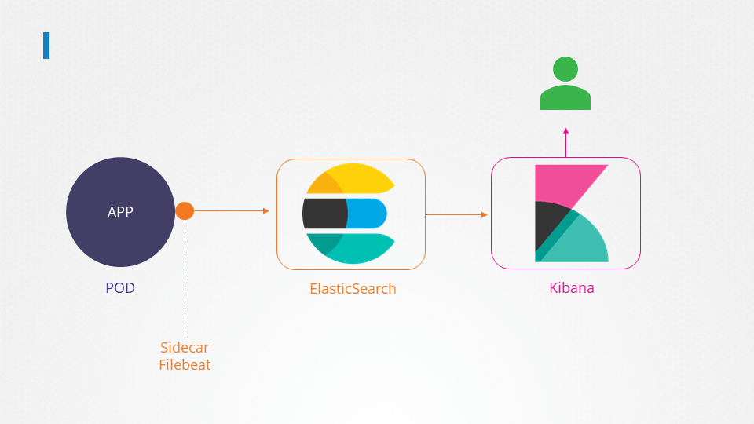

# Certified Kubernetes Administrator (CKA) with Practice Tests

## CORE CONCEPTS, PRACTICE TEST – PODS

### PODs with YAML
```
kubectl run nginx --image=nginx

kubectl describe pod newpods-<id>

kubectl get pods -o wide
```

What does the READY column in the output of the kubectl get pods command indicate?
- Running Conatiners in POD/Total Conatiners in POD

```
kubectl delete pod webapp
kubectl run redis --image=redis123 --dry-run=client -o yaml > redis-definition.yaml
```

```
# redist-definition.yaml
apiVersion: v1
kind: Pod
metadata:
  name: redis
spec:
  containers:
  - name: redis
    image: redis123    
```

- vi find and replace: `:s/redis123/redis/g`

### ReplicaSets
```
apiVersion: apps/v1
kind: ReplicaSet
metadata:
  name: myapp-replicaset
  labels:
    app: myapp
    type: front-end
spec:
  template:
    metadata:
      name: myapp-pod
      labels:
        app: mysqpp
        type: front-end
    spec:
      containers:
      - name: nginx-container
        image: nginx
 replicas: 3
 selector: 
   matchLabels:
     type: front-end
```

- ReplicaSets에서는 `selector`를 통해서 대상 `Pod` 선정
- Scale

```
kubectl replace -f replicaset-defnition.yml
kubectl scale --replicas=6 -f replicaset-definition.yml
kubectl scale --replicas=6 replicaset myapp-replicaset
```

```
kubectl get replicasets

kubectl describe replicasets new-replica-set
```

Why are there still 4 PODs, even after you deleted one?
- ReplicaSet ensures that desired number of PODs always run

Create a ReplicaSet using the `replicaset-definition-1.yaml` file located at /root/. There is an issue with the file, so try to fix it.
- `kubectl explain replicaset | grep VERSION`


```
$ kubectl explain replicaset
KIND:     ReplicaSet
VERSION:  apps/v1
```

```
kubectl delete replicaset replicaset-1

kubectl edit replicaset new-replica-set

# 기존 Pod를 삭제해야 새로운 Pod들이 실행됩니다.
kubectl delete pod new-replica-set-nxbh6 new-replica-set-62524 new-replica-set-5mv75 new-replica-set-rvpp8

# replicaset 개수 조정 (UP/DOWN)
kubectl edit replicaset new-replica-set
```

### Certification Tip!
```
kubectl run nginx --image=nginx --dry-run=client -o yaml

kubectl create deployment --image=nginx nginx --dry-run=client -o yaml

kubectl create deployment --image=nginx nginx --dry-run=client -o yaml > nginx-deployment.yaml

kubectl create deployment --image=nginx nginx --replicas=4 --dry-run=client -o yaml > nginx-deployment.yaml
```

### Deployments
```
$ kubectl get all

$ kubectl create -f deployment-definition-1.yaml 
Error from server (BadRequest): error when creating "deployment-definition-1.yaml": deployment in version "v1" cannot be handled as a Deployment: no kind "deployment" is registered for version "apps/v1" in scheme "k8s.io/apimachinery@v1.23.3-k3s1/pkg/runtime/scheme.go:100"

$ kubectl explain deployment 
KIND:     Deployment
VERSION:  apps/v1

$ kubectl create deployment --image=httpd:2.4-alpine httpd-frontend --replicas=3 --dry-run=client -o yaml > deployment-definition.yaml
```

### Service
```
apiVersion: v1
kind: Service
metadata:
  name: webapp-service
spec:
  type: NodePort
  ports:
   - targetPort: 8080
     port: 8080
     nodePort: 30080
  selector:
    name: simple-webapp
```

### Namespaces

mysql.connect("db-service.dev.svc.cluster.local")
- cluster.local: domain
- svc: object
- dev: namespace
- db-service: service name

```
# namespace-dev.yaml

apiVersion: v1
kind: Namespace
metadata:
  name: dev
```

```
kubectl get pods --namespace=prod
kubectl config set-context $(kubectl config current-context) --namespace=dev
kubectl get pods --all-namespaces
kubectl get po -A
```

#### Resource Quota
```
# compute-quota.yaml

apiVersion: v1
kine: ResourceQuota
metadata:
  name: compute-quota
  namespace: dev
spec:
  hard:
    pods: "10"
    requests.cpu: "4"
    requests.memory: 5Gi
    limits.cpu: "10"
    limits.memeory: 10Gi
```

```
k get po -n research
kubectl run redis --image=redis -n finance --dry-run=client -o yaml

k get po --all-namespaces | grep blue
```

### Imperative vs Declarative

**Imperative**
```
kubectl run --image=nginx nginx
kubectl create deployment --image=nginx nginx
kubectl expose deployment nginx --port 80
kubectl edit deployment nginx
kubectl scale deployment nginx --replicas=5
kubectcl set image deployment nginx nginx=nginx:1.18
kubectl create -f nginx.yaml
kubectl replace -f nginx.yaml
kubectl delete -f nginx.yaml
```

**Declarative**
```
kubectl apply -f nginx.yaml
```

#### Certification Tips - Imperative Commands with Kubectl

```
# POD
kubectl run nginx --image=nginx --dry-run=client -o yaml

# Deployment
kubectl create deployment nginx --image=nginx --replicas=4 --dry-run=client -o yaml

kubectl create deployment nginx --image=nginx --replicas=4 --dry-run=client -o yaml > nginx-deployment.yaml

# Service
# Create a Service named redis-service of type ClusterIP to expose pod redis on port 6379
kubectl expose pod redis --port 6379 --name redis-service --dry-run=client -o yaml 
kubectl create service clusterip redis --tcp=6379:6379 --dry-run=client -o yaml

# Create a Service named nginx of type NodePort to expose pod nginx's port 80 on port 30080 on the nodes:
kubectl expose pod nginx --type=NodePort --port=80 --name=nginx-service --dry-run=client -o yaml
```

#### Practice
```
kubectl run redis --image=redis:alpine --dry-run=client -o yaml > redis-pod.yaml
kubeclt run redis --image=reids:aplpine --labels="tier=db"

kubectl expose pod redis --port=6379 --name redis-service --dry-run=client -o yaml > redis-service.yaml

kubectl create deployment webapp --image=kodekloud/webapp-color --replicas=3 

kubectl run custom-nginx --image=nginx --port=8080

kubectl create namespace dev-ns

kubectl create deployment redis-deploy --image=redis --namespace=dev-ns --replicas=2

kubectl run httpd --image=httpd:alpine --port=80 --expose
```

## Section 3: Scheduling

### Manual Scheduling
```
# Pod-bind-definition.yaml
apiVersin: v1
kind: Binding
metadata:
  name: nginx
target:
  apiVersion: v1
  kind: Node
  name: node2

curl --header "Content-Type:application/json" --request POST --data '{"apiVersion":"v1", "kind:"Binding", ..}' http://$SERVER/api/v1/namespace/default/pods/$PODNAME/binding/
```

#### Practice

```
# Check scheduling controller
kubectl get pods --namespace kube-system

# Assign pod to node01 manually
---
apiVersion: v1
kind: Pod
metadata:
  name: nginx
spec:
  containers:
  -  image: nginx
     name: nginx
  nodeName: node01

# You should delete or replace pod first
kubectl replace --force -f nginx.yaml

# Monitor the pod you deployed
kubectl get pods --watch
kubectl get pods -o wide
```

### Labels and Selectors
```
kubectl get pods --selector app=App1
```
#### practice
```
kubectl get pods --selector env=dev
kubectl get pods --selector env=dev --no-headers | wc -l

kubectl get all --selector env=prod
kubectl get pods --selector env=prod,bu=finance,tier=frontend
```

### Taints and Tolerations

`kubectl taint nodes node-name key=value:taint-effect`
- taint-effect
  - NoSchedule
  - PreferNoSchedule
  - NoExcute

```
kubectl taint nodes node1 app=blue:NoSchedule
```

#### Practice
```
k describe  node node01 | grep Taint
kubectl taint nodes node01 spray=mortein:NoSchedule

k describe  node node01 | grep Taint
Taints:             spray=mortein:NoSchedule

kubectl run mosquito --image=nginx

```


**pod-definition.yml**
```yaml
apiVersion:
kind: Pod
metadata:
  name: myapp-pod
spec:
  containers:
  - name: nginx-container
    image: nginx
  
  tolerations:
  - key: "app"
    operator: "Equal"
    value: "blue"
    effect: "NoSchdule"
```

**Master Node**
```
kubectl describe node kubemaster | grep Taint
Taints:             node-role.kubernetes.io/master:NoSchedule
```

**pod-bee.yaml**
```yaml
apiVersion: v1
kind: Pod
metadata:
  name: bee
spec:
  containers:
  - image: nginx
    name: bee

  tolerations:
  - key: spray
    operator: Equal
    value: mortein
    effect: NoSchedule
```

**taints on controlplane**
```
k describe node controlplane | grep Taints
Taints:             node-role.kubernetes.io/master:NoSchedule
```

**Untaint controlplane**
```
kubectl taint nodes controlplane node-role.kubernetes.io/master:NoSchedule-
node/controlplane untainted
```

### Node Selectors

```
kubectl label nodes node01 size=large
```

### Node Affinity

```yaml
apiVersion: v1
kind: Pod
metadata:
  name: nginx
spec:
  affinity:
    nodeAffinity:
      requiredDuringSchedulingIgnoredDuringExecution:
        nodeSelectorTerms:
        - matchExpressions:
          - key: size
            operator: In
            values:
            - Large
            - Medium    
```

```yaml
apiVersion: v1
kind: Pod
metadata:
  name: nginx
spec:
  affinity:
    nodeAffinity:
      requiredDuringSchedulingIgnoredDuringExecution:
        nodeSelectorTerms:
        - matchExpressions:
          - key: size
            operator: NotIn
            values:
            - Small    
```

**Node Affinity Types**
- requiredDuringSchedulingIgnoredDuringExecution
- preferedDuringSchedulingIgnoredDuringExecution
- requiredDuringSchedulingrequiredDuringExecution

#### Practice
```
k describe node controlplane | grep -i taints
```

```
apiVersion: apps/v1
kind: Deployment
metadata:
  creationTimestamp: null
  labels:
    app: blue
  name: blue
spec:
  replicas: 3
  selector:
    matchLabels:
      app: blue
  strategy: {}
  template:
    metadata:
      creationTimestamp: null
      labels:
        app: blue
    spec:
      containers:
      - image: nginx
        name: nginx
        resources: {}
      affinity:
        nodeAffinity:
          requiredDuringSchedulingIgnoredDuringExecution:
            nodeSelectorTerms:
            - matchExpressions:
              - key: color
                operator: In
                values:
                - blue
```

```
apiVersion: apps/v1
kind: Deployment
metadata:
  creationTimestamp: null
  labels:
    app: red
  name: red
spec:
  replicas: 2
  selector:
    matchLabels:
      app: red
  strategy: {}
  template:
    metadata:
      creationTimestamp: null
      labels:
        app: red
    spec:
      affinity:
            nodeAffinity:
              requiredDuringSchedulingIgnoredDuringExecution:
                nodeSelectorTerms:
                - matchExpressions:
                  - key: node-role.kubernetes.io/master
                    operator: Exists
      - image: nginx
        name: nginx
        resources: {}
status: {}
```

### Resource Requirements and Limits

**Note on default resource requirements and limits**
```
apiVersion: v1
kind: LimitRange
metadata:
  name: mem-limit-range
spec:
  limits:
  - default:
      memory: 512Mi
    defaultRequest:
      memory: 256Mi
    type: Container
```

```
apiVersion: v1
kind: LimitRange
metadata:
  name: cpu-limit-range
spec:
  limits:
  - default:
      cpu: 1
    defaultRequest:
      cpu: 0.5
    type: Container
```

### A quick note on editing PODs and Deployments

Remember, you CANNOT edit specifications of an existing POD other than the below.
- spec.containers[*].image
- spec.initContainers[*].image
- spec.activeDeadlineSeconds
- spec.tolerations

**1. Run the kubectl edit pod <pod name> command.**
```
kubectl delete pod webapp
kubectl create -f /tmp/kubectl-edit-ccvrq.yaml
``` 
**2. The second option is to extract the pod definition in YAML format to a file using the command**
```
kubectl get pod webapp -o yaml > my-new-pod.yaml
vi my-new-pod.yaml
kubectl delete pod webapp
kubectl create -f my-new-pod.yaml
```

### Practice

**OOMKilled**
```
$ k describe po elephant | grep -A5 State
    State:          Waiting
      Reason:       CrashLoopBackOff
    Last State:     Terminated
      Reason:       OOMKilled
      Exit Code:    1
      Started:      Mon, 15 Aug 2022 00:51:42 +0000
      Finished:     Mon, 15 Aug 2022 00:51:42 +0000
    Ready:          False
```

**watch command to get the output every two seconds**
```
watch kubectl get pods
```

**Increase the limit of the elephant pod to 20Mi.**
```
# Solution A
kubectl edit pod elephant
kubectl replace --forece -f /tmp/kubectl-edit-000000.yaml

# Solution B
kubectl get pod elephant  -o yaml > elephant.yaml
kubectl delete pod elephant
kubectl create -f elephant.yaml

```

### DaemonSet
```
kubectl get daemonsets
kubectl describe daemonsets monitoring-daemon
```

#### Practice Test

```
k get daemonsets --all-namespaces
k get daemonsets -A

k describe daemonsets kube-flannel-ds -n kube-system
k describe ds kube-flannel-ds -n kube-system
k get ds -n kube-system
```

**Deploy a DaemonSet for FluentD Logging**
An easy way to create a DaemonSet is to first generate a YAML file for a Deployment with the command `kubectl create deployment elasticsearch --image=k8s.gcr.io/fluentd-elasticsearch:1.20 -n kube-system --dry-run=client -o yaml > fluentd.yaml`. Next, remove the replicas, strategy and status fields from the YAML file using a text editor. Also, change the kind from `Deployment to DaemonSet`.

Finally, create the Daemonset by running `kubectl create -f fluentd.yaml`

### Static Pods
Static Pods are managed directly by the kubelet daemon on a specific node, without the API server observing them. Unlike Pods that are managed by the control plane

1. How many static pods exist in this cluster in all namespaces?
- Run the command `kubectl get pods --all-namespaces` and look for those with `-controlplane` appended in the name
- `ownerReference`가 `Node`인지 확인

2. What is the path of the directory holding the static pod definition files?
- `/var/lib/kubelet/config.yaml`에서 `staticPodPath` 확인: `/etc/kubernetes/manifests`

```
cat /etc/kubernetes/manifests/kube-apiserver.yaml | grep image
    image: k8s.gcr.io/kube-apiserver:v1.23.0
    imagePullPolicy: IfNotPresent
```

3. Create a static pod named `static-busybox` that uses the `busybox` image and the command `sleep 1000`
```
k run static-busybox --image=busybox --dry-run=client -o yaml > static-busybox.yaml

# static-busybox.yaml
apiVersion: v1
kind: Pod
metadata:
  name: static-busybox
spec:
  containers:
  - image: busybox
    name: static-busybox
    command: ["sleep"]
    args: ["1000"]
```

```bash
root@controlplane:~# kubectl run static-busybox --image=busybox --restart=Never --dry-run=client -o yaml --command -- sleep 10000
```

4. We just created a new static pod named static-greenbox. Find it and delete it. This question is a bit tricky. But if you use the knowledge you gained in the previous questions in this lab, you should be able to find the answer to it.

Identify which node the static pod is created on, ssh to the node and delete the pod definition file.
If you don't know the IP of the node, run the `kubectl get nodes -o wide` command and identify the IP.
Then, SSH to the node using that IP. For static pod manifest path look at the file `/var/lib/kubelet/config.yaml` on node01

First, let's identify the node in which the pod called static-greenbox is created. To do this, run:
```bash
root@controlplane:~# kubectl get pods --all-namespaces -o wide  | grep static-greenbox
default       static-greenbox-node01                 1/1     Running   0          19s     10.244.1.2   node01       <none>           <none>
root@controlplane:~#
```

From the result of this command, we can see that the pod is running on node01.  
Next, SSH to `node01` and identify the path configured for static pods in this node.  
`Important`: The path need not be `/etc/kubernetes/manifests`.  
Make sure to check the path configured in the kubelet configuration file.

```bash
root@controlplane:~# ssh node01 
root@node01:~# ps -ef |  grep /usr/bin/kubelet 
root       752   654  0 00:30 pts/0    00:00:00 grep --color=auto /usr/bin/kubelet
root     28567     1  0 00:22 ?        00:00:11 /usr/bin/kubelet --bootstrap-kubeconfig=/etc/kubernetes/bootstrap-kubelet.conf --kubeconfig=/etc/kubernetes/kubelet.conf --config=/var/lib/kubelet/config.yaml --network-plugin=cni --pod-infra-container-image=k8s.gcr.io/pause:3.2
root@node01:~# grep -i staticpod /var/lib/kubelet/config.yaml
staticPodPath: /etc/just-to-mess-with-you
root@node01:~# 
```
Here the staticPodPath is `/etc/just-to-mess-with-you`  
Navigate to this directory and delete the YAML file:

```bash
root@node01:/etc/just-to-mess-with-you# ls
greenbox.yaml
root@node01:/etc/just-to-mess-with-you# rm -rf greenbox.yaml 
root@node01:/etc/just-to-mess-with-you#
```

Exit out of node01 using CTRL + D or type exit. You should return to the controlplane node. 
Check if the static-greenbox pod has been deleted:

### Multiple Schedulers

1. What is the name of the POD that deploys the default kubernetes scheduler in this environment?
```bash
root@controlplane ~ ➜  k get po -n kube-system
```

2. Create a configmap with name `my-scheduler-config` using the content of file `/root/my-scheduler-config.yaml`
```bash
root@controlplane ~ ➜  k create -n kube-system configmap my-scheduler-config --from-file=/root/my-scheduler-config.yaml
```

3. Deploy an additional scheduler to the cluster following the given specification. Use the manifest file provided at /root/my-scheduler.yaml. Use the same image as used by the default kubernetes scheduler.

```yaml
# /root/my-scheduler.yaml
apiVersion: v1
kind: Pod
metadata:
  labels:
    run: my-scheduler
  name: my-scheduler
  namespace: kube-system
spec:
  serviceAccountName: my-scheduler
  containers:
  - command:
    - /usr/local/bin/kube-scheduler
    - --config=/etc/kubernetes/my-scheduler/my-scheduler-config.yaml
    image: k8s.gcr.io/kube-scheduler:v1.23.0
    livenessProbe:
      httpGet:
        path: /healthz
        port: 10259
        scheme: HTTPS
      initialDelaySeconds: 15
    name: kube-second-scheduler
    readinessProbe:
      httpGet:
        path: /healthz
        port: 10259
        scheme: HTTPS
    resources:
      requests:
        cpu: '0.1'
    securityContext:
      privileged: false
    volumeMounts:
      - name: config-volume
        mountPath: /etc/kubernetes/my-scheduler
  hostNetwork: false
  hostPID: false
  volumes:
    - name: config-volume
      configMap:
        name: my-scheduler-config
```

4. A POD definition file is given. Use it to create a POD with the new custom scheduler. File is located at /root/nginx-pod.yaml
```yaml
apiVersion: v1
kind: Pod
metadata:
  name: nginx
spec:
  schedulerName: my-scheduler
  containers:
  - image: nginx
    name: nginx
```

## 4. Logging & Monitoring
### Monitor Cluster Components

1. Let us deploy metrics-server to monitor the PODs and Nodes. Pull the git repository for the deployment files.

```bash
# git clone https://github.com/kodekloudhub/kubernetes-metrics-server.git

# k create -f .    
```

2. Identify the node that consumes the most CPU.
```bash
# k top node
NAME           CPU(cores)   CPU%   MEMORY(bytes)   MEMORY%   
controlplane   326m         0%     1204Mi          0%        
node01         32m          0%     345Mi           0%        
```

3. Identify the POD that consumes the most Memory.
```bash
# k top po
NAME       CPU(cores)   MEMORY(bytes)   
elephant   20m          32Mi            
lion       1m           18Mi            
rabbit     139m         252Mi           
```

### Managing Application Logs
1. A user - USER5 - has expressed concerns accessing the application. Identify the cause of the issue.
```bash
# k logs webapp-1
```

2. A user is reporting issues while trying to purchase an item. Identify the user and the cause of the issue.
```bash
# k get po webapp-2 --watch
NAME       READY   STATUS    RESTARTS   AGE
webapp-2   2/2     Running   0          33s

# k logs webapp-2 
error: a container name must be specified for pod webapp-2, choose one of: [simple-webapp db]

# k logs webapp-2 simple-webapp
...
[2022-08-24 00:56:01,413] WARNING in event-simulator: USER30 Order failed as the item is OUT OF STOCK.
...
```

## 5. Application Lifecycle Management
### Rolling Updates and Rollbacks

1. Inspect the deployment and identify the current strategy

```bash
# k get all
NAME                            READY   STATUS    RESTARTS   AGE
pod/frontend-5c74c57d95-mhqnd   1/1     Running   0          3m36s
pod/frontend-5c74c57d95-wpfnv   1/1     Running   0          3m36s
pod/frontend-5c74c57d95-srbbd   1/1     Running   0          3m36s
pod/frontend-5c74c57d95-9qzj9   1/1     Running   0          3m36s
...

# k describe deploy frontend
...
StrategyType:           RollingUpdate
RollingUpdateStrategy:  25% max unavailable, 25% max surge
Pod Template:
  Labels:  name=webapp
  Containers:
   simple-webapp:
    Image:        kodekloud/webapp-color:v1
...
```

2. Let us try that. Upgrade the application by setting the image on the deployment to `kodekloud/webapp-color:v2`
```bash
# k edit deploy frontend
```

3. k edit deploy frontend
```yaml
...
spec:
  ...
  strategy:
    type: Recreate
```

### Commands and Arguments
1. Create a pod with the ubuntu image to run a container to sleep for 5000 seconds. Modify the file ubuntu-sleeper-2.yaml
```yaml
apiVersion: v1
kind: Pod 
metadata:
  name: ubuntu-sleeper-2
spec:
  containers:
  - name: ubuntu
    image: ubuntu
    command: ["sleep"]
    args: ["5000"]
```

```yaml
apiVersion: v1
kind: Pod 
metadata:
  name: ubuntu-sleeper-3
spec:
  containers:
  - name: ubuntu
    image: ubuntu
    command:
      - "sleep"
      - "1200"
```

### Configure Environment Variables 
1. Update the environment variable on the POD to display a `green` background

```bash
# k edit po webapp-color
# k replace --force -f /tmp/kubectl-edit-000000000.yaml
```


2. Create a new ConfigMap for the `webapp-color` POD. Use the spec given below.
```bash
# kubectl create configmap webapp-config-map --from-literal=APP_COLOR=darkblue
```

```yaml
# webapp-config-map.yaml
apiVersion: v1
kind: ConfigMap
metadata:
  name: webapp-config-map
data:
  APP_COLOR: "darkblue"
```

```bash
#  k get cm 
NAME                DATA   AGE
kube-root-ca.crt    1      20m
db-config           3      8m28s
webapp-config-map   1      31s
```

```yaml
  containers:
  - envFrom:
    - configMapRef:
        name: webapp-config-map
```

### Configure Secrets in Applications

**A note about Secrets**  
Secrets are not encrypted, so it is not safer in that sense. However, some best practices around using secrets make it safer. As in best practices like:
- Not checking-in secret object definition files to source code repositories.
- [Enabling Encryption at Rest](https://kubernetes.io/docs/tasks/administer-cluster/encrypt-data/) for Secrets so they are stored encrypted in ETCD. 

Also the way kubernetes handles secrets. Such as:
- A secret is only sent to a node if a pod on that node requires it.
- Kubelet stores the secret into a tmpfs so that the secret is not written to disk storage.
- Once the Pod that depends on the secret is deleted, kubelet will delete its local copy of the secret data as well.

1. How many secrets are defined in the default-token secret?

There are three secrets - ca.crt, namespace and token.
```
Type:  kubernetes.io/service-account-token

Data
====
ca.crt:     570 bytes
namespace:  7 bytes
token:      eyJhbGciOiJSUzI1NiIsImtpZCI6Ii1fY2MzNjQxUmhWYlFpTW5DZzJ2NHJoR25XLUxpYmZpcF9xNkF6VlZ1RDgifQ.eyJpc3MiOiJrdWJlcm5ldGVzL3NlcnZpY2VhY2NvdW50Iiwia3ViZXJuZXRlcy5pby9zZXJ2aWNlYWNjb3VudC9uYW1lc3B
```

2. The reason the application is failed is because we have not created the secrets yet. Create a new secret named db-secret with the data given below.

```bash
# k create secret --help
# k create secret generic --help

# k create secret generic db-secret --from-literal=DB_Host=sql01 --from-literal=DB_User=root --from-literal=DB_Password=password123
```

```yaml
apiVersion: v1
data:
  DB_Host: c3FsMDE=
  DB_Password: cGFzc3dvcmQxMjM=
  DB_User: cm9vdA==
kind: Secret
metadata:
  name: db-secret
type: Opaque
```

3. Configure `webapp-pod` to load environment variables from the newly created secret. Delete and recreate the pod if required.

```yaml
containers:
  - name: webapp
    image: kodekloud/simple-webapp-mysql
    envFrom:
    - secretRef:
        name: db-secret
```

```bash
# k edit po webapp-pod
error: pods "webapp-pod" is invalid
A copy of your changes has been stored to "/tmp/kubectl-edit-1890615175.yaml"
error: Edit cancelled, no valid changes were saved.

# k replace --force -f /tmp/kubectl-edit-1890615175.yaml
```

### Multi Container PODs
1. Create a multi-container pod with 2 containers.

```txt
    State:          Waiting
      Reason:       CrashLoopBackOff
```

```
apiVersion: v1
kind: Pod
metadata:
  name: yellow
spec:
  containers:
  - image: busybox
    name: lemon
    command:
      - "sleep"     
      - "1000"     
  - image: redis
    name: gold  
```

```bash
# k replace --force -f yellow.yaml 
pod "yellow" deleted
pod/yellow replaced
```

2. Configure a sidecar container for the application to send logs to Elastic Search. 
```bash
# kubectl -n elastic-stack logs kibana
```

3. The application outputs logs to the file /log/app.log. View the logs and try to identify the user having issues with Login

```bash
# kubectl -n elastic-stack exec -it app -- cat /log/app.log
```

4. Edit the pod to add a sidecar container to send logs to Elastic Search. Mount the log volume to the sidecar container. Only add a new container. Do not modify anything else. Use the spec provided below.

  

```yaml
apiVersion: v1
kind: Pod
metadata:
  name: app
  namespace: elastic-stack
  labels:
    name: app
spec:
  containers:
  - name: app
    image: kodekloud/event-simulator
    volumeMounts:
    - mountPath: /log
      name: log-volume

  - name: sidecar
    image: kodekloud/filebeat-configured
    volumeMounts:
    - mountPath: /var/log/event-simulator/
      name: log-volume

  volumes:
  - name: log-volume
    hostPath:
      # directory location on host
      path: /var/log/webapp
      # this field is optional
      type: DirectoryOrCreate
```

5. Inspect the Kibana UI. You should now see logs appearing in the Discover section.


---
```
apiVersion: 
kind:
metadata:


spec:
```