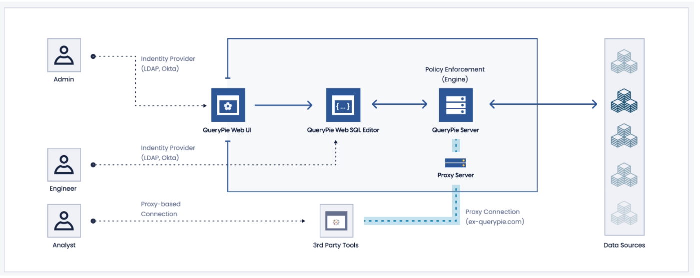
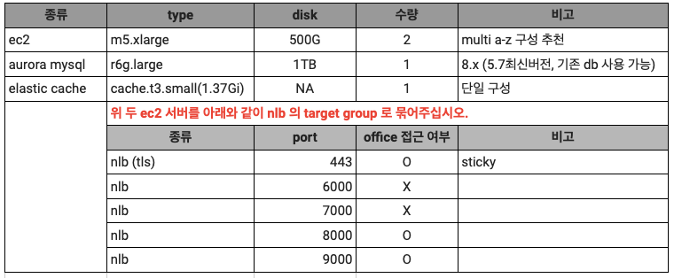
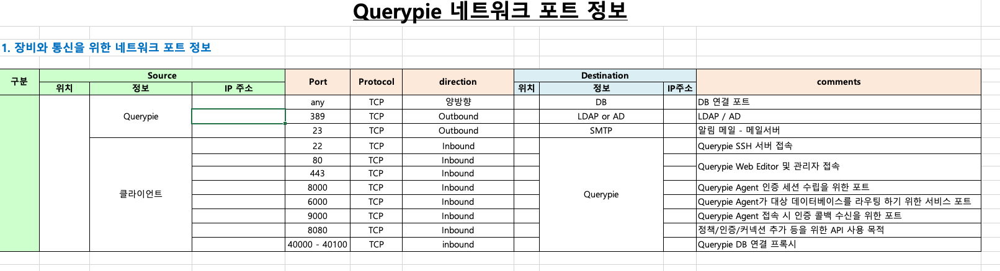

## QueryPie Architecture

[Sample Architecture](https://www.notion.so/chequer/Sample-Architecture-7e29ec69c1ac4565975b58c14a16aeae)



- M/W (80/443, 에이젼트 접속시 인증 콜백 수신 6000) --> API (8080)
- Proxy (9000, 인증 세션 수립 8000) --> API (8080)
- Tool (3000)

### API (Engine, Server)
- IAM
- DBAM
- Cloud Management
- Scheduled Jobs

### Middleware (Web UI, WEB SQL Editor)
- Web SQL Editor
- Process Management
- Executing SQL

### Proxy
- Agent Authentication
- Proxy to Real Data Server

## QueryPie Installation

[System Requirement](https://www.notion.so/chequer/System-Requirements-58fb57ea60e2433aa4a74d8cda00b2c9)

[Amazon EC2 인스턴스 유형](https://aws.amazon.com/ko/ec2/instance-types/)
- T: Burst
- M: 범용 인스턴스
- C: 컴퓨팅 집약적 워크로드에 최적화
- R: 메모리 최적화

### Reccomended Spec
- API: m5.xlarge, 50GB
- M/W: m5.xlarge, 2TB (디스크 캐시 사용 등으로 높은 디스크 용량이 필요)
- Proxy: m5.xlarge, 50GB

## PoC




PoC 사전 준비 
- [PoC 사전 요청서](https://forms.monday.com/forms/f51f98b9ed591ae52b14d4a7fdfeb919?r=use1)
- [PoC 체크 리스트](https://docs.google.com/spreadsheets/d/1ECdXVs_rqZ7AjNEzMyWVacsxsywrJ8SDUKZxK-Ky5ZI/edit?usp=sharing)
- 보안
  - VPC 선택시, PoC하고자 하는 노트북(혹은 오피스) IP 대역에서 AWS VPC에 접근할 수 있어야 함
  - VPC 내부의 Subnet 또는 Private Subnet이 아닌, 노트북 IP 대역대에서 접근 가능해야 함
  - 소스IP는 PoC환경에 따라 적절히 제한하면 됨
  - SSH 22
  - HTTP/HTTPS 80/443
  - QueryPie Tool 3000
  - API Server 8080
  - Proxy Port 40000 ~ 40010
    - 데이터베이스 1개당 프록시 포트 1개를 점유함. 10개 이상의 DB에 대해 PoC를 할 경우 Port를 더 여유롭게 오픈해야 함
  - 아웃바운드는 모두 열면 됨 
- 인스턴스: r5.xlarge (4vCPU / 3GiB Memory)
- 디스크: 2000GiB (기비바이트)
- 설치 가이드
  - [Docker Compose를 통한 QueryPie PoC 설치 가이드](https://chequer.monday.com/docs/2758643566)
  - [PoC용 설치 스크립트](https://chequer.monday.com/docs/3043625004)
- 매뉴얼
  - [QueryPie Manual 9.6.0 ~ 9.8.6 ver](https://www.notion.so/chequer/QueryPie-Manual-9-6-0-9-8-6-ver-bd9a1ad2788b4cb8877d3a233c65688f)

### Kurly Pay
- EC2 폐쇄망, 멀티 계정
- MySQL, AWS Athena, DynamoDB, MariaDB, PostgreSQL, SQL Server
- QueryPie 자체 계정 사용

#### Aug 8

```
다음과 같은 환경 준비 부탁드립니다.
- Amazon Linux2
- 4vCPU, 32GiB, 200GiB
- EC2 인스턴스에서 대상 데이터베이스에 접근 가능하도록 IAM 권한(ReadOnly) 부여
```

### 미리디
#### Aug 9
- 만약 Okta의 LCM 기능 없이 Okta의 Universal Direcotry를 이용하여 Querypie랑 LDAP 연결 했을 때 Okta에서 계정 생성 시 Querypie에도 계정과 권한이 생성되는지?
  - LCM(Lifecycle Management)


### RIDI

- EKS에서 Proxy를 Pod로 배포할 경우, annotation을 수정
```
service.beta.kubernetes.io/aws-load-balancer-nlb-target-type: "ip"
service.beta.kubernetes.io/aws-load-balancer-backend-protocol: "TCP"
service.beta.kubernetes.io/aws-load-balancer-cross-zone-load-balancing-enabled: "true" 
service.beta.kubernetes.io/aws-load-balancer-healthcheck-port: "3000"
service.beta.kubernetes.io/aws-load-balancer-scheme: "internet-facing"
service.beta.kubernetes.io/aws-load-balancer-name: "querypie-proxy"
service.beta.kubernetes.io/aws-load-balancer-type: external
service.beta.kubernetes.io/aws-load-balancer-additional-resource-tags: "duty.querypie.io/mgmt=SRE"
```

### 엔에치엔 클라우드
#### Aug 17 (Brantt)

Why Us 
- DB 접근제어 솔루션 통합 용이, API 제공
- 보안 인증들을 갖추고 있음 (공공쪽 보안인증확인서, GS인증서, GSA Start, ISMS-p)

Customer Profile
- "클라우드 네이티브 회사면서 NoSql, Okta 같은 최신의 SaaS 애플리케이션과 최신의 트랜디한 DB를 사용하는 회사"

References
- 카카오가 최초 주주
- 엔에치엔커머스가 `고도몰`은 쿼리파이를 통해 접근제어 및 보안감사
- 다른 CSP들하고는 화이트레이블링해서 마치 네이버 클라우드나 카카오 아이 클라우드의 제품 일부분인 것처럼 제품 통합 


## References
- [QueryPie Deploy Project(WIP)](https://www.notion.so/chequer/QueryPie-Deploy-Project-WIP-0f83906d93a94449928d9bf4650b7155)
- [QueryPie 배포](https://www.notion.so/chequer/QueryPie-d06e4e83dfab4d3b8f14b4958c714a2c)
- [QueryPie Demo Video](https://youtu.be/5zFpJOkdFcU)
- [[Public] QueryPie Support](https://www.notion.so/chequer/Public-QueryPie-Support-bfd06f81d80e4152a9758487181c86fd)
- [QueryPie 릴리즈 노트](https://support.querypie.com/hc/ko/categories/360001485233)
- [PoC 사전 요청서](https://chequer.monday.com/boards/2803769546/)
- [QueryPie2022 Jira Kanban board](https://chequer.atlassian.net/jira/software/c/projects/QP/boards/45)
- [QueryPie 배포회고](https://www.notion.so/chequer/3112e496c7ad4da78e449942a33094b1)
- [QueryPie 장애노트](https://www.notion.so/chequer/Public-QueryPie-Support-bfd06f81d80e4152a9758487181c86fd)
