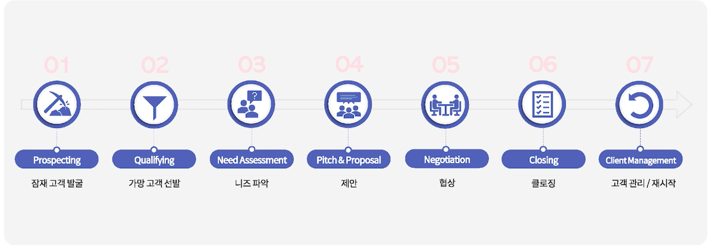

# 세일즈 코치 Cate의 B2B Sales 성공방정식
## 00. Introduction

- **고객의 고민을 해결해 주는 것이 솔루션 세일즈의 시작**
- **Why buy? Why now? Why us?**

## 01. B2B 세일즈란?
### B2B 세일즈란?
- **기.승.전 매출**
- B2B 세일즈의 오해
  - `왕성한 호기심` > 고객 어려움 인식 > 문제에 대한 솔루션 제공 
  - 논리적인 설득 필요
  - 영업력과 크게 관련이 없음

### 구매 여정에서 세일즈 위치

마케팅 vs 세일즈
- 알리기 vs 매출전환
- 세일즈의 `Call to Action`은 `문의하기`이고 이 기회를 매출로 전환하는 것

### 다양한 용어와 컨셉
- Lead Generation: 잠재고객 `실마리`를 만드는 활동
- Sales Funnel (앞단이 넓은 것이 중요)
- Lead(잠재고객) -> Prospect(가망고객) -> Client(고객)
- Qualifying Prospects: `옥석을 가려내야` 효율적인 매출전환이 가능
- Hunter vs Farmer
  - Outbound vs Inbound
  - Conversion vs Retension

## 02. 세일즈 프로세스
### B2B 세일즈의 필수 요소 - 고객
- **고객과의 궁합 + 고객의 챌리지 + 고객의 구매 의지**
- **이상적인 고객 프로파일링**
- 고객의 구매 이유는 3가지 미만 - **선택해서 집중할 수 있는 2 ~ 3가지를 뽑아 내는 것이 중요**

### B2B 세일즈의 필수 요소 - 솔루션
- 기능 vs 혜택(고객의 문제를 해결 - ex. 워킹맘)
- 교육(목적지까지 가는 방법) vs 데모(어디까지 갈수 있는지?, `꿈을 꿀수 있게 함`)
- **고객과의 커넥션** (고객의 문제와 연결, 시작이 우리가 아니라 고객)

### B2B 세일즈의 필수 요소 - 세일즈 담당자
- 세일즈 담당자의 역할: "저들은 어떤 문제를 가지고 있을까?"
- 반쪽짜리 세일즈: 내부 세일즈 해야 함 
- 매끄러운 인계: Over sell하고 Under deliver하지 말아야 함
- 파이프라인 관리

## 03. 세일즈 필수 요소
### 세일즈 프로세스

### Prospecting
- **최대한 많은 리드 발굴**
- INBOUND: 예전고객, 놓친고객, Disqualified 가망 고객

### Qualifying
- 리드에서 가망 고객을 선별하는 과정 (예선통과, 효율성)
- **가망고객과 1차 미팅 잡기**

### Need Assessment
> 오프닝 질문
> - "오늘 어떤 배경에서 미팅 요청을 주셨나요?"
> - "오늘 고객님께서 꼭 얻어 가고자 하시는 것이 무엇인가요?"

- 일단 듣기
- **적절한 질문(낚시질문)으로 니즈파악**

> 펼처 묻기 + 유리한 고기만 낚기
> - 상황: 비즈니스 상황/모델, 경쟁구도, 차별점
> - 어려움: 내부/외부적 어려움 (고객의 문제, 상황의 문제)
> - 이슈의 심각성/영향: 어려움으로 일어나는 비효율, 손실/손해, 놓치고 있는 기회

> 다음으로 넘어가지 전!
> - 고객이 가진 어려움이 명확한가?
> - 그 어려움을 우리 제품/서비스로 해결할 수 있는가?

### Pitch & Proposal
- NO! 교육 `YES! 데모`
- `So What` 이점을 제시
- 플러스 알파

### Negotiation
- `WHY US`를 명확하게 하여 계약까지 다다르게 하는 과정
- 불편한 모든것을 제거해야만 계약 성사 
- 문제의 이면을 파악할 것
  - 1차 질문: 문제 파악
  - 2차 질문: 문제의 이면(배경과 이유 파악)
- `FEEL, FELT, FOUND` 기법으로 반대 의견 뒤집기
  - "I understand you FEEL ..."
  - "Other people FELT that way too."
  - "Many people FOUND that OOO also works."

### Closing
> 여기서 잠깐!
> - `차원이 다른 세일즈 되려면 계약서부터 읽을 것!`
> - 계약서를 미리 읽으면 협상에서 조심해야 하는 사항 파악 가능
> - Schedule of Service: 계약기간, 연장조건, `제품/서비스 정의/범주, 제품가격`

- 아래 표의 내용이 명확 하다면 GO!  

### Client Management
**Follow up & Start Over**
- 다시 새로운 프로세스 시작
- 계약=새로운 기회의 시작

## 04. 세일즈 컨셉부터
### 솔루션 세일즈
팔기에 급급한 세일즈 -> 솔루션 세일즈
- 고객의 파트너로 능동적으로 고객과 함께 문제 해결

### Why Buy, Why Now, Why Us

"열린 질문을 해라!"  
신규 카테고리일 경우는 `Why Buy`에 집중   

Why Buy
- 기능 & 혜택
- 니즈: 기존 카테고리 + 신규 카테고리
- "어떤 배경에서 솔루션을 찾게 되었나요?"
- "문제해결을 위해 고려해보신 방법에는 어떤 것들이 있나요?"

Why Now
- Sense of Urgency (위급함, 절박함)
- 손해 & 이익
- 고관여 제품일수록 Timeline을 제어하기 쉽지 않음
- "현시점에서 솔루션을 고려하게 된 계기는 무엇인가요?"
- "어떤 타임라인을 가지고 계신가요?"

Why Us
- 경쟁입찰 
- 가장 쉽게 경쟁 입찰에서 이기는 방법은 RFP를 고객사와 함께 작성하는 것!
- `주 고려요인`과 `우리의 차별점`이 연결되어야 함 (So What?)
- "파트너사 선정에서 중점적으로 고려하고 계신 3가지는 무엇인가요?"
- "지난번 프로젝트에서 아쉬웠던 점은 무엇인가요?"
- "진행에 앞서 걱정되는 점은 무엇인가요?"

## 05. 세일즈 소프트스킬

핵심은 **질문을 잘 하는 것**이다.

### 고객 발굴 및 선별을 위한 서면 커뮤니케이션
- 이메일은 KISS 기법에 따라서 간단 명료하게
- KISS = Keep It Short & Simple
- **Call To Action**: 마케팅에서 타겟의 행동이나 반응을 유도하는 방법

> 예시 (추천하지 않는 문구 - 자신감 부족/과잉, 비구체적인, 주저리 주저리)
> - 바쁘신데 죄송합니다.
> - 저희 솔루션은...

### 고객 발굴 및 선별을 위한 유선 커뮤니케이션
콜플랜
- 목표: 오늘 콜에서 얻고자 하는 것
- 질문: 목표 달성을 위하여 물어야 하는 것 (Why buy, Why now, Why us?)
- 다음 액션: 내가 해야 할일 vs 고객이 해야 할일
- 마무리: 고객이 기억했으면 하는 메시지 
  - "도움이 될만한 내용이 있으면 종종 연락드리겠습니다."

콜 흐름 예상  
**가장 중요한 것은 목소리의 자신감**  
자신감 얻기
- 내 솔루션에 잘 알고 있는 사람은 바로 **나**
- 모르면 한번 더 묻기!
- 약속 지키기 (내부적으로 확인해 보고 회신 약속)   

오프닝 - 짧고 간단하게 머뭇거림 없이 본론으로  
마무리 - 실패했더라도 다음을 위한 전략이 필요   

### 고객의 니즈 파악을 위한 회의 프레임워크

> 꼭 피해야 하는 미팅
> - 결론 없는 미팅
> - 스스로 숙제 만들기 (요청하지 않았는데 "자료는 미팅후 이메일로 보내 드리겠습니다")

### 원하는 방향으로 이끌 수 있는 법
오프닝이 KEY
- 미킹 오프너=주도권
- 미팅 목적, 아웃컴 설명

"오늘 미팅에서 꼭 얻어갔으면 하시는 점이 무엇인가요?"  

적절한 질문으로 니즈 파악
- 낚시질문: 펼쳐 묻고 유리한 고기만 낚아라
- "만두야! 오늘은 어떤 맛으로 양치질할까? 지금 양치할까? 뽀로로 더 보고 5분후에 양치질할까?"

고객이 삼천포로 갔을 떄
- 중간에 고객의 페이스에 말리는 것이 아니라 한번 동의해 드리고 내가 원하는 토픽으로 환기시키는 것이 중요

잘 듣는 방법
- 잘 듣고 --> 되묻고 --> 요약하기

### 가능성을 보여주는 세일즈 데모
- 데모 (어디까지 갈 수 있는지?)
- `So What` 으로 이점 제시
- Plus Ahlpa

### 원활한 세일즈를 위한 협상법
- 문제의 이면을 파악할 것 
- 1차 질문: 어떤 반대 의견이 있나요?
- 2차 질문: 그 반대 의견은 어떤 배경에서 발생하나요?, 이견을 제시한 이유는 무엇인가요?

  

- WHY가 궁금하면 WHY를 빼라
  

### 클로징
- 작고 작은 클로징(=진전)이 모여 마지막 Grand Closing이 됩니다.
- 항상 정리하고 고객에게 확인(질문)해야 한다.
- 펼처 물었던 것을 다시 좁히는 작업도 필요하다.
- 논의 순서가 아닌 중요도에 따라 우선 순위화
- 실제로 물어야 끝 (계약)

### 고객 관리
- 상호가치를 극대화하고 `상호 이익`이 되는 목표를 달성하기 위해 `가장 중요한 고객`을 관리하고 `성장`시키는 체계적 접근 방식

## 06. 짚어봐야할 문제와 실수들
  

### 파이프라인 관리
Time Management
- 목표: 당월 목표의 3배 기회 만들기
- 20% 이상 프로스펙팅에 쓰고 있나요?
- 콜드콜링하는 시간이 따로 있나요?
- 시간=제로썸 
  - **숙제피하기**: 고객이 요청할 때까지 기다리세요
  - **NO하는 법을 배워야할 때**

선택과 집중
- Why buy, why now, why us?중 어느 부분이 충족되지 않는 기회에 집중하고 있는지?
- *Barking at the wrong tree?*

FactCheck
- "나만" 이 기회가 성사될 것이라고 생각하고 있지는 않은가?

### 소프트스킬 트러블슈팅
유선 커뮤니케이션 
- 특히 편한 목소리인지?
- 목소리에 힘 빼세요! + 말끝 내리기부터 시도!   

듣기 VS 말하기
- 더 많이 듣고 있다면: 질문을 잘 하고 있을 확률이 높음, 고객과 상호작용하고 있다는 뜻.

데모준비
- 준비가 안되었다면, 데모를 미뤄라!
- 기본 체크리스트
  - 고객 기본정보 + 최근뉴스 확인
  - TOP3 챌린지 정리
  - 바로 연결되는 솔루션 정리
  - Why Us 정리

가격(고객이 가격에만 집중하고 있다면?)
- "정확한 견적을 내려면 필요한 정보가 있습니다. 질문해도 될까요?" 
- 어느 정도 range인지 궁금해하는 경우가 많음. 답변후 환기

경쟁사
- 미팅안에서는 우리에게 집중하도록 환기시키고
- 미팅 끝나고 캐주얼하게 질문 (나중에 활용할 수 있는 정보)

"내가 솔루션 세일즈를 하고 있는지?"
- 솔루션으로 문제해결: 제공 가능한 직접적인 혜택에 집중하세요(고객의 공감 필요) 

### 세일즈 코칭
- SALES SHADOW  
- SALES COACHING  
- SALES 아이디어 공유  

### 세일즈 트러블슈팅 FAQ
콜드콜링은 꼭 해야 하나요? - 꼭 필요한 과정  
콜드콜링할때 그럴싸한 솔루션을 미리 준비해서 전화해야 하지 않나요? - 그럴 필요없음, 콜드콜링의 목적이 중요  
고객이 우리를 선택하지 않은 경우 꼭 "왜?"를 물어봐야 하나요? - 항상 질문해야 함  
질문을 잘 해야 한다는 것은 알겠는데 너무 어려워요. 어떻게 하면 좋을까요? - "질문은행"을 만드세요  
통화 녹음도 해보고 콜 코칭도 해봤어요. 시도해볼 수 있는 또 다른 방법은 뭐가 있나요? - 동료와 "상황극" 연습  

## 07. 내가 잘 팔아서 잘되는 시대는 끝났다
### 이쯤에서 나도 팀장
세일즈 팀장이 되기 전 생각해봐야할 질문
- 나는 오지랖이 넓은가?
- 나는 타인에게 관심과 호기심이 있는가?
- 누군가를 돕고 좋은 결과가 있을 때 희열을 느끼는가?
- 조연도 괜찮나?
- 외로울 준비가 되어 있는가?

### 세일즈 리더란
- WHO:  `예측 가능한 매출`을 달성하기 위하여 `팀의 목표`를 세우고 `프로세스`를 확립하여 `팀을 리드`하는 사람  
- WHY: 회사의 목표와 align되어 조직의 목표인 매출 달성과 성장을 위한 동력을 마련
- HOW: 각각의 세일즈 담당자가 `스스로` 성과관리를 할 수 있도록 도와서, 팀원의 성공을 통해 팀과 자신을 성공을 이룸

세일즈 리더의 자질
- 사람과 비즈니스 호기심 (Problem Solving에 대한 가장 중요한 부분)
- 성과중심 (세일즈는 결국 실적)
- 진심 (팀원을 도와 성공하게 하려면)

### 팀장의 360

### 세일즈 팀장 FAQ
- 진정한 리더는 팀원들이 스스로 할 수 있도록 영감을 주는 사람
- 내가 각각의 팀원들에게 어떻게 맞출지 생각해야 함
- 상대방의 성공을 돕고자 하는 마음을 전하고 나에게 어떤 기대를 하는지 진심으로 물어보기
- 팀원의 강점을 빠르게 파악하고 도움을 요청

## 08. 세일즈 팀 꾸리기
### Purpose - 우리는 왜
**"우리는 왜 존재하는지?"**  - Mission Statement  

매출 - 기회창출, 기회전환, 매출방어  

- 자주 상기시키고
- 성과를 존재 이유와 연결

### Process - 우리는 어떻게

**팀 = 프로세스**    

WHY 프로세스 
- 성공의 확률을 극대화 (Best Practice 확장)
- 확장하여 반복 가능한가? (새로운 팀원, 새로운 채널, 새로운 상품)
- 누구나 실행 가능한가?

**Sales Playbook**  
- 미션, 목적
- 타겟시장
- 포지셔닝
- 팀
- 세일즈 메시지
- 사용하는 툴 

### People - 우리는 누구
팀장은 덧셈이 아닌 곱셈을 해야 한다

## 09. 세일즈 팀 이끌기
### 장기계획
나만의 운영 철학
- 투명성, 공정성, 일관성

30,60,90일 계획
- 30일: 고객, 솔루션, 사람
- 60일: 프로세스, 파이프라인, 성과측정 및 GAP파악
- 90일: 로드맵, 전략수립, 실험시작

### 성공적인 성과 만들기

- 프로세스와 세일즈툴의 생활화
- 질문을 할 떄는 도움을 주는 목적이어야 한다.
- 함께 공부하고 성장하기
- 매주 45분 모두가 함께
  - 가장 중요한 내용은 무한반복(목적, 변화, 질의응답)
  - 파이프라인 업데이트, 시장상황 공유(시장, 경쟁사)
  - 성공 사례 (성공을 복제하는 방법)
  - 실패 사례 

- 1:1
  - 주인공은 팀원
  - 목표 대비 개인성과, 중요한 기회 2~3개
  - 어려운 점, 잘된 점, 배운 점, 도움이 필요한 것
  - 커리어 개발  

- 피드백
  - 긍정적인 부분/강점에 집중 (어떻게 발전시킬지)
  - 그때 그때 피드백을 줘야 함 
  - Praise in public, Correct in private
  - 구체적인 예시
  - 사람이 아닌 행동이 중심이 되어야 함
  - 논의의 시작점 

- 좋은 피드백
  - Praise in public, Correct in private
  - 문제가 있다면 당사자와 먼저 논의할 것
  - 어떻게 피드백을 받고 싶은지 팀원에게 먼저 물어볼 것 

- 이런 것들은 NO NO
  - 항상, 매번, 저번에, 여러 번
  - 준비를 많이 안 한 모양인데 (지레짐작)
  - 당신은 그래서 (주어는 당신이 아니라 "그런 행동은")

  
  

### 때떄로 필요한 것들
건강하게 팀 이끌기
- `Rules of Engagement` (기본적인 룰세팅)
- 기본은 갈등의 당사자들끼리 이야기해야 한다 (갈등은 `정면돌파`부터 시도)

껄끄러운 이야기하기
- 최대한 짧고 담박하게
- Own Your Message (너무나 당연한듯)
- 주어는 사람이 아닌 상황으로

> 예) "OO은 오늘부로 퇴사했습니다. 그동안 힘들게 쌓고 지켜온 업무태도 기준을 포기할 수 없다고 생각했고 그래서 함께 하지 않는 것이 좋겠다고 생각했습니다. 이상입니다"  

## 10. 팀장의 고민
### 성과내기

- 콜드콜링 대회 (다같이 즐겁게)
- 공격과 수비를 분리 (본능적으로 수비를 먼저)
  - 수비: 들어 오는 요청을 전환
- 잘 하는 친구는 조금만 도와주면 훨씬 더 잘할 수 있음    

### 팀과 나의 발전
- 매출이 기본
- 함께 공부하고 발전
- 구조적 사고를 할 수 있도록 리드

  
  

### 즐길줄 아는 팀
`재미`의 중요성을 잊지 마세요!  
어차피 할 일이라면 `재미있게`  
아침 출근하면 밝고 웃는 얼굴로 `굿모닝~~!`  

## Closing
- 진심으로 고객의 고민을 해결하자고 노력하고 거기에 내 솔루션을 연결할 수 있어야 한다.
- 될만한 기획에 집중하여 효율적으로 성과를 만들어라.
- "팀장으로 잘 하려고 하는 생각을 버리면 반은 먹고 들어간다!" 
- 팀원 스스로 문제를 해결할 수 있게 하는 Enabler가 되라!
- 무엇이든 신나게 팔수 있도록 도와라!

